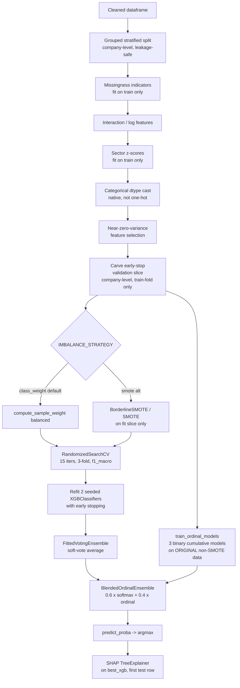
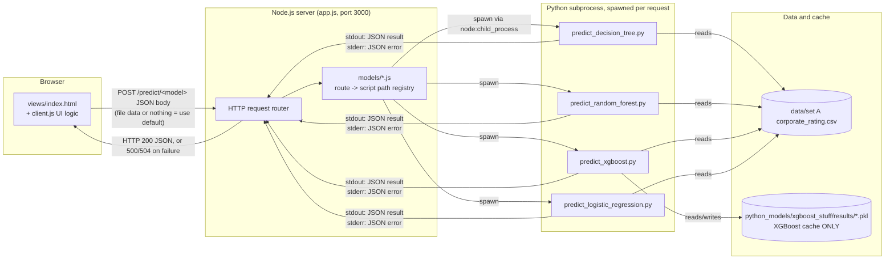

# FYP Knowledge Base: Corporate Credit Risk Classification with XGBoost, SHAP, and a Multi-Model Comparison Dashboard

> **How to use this document.** This is not a summary of your project — it is a teaching document. Read it top to bottom once, then use it as a reference during revision. Every technical term is defined before it is used. Every design decision is justified using the *actual code* in this repository, not textbook boilerplate. Where the report says "this project does X", it is citing a real file and line, not a generic ML pipeline. Where a concept has an "Evaluator questions" box, treat those as flashcards.
>
> **Grounding statement.** This document was written by reading the actual repository: `python_models/shared_baseline.py`, `python_models/xgboost_stuff/preprocessing.py`, `python_models/xgboost_stuff/predict_xgboost.py`, `python_models/xgboost_stuff/evaluate_xgboost.py`, `python_models/decision_tree_stuff/predict_decision_tree.py`, `python_models/random_forest_stuff/predict_random_forest.py`, `python_models/logistic_regression_stuff/predict_logistic_regression.py`, `app.js`, `models/*.js`, the test suite in `python_models/tests/`, the dataset `data/set A corporate_rating.csv`, the cached metrics in `python_models/xgboost_stuff/results/`, and `docs/XGBoost_Technical_Report.md`. Every number quoted (accuracy, row counts, class counts) is taken from these files, not invented. Where something could not be verified from the repository (e.g. Optuna, which is **not used anywhere in this codebase** — hyperparameter search here is `RandomizedSearchCV` and `GridSearchCV` from scikit-learn), this document says so explicitly rather than inventing a fictional implementation detail to satisfy a checklist.

---

## Table of Contents

1. Executive Summary
2. Business Analysis
3. The Dataset
4. Data Preprocessing (Deep Dive)
5. Class Imbalance
6. Machine Learning Models (Logistic Regression, Decision Tree, Random Forest)
7. XGBoost Masterclass
8. Hyperparameter Tuning (as actually implemented — RandomizedSearchCV / GridSearchCV, not Optuna)
9. Model Evaluation
10. Explainable AI (SHAP)
11. Project Architecture
12. Code Walkthrough (every script)
13. Technology Stack
14. Glossary
15. Evaluator Questions (100+)
16. Distinction Critique
17. Final Distinction Checklist

---

# 1. Executive Summary

## 1.1 What This Project Is

This project is a web application that predicts a company's **credit risk tier** — one of four categories, from safest to riskiest — using only the company's publicly reportable financial ratios (things like its current ratio, debt-to-equity ratio, and profit margins). It does this using four different machine learning algorithms side by side (Logistic Regression, Decision Tree, Random Forest, and XGBoost), so a user can compare how differently each algorithm reasons about the same company, and it explains *why* each prediction was made using an explainability technique called SHAP (explained fully in Chapter 10).

## 1.2 The Business Problem

Credit rating agencies (Moody's, S&P, Fitch, and smaller agencies like Egan-Jones, whose ratings make up this dataset) assign letter grades — AAA, AA, A, BBB, BB, B, CCC, CC, C, D — to companies that borrow money (by issuing bonds or taking loans). These letter grades tell lenders and bond investors how likely the company is to default (fail to pay back what it owes). The rating process today is manual: teams of financial analysts read a company's financial statements, apply proprietary methodologies, and issue a grade. This is slow (ratings can lag real financial deterioration by months), expensive (it requires skilled analyst labour), and opaque (agencies do not publish the exact weightings they use).

This project asks: **can a machine learning model, trained on historical financial-ratio-to-rating pairs, learn to predict the same rating tier from the ratios alone?** If it can do this even approximately well, it becomes useful as a fast, cheap, first-pass screening tool — not a replacement for a human analyst or a regulator-approved rating, but a triage instrument that flags which companies deserve closer manual attention.

## 1.3 The Machine Learning Problem, Precisely Stated

This is a **multiclass supervised classification problem**. "Supervised" means the model is trained on data where the correct answer (the rating) is already known for every historical example, so the model learns a mapping from inputs (financial ratios) to outputs (rating tier) by comparing its guesses to the known correct answers and adjusting itself to reduce its errors. "Multiclass" means there are more than two possible output categories (as opposed to a "binary" problem like spam/not-spam) — here there are exactly four: **Investment-High**, **Investment-Low**, **Speculative**, and **Distressed** (defined precisely in §3.5). "Classification" (as opposed to "regression") means the output is a discrete category, not a continuous number.

## 1.4 Why This Project Matters (Beyond the Grade)

Three things make this project a genuinely defensible piece of engineering rather than a "train a model, report accuracy" exercise:

1. **It takes data leakage seriously.** The dataset contains ~3.4 rows per company (a company appears multiple times, once per year it was rated). A naive random train/test split would let the model see one year of a company's data in training and a different year of the *same company* in testing — which inflates accuracy because the model can partly just recognise the company rather than generalise from its ratios. This project deliberately uses a **company-level grouped split** (§4.9) to prevent this, and the technical report documents that the naive approach originally produced an inflated ~72% accuracy that dropped to an honest ~46–53% once this leak was fixed. Diagnosing and fixing your own data leakage, with before/after numbers, is exactly the kind of engineering judgement FYP examiners reward.
2. **It reports cross-validated, not single-split, accuracy as authoritative.** `evaluate_xgboost.py` is documented in its own module docstring as "the single source of truth" for reported performance, specifically because a single train/test split on ~593 companies is a high-variance estimate (the same pipeline has swung from ~45% to ~70% single-split accuracy purely depending on which companies land in the held-out fold).
3. **It runs the same fair, untuned baseline pipeline across all four models** (`shared_baseline.py`) specifically so that a cross-model accuracy comparison measures the *algorithm*, not four different data-cleaning pipelines wearing different clothes. This is a subtle and important experimental-design point: without a shared baseline, "XGBoost beat Logistic Regression" could just mean "XGBoost's bespoke pipeline was better engineered than Logistic Regression's bespoke pipeline" — a confound the project explicitly designed around.

## 1.5 Expected Users

- **A credit analyst or lending officer** using the tool as a quick, explainable first-pass screen before committing analyst time to a full manual review.
- **A student, examiner, or reviewer** of this FYP, who needs to see the reasoning grounding every model's prediction (the SHAP explanations exist for this audience too).
- **A user who wants to test a different dataset**: the dashboard accepts CSV/Excel uploads with the same schema (or, for Random Forest, an inferred target column), so the pipeline is not hard-coded only to the bundled dataset.

## 1.6 Business Impact (Realistic, Not Oversold)

The measured, honest performance ceiling (~52.6% ± 2.5% mean cross-validated accuracy for the XGBoost pipeline, per `xgboost_cv_metrics.json`) is well above the naive "always predict the majority class" baseline (~39%, since Speculative is the largest of the four tiers at ~39.2% of rows), but far below what a regulator or bank would accept as a rating-replacement tool. The honest framing — repeated throughout the project's own technical report — is that this is a **screening / triage tool**, not a rating-agency replacement. Overstating accuracy in your viva is one of the fastest ways to lose examiner confidence; the correct framing is "this model is meaningfully better than chance and better than a naive baseline, on a genuinely hard 4-class problem with severe class imbalance and only ~2,000 rows, and here is exactly how much better and why it cannot go much further without more data."

## 1.7 Limitations (State These Proactively)

- **Small dataset**: 2,029 rows, 593 unique companies. For a 4-class problem with dozens of engineered features, this is a modest sample.
- **Severe class imbalance**: The Distressed tier is only ~3.6% of rows (~72 records) — there is very little real signal for the model to learn the riskiest class from.
- **No temporal modelling in the primary model**: each company-year row is treated as (mostly) independent; the XGBoost pipeline experimented with trailing year-over-year trend features (`add_temporal_features` in `preprocessing.py`) but this was tested and **reverted** because it did not improve — and the technical report documents this as a negative result, not silently dropped.
- **Dataset age**: the ratings are dated 2012–2015 (Egan-Jones/Fitch), so the model reflects that economic period, not current markets.
- **Sector fairness gap, measured not assumed**: cross-validated per-sector accuracy ranges from ~43% (Public Utilities) to ~66% (Finance) — a genuine, documented disparity, not glossed over.

---

# 2. Business Analysis

## 2.1 The Business Problem, Expanded

**Credit risk** is the risk that a borrower — in this project's case, a corporation that has issued rated debt — will fail to meet its financial obligations (interest payments, principal repayment). Lenders and bond investors price this risk into the interest rate they demand: a riskier borrower pays a higher rate to compensate the lender for the extra chance of loss. **Credit ratings** are the standardised, third-party-verified signal the market uses to price this risk without every individual lender having to perform their own deep financial analysis of every borrower.

## 2.2 Why This Is Specifically Relevant to SME Credit Risk

Although the training dataset here consists of large, already-rated corporations (companies large enough to have a public credit rating from an agency like Egan-Jones), the same underlying financial-ratio-to-risk-tier mapping problem is exactly what a bank faces when assessing **SME (Small and Medium-sized Enterprise)** loan applicants who are *not* rated by any agency at all — which is the majority of SME borrowers. A bank cannot economically afford to run a full agency-style rating process (which takes analyst-weeks and costs thousands of dollars) for a modest-sized business loan. The value proposition of a model like this one is that it demonstrates the *feasibility* of inferring a rating-equivalent risk tier purely from the financial ratios that any business, rated or not, can supply from its own financial statements — which is exactly the SME use case, even though the specific training data used here comes from already-rated large corporates (an important scope caveat to raise proactively if an examiner asks whether this generalises to SMEs).

## 2.3 Why Predicting Credit Risk Matters (Concretely)

- **Pricing**: the interest rate on a loan or bond is directly tied to the perceived default probability.
- **Capital requirements**: banks must hold more regulatory capital against riskier loans (this is the substance of the Basel II/III Internal Ratings-Based frameworks referenced in the project's own technical report, §2.2 of `docs/XGBoost_Technical_Report.md`).
- **Early warning**: a model that can flag deteriorating credit quality faster than a slow manual rating review process gives a lender more time to act (renegotiate terms, reduce exposure) before a default actually occurs.

## 2.4 The Existing Manual Process, and Its Problems

The status quo, as this project's own dataset implies (it is built from rating-agency output, meaning a human/institutional process already produced these labels), is: analysts gather a company's financial statements, compute standard ratios, apply an internal (often partly qualitative and proprietary) scoring methodology, and issue a letter grade, which is then periodically reviewed. The three concrete problems with this process, all stated in the project's own documentation:

1. **Expense**: it requires skilled analyst labour, which does not scale to every borrower a bank might want to assess (especially smaller ones).
2. **Speed**: rating reviews are periodic, not continuous, so a rating can be stale relative to a company's actual current financial health.
3. **Opacity and inconsistency**: different agencies can and do disagree (this dataset itself contains ratings from multiple agencies, and the preprocessing code contains a `_resolve_rating_conflicts` function specifically to handle cases where the same company-date pairing has been rated more than once, possibly with disagreeing grades — see §4.4), and the exact weighting scheme any one agency uses is not public.

## 2.5 The Benefits Machine Learning Offers Here

A trained ML classifier, once fitted, produces a prediction in milliseconds, is (with SHAP, see Chapter 10) auditable in terms of exactly which financial ratios drove a specific decision, and is trivially reproducible (the same input always produces the same output, unlike a human analyst whose judgement can vary day to day). None of this makes the model *more accurate* than a skilled human analyst with access to information beyond the ratios (e.g. management interviews, industry outlook, off-balance-sheet risk) — the honest claim is that it is **faster, cheaper, and more consistent** at the specific, narrower task of mapping a fixed set of quantitative ratios to a risk tier, which makes it valuable as a triage/screening layer in front of (not a replacement for) human judgement.

## 2.6 Project Scope

**In scope**: multiclass risk-tier classification from 30 financial ratios and 1 categorical sector feature; a comparison of four algorithm families on a shared, fair baseline; a tuned, production-oriented pipeline specifically for XGBoost with native missing-value handling, an ordinal-aware ensemble, and SHAP explanations; a Node.js web dashboard that lets a user upload their own dataset and see all four models' predictions and explanations side by side.

**Out of scope** (explicitly, per the technical report's own "Non-Objectives" section, §1.3): state-of-the-art rating accuracy (which would require far more data, macroeconomic indicators, and temporal modelling); replacing regulator-approved rating models; and production-grade compliance (SOC 2, model governance, formal validation) needed for an actual deployed banking system.

## 2.7 Project Limitations (Business Framing)

Because the Distressed tier — the class a lender most needs early warning about — has the least data (~3.6% of rows) and the weakest measured F1 score (~0.30 in cross-validation, see §9), the tool is **least reliable exactly where it would be most valuable**. This is a fundamental, unresolved tension worth stating plainly to an examiner rather than hiding: the model helps you separate "clearly fine" from "somewhat risky" companies more reliably than it helps you catch the rare, already-distressed cases.

---

# 3. The Dataset

## 3.1 Data Source

The dataset is `data/set A corporate_rating.csv`, containing **2,029 data rows** (confirmed by direct inspection: the file has 2,030 lines including the header) covering **593 unique companies** (identified by the `Symbol` column), rated primarily by Egan-Jones Ratings Company and Fitch. Each row is one **company-year observation**: one company, one rating date, one set of financial ratios computed as of that date, one letter-grade rating.

## 3.2 Dataset Structure

The columns, exactly as they appear in the CSV header, fall into three groups:

**Identifier / metadata columns** (never used as predictive features — dropped via `DROP_COLS` in both `shared_baseline.py` and `preprocessing.py`):
- `Rating` — the target variable, before grouping (see §3.5).
- `Name` — the company's full name (e.g. "Whirlpool Corporation").
- `Symbol` — the stock ticker (e.g. "WHR"); this is the **company-level grouping key** used to prevent data leakage (§4.9).
- `Rating Agency Name` — which agency issued this specific rating (e.g. "Egan-Jones Ratings Company").
- `Date` — the date this rating/ratio snapshot was taken (e.g. "11/27/2015").

**One categorical feature**:
- `Sector` — the company's industry classification. There are 12 distinct sectors in the dataset: Energy (294 rows), Basic Industries (260), Consumer Services (250), Technology (234), Capital Goods (233), Public Utilities (211), Health Care (171), Consumer Non-Durables (132), Consumer Durables (74), Transportation (63), Miscellaneous (57), Finance (50).

**Twenty-five numeric financial-ratio features**, listed and explained in full in §3.4.

## 3.3 The Target Variable

The raw `Rating` column contains 10 distinct letter grades. Their exact counts in the default dataset are:

| Grade | Count |
|---|---|
| BBB | 671 |
| BB | 490 |
| A | 398 |
| B | 302 |
| AA | 89 |
| CCC | 64 |
| AAA | 7 |
| CC | 5 |
| C | 2 |
| D | 1 |

Notice how thin the tails are: only 7 AAA rows, 2 C rows, and a single D row in the *entire* dataset. Training a 10-class classifier on this distribution is not viable — several classes have single-digit sample counts, meaning there is essentially no statistical basis on which a model could learn to recognise them, and a train/test split would frequently place zero examples of a rare grade into one side of the split entirely by chance. This is the direct motivation for grouping the ten grades into four broader, better-supported tiers (§3.5).

## 3.4 The Financial Ratio Features, Explained One by One

Every feature below is defined, interpreted, and connected to why a credit analyst — human or machine — cares about it. `ε` (epsilon) below refers to a small constant (`EPS = 1e-5` in the code) added to denominators purely to avoid division-by-zero; it has no financial meaning of its own.

### Liquidity ratios — "can the company pay its bills due in the next year?"

- **`currentRatio`** = Current Assets ÷ Current Liabilities. Measures whether a company has enough assets convertible to cash within a year to cover liabilities due within a year. A ratio below 1.0 means current liabilities exceed current assets — a liquidity warning sign. Above ~2 is often considered comfortable, though "comfortable" is sector-dependent (see §3.4's Sector discussion below).
- **`quickRatio`** (the "acid-test" ratio) = (Current Assets − Inventory) ÷ Current Liabilities. Stricter than the current ratio because it excludes inventory, which may not sell quickly or at book value in a cash crunch.
- **`cashRatio`** = (Cash + Cash Equivalents) ÷ Current Liabilities. The strictest liquidity measure: could the company pay its near-term bills using *only* cash on hand, with no reliance on selling anything?
- **`daysOfSalesOutstanding`** (DSO) = average number of days it takes the company to collect payment after a sale. A rising DSO can mean customers are struggling to pay (a leading indicator of trouble) or that the company is loosening credit terms to win sales it otherwise couldn't.

### Profitability ratios — "does the business actually make money, and how much?"

- **`netProfitMargin`** = Net Income ÷ Revenue. The percentage of every sales dollar that becomes actual bottom-line profit after all expenses, interest, and taxes.
- **`pretaxProfitMargin`** = Pre-tax Income ÷ Revenue. Same idea, before the tax line — isolates operating and financing performance from tax-jurisdiction effects.
- **`grossProfitMargin`** = Gross Profit ÷ Revenue. Revenue minus the direct cost of producing the goods/services sold, as a percentage of revenue — a pure measure of production/service economics before overhead.
- **`operatingProfitMargin`** = Operating Income ÷ Revenue. Profitability from core operations, before interest and tax — isolates how well the underlying business runs, independent of how it's financed.
- **`returnOnAssets`** (ROA) = Net Income ÷ Total Assets. How efficiently the company turns its total asset base into profit.
- **`returnOnCapitalEmployed`** (ROCE) = Operating Income ÷ Capital Employed. Similar to ROA but relates profit to the capital actually deployed in the business (debt + equity), a common measure for capital-intensive sectors.
- **`returnOnEquity`** (ROE) = Net Income ÷ Shareholders' Equity. Profit generated per dollar of shareholders' own money invested — this can be inflated by leverage (borrowing to boost the numerator's base), which is exactly why the project engineers a `roe_roa_spread` feature (ROE − ROA) that isolates the leverage-driven amplification component (§4.5).
- **`ebitPerRevenue`** = EBIT (Earnings Before Interest and Tax) ÷ Revenue — the nearest available proxy in this dataset for "earnings power" used repeatedly in engineered features, since the raw dataset has no EBITDA or interest-expense column to compute a textbook interest-coverage ratio directly.

### Leverage ratios — "how much of the company is financed by debt, and how risky is that debt load?"

- **`debtEquityRatio`** = Total Debt ÷ Shareholders' Equity. The classic leverage measure: how many dollars of debt for every dollar of equity. Higher means more financial risk (fixed interest obligations regardless of how business performs) but potentially higher ROE if the borrowed capital is deployed profitably.
- **`debtRatio`** = Total Debt ÷ Total Assets. What fraction of the company's total asset base is debt-financed.
- **`companyEquityMultiplier`** = Total Assets ÷ Shareholders' Equity. A leverage measure used in the DuPont decomposition of ROE (§4.5's `dupont_roe` feature): ROE = Net Profit Margin × Asset Turnover × Equity Multiplier.

### Efficiency ratios — "how well does the company use its assets?"

- **`assetTurnover`** = Revenue ÷ Total Assets. How much revenue the company generates per dollar of assets it owns — an efficiency measure.
- **`fixedAssetTurnover`** = Revenue ÷ Fixed (Net Property, Plant & Equipment) Assets. Same idea, focused specifically on physical/fixed assets — important for capital-intensive sectors like Public Utilities and Energy.
- **`payablesTurnover`** = Cost of Goods Sold ÷ Accounts Payable. How quickly the company pays its own suppliers; a very low turnover can mean the company is stretching supplier payments to conserve cash — itself a subtle distress signal.

### Cash flow ratios — "does the company's reported profit translate into actual cash?"

- **`operatingCashFlowPerShare`**, **`freeCashFlowPerShare`**, **`cashPerShare`**: cash-generation and cash-holding measures normalised per share, so companies of different sizes are comparable.
- **`operatingCashFlowSalesRatio`** = Operating Cash Flow ÷ Revenue. What fraction of sales actually convert into operating cash, rather than remaining as (potentially uncollectible) accounting profit — a low or negative value relative to reported profit margins is a classic "earnings quality" red flag, which is exactly why the project engineers an `earnings_quality` feature (`operatingCashFlowSalesRatio − operatingProfitMargin`).
- **`freeCashFlowOperatingCashFlowRatio`** = Free Cash Flow ÷ Operating Cash Flow. What fraction of operating cash flow remains after capital expenditure — the cash actually available to service debt or return to shareholders.

### Valuation / tax

- **`enterpriseValueMultiple`** — a valuation multiple (Enterprise Value relative to an earnings measure) reflecting how the market prices the company relative to its earnings power.
- **`effectiveTaxRate`** — the actual percentage of pre-tax income paid in tax, which can legitimately be negative (tax credits/carryforwards) or unusually high (one-off charges) — this is why the project's cleaning step treats extreme values here as winsorisation candidates for the models that use it, rather than nulling them as "impossible" (only ratios that are mathematically non-negative by construction, like `currentRatio`, are treated that way — see §4.4).

## 3.5 The Target Label Mapping (Group Rating)

**Definition.** All four backend model scripts (and the shared `shared_baseline.py`) implement a function called `group_rating()` that collapses the 10 raw letter grades into **4 risk tiers**:

| Tier | Raw Grades Included | Financial Meaning |
|---|---|---|
| **Investment-High** | AAA, AA, A | Minimal default risk — "blue chip" credit quality |
| **Investment-Low** | BBB | Adequate capacity to pay, but more vulnerable to adverse conditions — the lowest rung still considered "investment grade" |
| **Speculative** | BB, B | Significant credit risk — sometimes called "junk" or "high-yield" grade |
| **Distressed** | CCC, CC, C, D | Near-default or actually defaulted |

**Why group at all?** As shown in §3.3, several raw grades have single-digit sample counts. A model cannot learn a class it almost never sees, and a train/test split cannot even reliably *evaluate* a class with (say) 2 total examples — you might get 0 or 2 of them in your test fold purely by chance, both of which produce a meaningless 0% or 100% "accuracy" for that class. Grouping into 4 broader tiers that map directly onto the investment-grade / speculative-grade / distressed boundary used in real banking practice (referenced in the project's technical report as aligned with the Basel II Internal-Ratings-Based framework) turns an unlearnable 10-class problem into a learnable, if still hard, 4-class one.

**Why is CCC/CC grouped with Distressed, not Speculative?** This is a genuine, documented design decision, not an arbitrary choice, and it is exactly the kind of decision an evaluator will probe. The alternative (CCC/CC → Speculative, only C/D → Distressed) was tested and rejected because it shrinks the Distressed tier down to just C+D (~3 rows total in this dataset) — unmeasurably small. Moving CCC/CC into Distressed raises that tier to ~72 rows (~3.6% of the dataset), which is still a severe minority class but is at least large enough to compute a meaningful, if weak, F1 score for it. The trade-off, stated honestly in the technical report: this makes the Distressed tier internally more heterogeneous (spanning CCC through D, a wide range of actual severity) in exchange for making it statistically measurable at all.

> **A real engineering defect that was found and fixed here.** The project's own technical report documents that an earlier version of the codebase had **two different, silently disagreeing implementations** of this grouping rule: the frontend (`client.js`) and the Random Forest backend originally mapped CCC/CC to Speculative, while the other three backends mapped them to Distressed — meaning two of the four dashboard "models" were technically being evaluated on a *different classification task* than the other two, making any cross-model comparison invalid until this was caught and fixed so that all five implementations agree. This is documented and tested: `python_models/tests/test_group_rating_consistency.py` is a regression test that imports every `group_rating()` implementation in the codebase and asserts they all agree on the same tier for every raw grade — specifically so this class of bug cannot silently reappear.

**Class imbalance after grouping**, measured directly from the code paths' groupings of the full dataset counts above:

| Tier | Approx. rows | Approx. proportion |
|---|---|---|
| Speculative (BB+B) | ~792 | 39.0% |
| Investment-Low (BBB) | ~671 | 33.1% |
| Investment-High (AAA+AA+A) | ~494 | 24.3% |
| Distressed (CCC+CC+C+D) | ~72 | 3.6% |

A "dumb" classifier that always predicts the majority class (Speculative) would score ~39% accuracy on this dataset purely by never being wrong about the largest group — this is the correct baseline to compare the model's ~52.6% cross-validated accuracy against, not 0% or 25% (naive random guessing among 4 classes would average 25%). The model beats the majority-class baseline by roughly 13-14 percentage points; it does not beat it by a dramatic margin, and being honest about that margin is exactly the kind of self-aware framing that earns marks in a viva.

## 3.6 Missing Values, Duplicates, and Outliers — Measured, Not Assumed

The project's technical report is explicit that these data-quality checks were run directly against the bundled dataset (not assumed generically):

- **Missing values**: the default CSV contains **zero** NaN cells and zero infinite values. The pipeline's missing-value handling (imputation for the three non-tree models, native NaN pass-through for XGBoost) exists primarily to robustly handle (a) a user's own uploaded dataset, which may well have missing values, and (b) missingness that the cleaning step itself deliberately introduces when it nulls out impossible values (§4.4).
- **Duplicates**: zero exact duplicate rows in the default dataset, and zero `(Symbol, Date)` groups carrying more than one distinct rating (i.e. no multi-agency conflicts in this particular file). The `clean_dataframe()` deduplication and conflict-resolution logic is a no-op on the bundled data but is exercised and unit-tested (`test_clean_dataframe_drops_exact_duplicates`, `python_models/tests/test_shared_baseline.py`) specifically to handle arbitrary user uploads that might contain either problem.
- **Impossible negatives**: 55 cells across 8 mathematically-non-negative columns (`currentRatio`, `quickRatio`, `cashRatio`, `cashPerShare`, `daysOfSalesOutstanding`, `debtRatio`, `assetTurnover`, `fixedAssetTurnover`, `payablesTurnover`) hold negative values, which is a logical impossibility for a ratio or count of two non-negative quantities — these are data-entry errors and are converted to missing (`NaN`) rather than left as garbage or silently used as-is.
- **Outliers**: financial ratios have famously heavy-tailed distributions (e.g. `debtEquityRatio` can range from near-zero to over 100 for a heavily leveraged company) — this motivates the log-transform and (for the non-tree models) winsorisation steps covered in Chapter 4.

---

# 4. Data Preprocessing (Deep Dive)

This chapter explains every preprocessing concept the project uses, in the order the pipeline actually applies them, and — critically — explains that **the XGBoost pipeline and the other three models' pipelines deliberately preprocess data differently**, because different algorithm families have genuinely different mathematical requirements. Treating "preprocessing" as one universal recipe applied identically to every model would itself be a mistake this project's own documentation explicitly argues against (see `preprocessing.py`'s module docstring: "Deliberately NOT in this pipeline... median/mean imputation, winsorisation/outlier clipping, StandardScaler/MinMaxScaler... None of the scaler/power-transform steps were ever present in this file").

## 4.1 What Is Data Leakage, and Why Is It the Single Most Important Concept in This Project?

**Definition.** Data leakage is any situation where information that would not be available at real prediction time accidentally influences model training or evaluation, making the model's measured performance look better than its true, honest performance on genuinely new data.

**Plain English.** Imagine studying for an exam by memorising the answer key instead of learning the material — you'll score 100% on that exact exam, but you haven't actually learned anything, and you'll fail a different exam covering the same topics. Data leakage is the machine-learning equivalent: the model "peeks" at information it shouldn't have access to, scores artificially well on the test you gave it, and then performs much worse in the real world where that peeking isn't possible.

**Why it exists as a risk here specifically.** This dataset has ~3.4 rows per company (each company appears in multiple years). If you split rows randomly into train and test sets, it is entirely possible — indeed likely — for one year of Whirlpool Corporation's data to land in the training set and a different year of Whirlpool's data to land in the test set. Because a single company's financial ratios tend to be similar from year to year (it's the same business, the same management, the same industry), a model trained on one year of Whirlpool can partly "recognise" Whirlpool in the test year rather than genuinely learning the general relationship between ratios and risk tier that would let it correctly assess a company it has *never* seen at all.

**How the project detected and fixed this.** The project's own technical report documents that an early, naive row-level split produced an inflated accuracy figure of roughly 72%. Once a company-level grouped split was implemented (§4.9), the honest accuracy dropped to roughly 46–53% depending on the exact model configuration. This drop is not a regression — it is the leakage being *removed*, revealing the model's true generalisation performance. This is one of the strongest, most defensible engineering narratives in the entire project, and you should lead with it in your viva if asked "how do you know your accuracy is trustworthy?"

**Evaluator questions:**
- *"How do you know your reported accuracy isn't inflated by leakage?"* — Because the project specifically tested for and fixed exactly this leakage mode (company-level leakage via repeated year-rows), documented the before/after accuracy change, and unit-tests the fix (`test_make_split_keeps_companies_on_one_side` in `python_models/tests/test_shared_baseline.py` asserts that no company's `Symbol` appears in both the train and test partitions).
- *"What other kinds of leakage exist besides train/test row leakage?"* — **Preprocessing leakage**: fitting a transformation (like computing a median for imputation, or a mean/std for scaling) on the *entire* dataset before splitting, rather than fitting it on the training fold only and then applying those already-fitted parameters to the test fold. This project is explicit and disciplined about this: every fit-style function (imputation, winsorisation, sector z-scoring, feature selection) is documented and coded to be computed on `X_train` only, then *applied* (not re-fit) to `X_test`. **Target leakage**: accidentally including a feature that is itself derived from or correlated with the future/the label in a way that wouldn't be available at real prediction time — not directly an issue here since all features are financial ratios computed independently of the rating itself, but worth naming as a category.

## 4.2 Data Cleaning (Deterministic, Pre-Split Steps)

**Why these specific steps run *before* the split, while others run after.** The project's design principle, stated directly in `clean_dataframe()`'s docstring, is: a preprocessing step is safe to run before the split *only if it operates on one row/cell at a time and uses no aggregate statistic computed across many rows*. Deduplication, numeric-type coercion, whitespace trimming, and nulling out mathematically impossible values are all "local" operations — they look at one row or one cell and make a decision using only information from that row/cell, so no information from the *test set's aggregate statistics* (its mean, its median, its variance) can possibly leak into how the training set gets processed. Contrast this with imputation, which computes a median across many rows — that computation must only ever see training rows, or the test set's own values have silently influenced the number used to fill training rows (or vice versa).

The seven cleaning steps, in the exact order `clean_dataframe()` applies them:

1. **Numeric-like coercion** (`_coerce_numeric_like`): uploaded CSVs can encode a missing/errored numeric cell as text like `"N/A"`, `"-"`, or `"#DIV/0!"`, which makes pandas read the *entire column* as a generic "object" (text) dtype rather than a number — silently breaking every downstream numeric operation (imputation, z-scoring, arithmetic all only operate on numeric columns and would otherwise ignore or crash on such a column). This function converts such garbage tokens to genuine missing values (`NaN`) so the column becomes numeric again and can be handled by the normal missing-value machinery. Known financial-ratio column names (`KNOWN_NUMERIC_FEATURE_COLS`) are always coerced; unknown text columns are only coerced if at least 90% of their non-null values successfully parse as numbers (`NUMERIC_COERCE_MIN_PARSE_RATIO = 0.9`), which protects genuinely categorical columns (like `Sector`) from being wrongly forced into numeric form.
2. **Exact duplicate row removal**: rows that are identical across every column are dropped once (`drop_duplicates()`), since a duplicate teaches the model nothing new and just double-weights one observation.
3. **Sector whitespace normalisation**: strips leading/trailing spaces from the `Sector` text so that (for example) `"Energy"` and `"Energy "` — which look identical to a human but are different strings to a computer — collapse into one category rather than silently becoming two different one-hot/categorical columns.
4. **Multi-agency rating-conflict resolution** (`_resolve_rating_conflicts`): if the same company on the same date somehow has more than one, possibly disagreeing, rating recorded, this keeps a single row per (company, date), always choosing the more conservative (worse) grade, using an ordinal severity mapping (`RATING_SEVERITY`, AAA=0 through D=9, worst wins). This is a genuinely leakage-safe step to run pre-split because it uses only the label column itself and no test-set-derived statistic — it is analogous to how excluding "Unknown" rated rows is done pre-split. It is a no-op on the bundled default dataset (verified: zero conflicting groups) but protects against a user-uploaded dataset that does have this problem.
5. **Infinity nulling**: `+inf`/`-inf` values (which can arise from a ratio's denominator being computed as exactly zero somewhere upstream of this dataset) are converted to `NaN` so they get handled by the normal missing-value path rather than poisoning any downstream arithmetic (multiplying anything by infinity produces infinity or NaN, silently corrupting engineered features).
6. **Impossible-negative nulling**: as covered in §3.6, mathematically-non-negative ratios that hold a negative value (a data-entry error) are converted to `NaN`.
7. **Empty-feature-row dropping**: any row whose *entire* numeric feature vector is `NaN` (i.e. every single ratio is missing) carries no usable signal at all and is dropped.

## 4.3 Missing Value Handling — Two Genuinely Different Strategies for Two Genuinely Different Model Families

**Definition of imputation.** Imputation is the process of filling in missing values with a substitute value, computed from the data that *is* present, so that algorithms which cannot mathematically handle a missing value (most classical statistical/linear models) have a complete matrix of numbers to operate on.

**Median imputation, as used for Logistic Regression, Decision Tree, and Random Forest** (via `sklearn.impute.SimpleImputer(strategy="median")` inside each of those three scripts' pipelines, and via `fit_imputation`/`apply_imputation` in `shared_baseline.py` for the fair cross-model comparison tier). **How it works**: for each numeric column, compute the median (the middle value when all training-fold values are sorted) using only the training fold, then fill every missing cell in that column — in both the training and test folds — with that single fitted number. **Why median, not mean?** The mean is heavily influenced by outliers (a single extreme `debtEquityRatio` of 100 pulls the mean upward substantially), while the median is robust to them (an outlier just becomes "the biggest value", and doesn't move the middle value at all). Given financial ratios are known to be heavy-tailed (§3.6), median is the safer, more standard choice. **Why this is fit-on-train-only**: if you computed the median using the test set too, the test set's own values would have silently influenced the number used to fill in training rows — a subtle preprocessing leak (§4.1).

**Why XGBoost's own pipeline does NOT impute at all — this is a deliberate, documented, and important design decision.** `preprocessing.py`'s module docstring is explicit: median imputation exists specifically to give *distance-based or linear* models (KNN, SVM, logistic regression) a complete numeric matrix, because those algorithms have no other way to handle a missing cell — a Euclidean distance or a dot product is undefined if one coordinate is missing. Tree-based models like XGBoost do not have this limitation: XGBoost's split-finding algorithm learns, at every single tree node, a **default direction** to send a row with a missing value in the feature being split on (this is XGBoost's native sparsity-aware / missing-value-handling algorithm, described further in Chapter 7). Filling a missing value with a fabricated median *throws away the genuine "this was unknown" signal* and replaces it with a fabricated data point that can actively bias where the tree decides to place its split threshold. So the XGBoost pipeline instead: (a) leaves `NaN` values as `NaN`, letting XGBoost's native handling deal with them, and (b) adds a companion binary flag column, `{col}_is_missing`, for every column that had at least one missing value in the training fold (via `fit_missingness_indicators`/`apply_missingness_indicators`), in case the *fact that a value is missing* is itself informative (e.g. a smaller or newer company omitting a disclosure-heavy ratio it doesn't routinely report might itself be a weak signal correlated with risk).

**Evaluator questions:**
- *"Why does your XGBoost model handle missing values differently from your other three models?"* — Because XGBoost is a tree-based, split-finding algorithm with a native mechanism for missing values (a learned default direction per split), whereas Logistic Regression's linear equation and (in this pipeline's implementation) Decision Tree/Random Forest's own preprocessing pipelines require a complete numeric matrix. Using median imputation for XGBoost too would throw away real "missingness is informative" signal for no benefit, since XGBoost doesn't need a complete matrix in the first place.
- *"What would go wrong if you imputed for XGBoost anyway?"* — Nothing would technically crash, but you would be replacing a genuine "unknown" signal with a fabricated, potentially misleading data point that can distort where XGBoost places split thresholds, and you would lose the `_is_missing` indicator feature's information entirely (since after imputation there's no way to tell "value present, happens to equal the median" from "value fabricated because it was missing").

## 4.4 Winsorisation (Outlier Clipping) — Used Only Where Distance/Coefficient Sensitivity Exists

**Definition.** Winsorisation is a technique for limiting the effect of extreme outlier values by *clipping* (capping) them to a fixed percentile of the observed distribution, rather than deleting the row or leaving the extreme value untouched. For example, "winsorise at the 1st/99th percentile" means: any value below the 1st percentile of the training data gets replaced with that 1st-percentile value, and any value above the 99th percentile gets replaced with the 99th-percentile value; everything in between is untouched.

**Why it exists.** Some models are sensitive to the *magnitude* of a value, not just its rank — an extreme outlier in a distance calculation (as in KNN) or a linear coefficient's contribution (as in Logistic Regression, where a coefficient is multiplied directly by the feature's raw or scaled value) can dominate the calculation and distort the model's fitted parameters, even if that one row is a rare, unrepresentative data-entry quirk rather than a genuinely important signal.

**Why this project does NOT winsorise for the XGBoost pipeline (a deliberate, documented removal).** `preprocessing.py` keeps a `winsorize_features` function defined, but its own comment block explains why it is **not called** by the active pipeline: "A tree split only ever asks 'is this value ≤ threshold?' — an outlier just becomes its own bucket at one end of a split and cannot inflate a coefficient or a Euclidean distance the way it would for logistic regression, SVM, or KNN. Clipping a genuine extreme ratio (e.g. a company mid-distress with a `currentRatio` near zero) can actively destroy the exact signal that distinguishes the Distressed class." This is an important, nuanced point: the very extremeness of a ratio can *be* the signal for the rarest, most important class (Distressed) — winsorising it away for a tree-based model would be actively harmful, not just unnecessary, because trees don't need the protection winsorisation offers in the first place, and the "protection" comes at the cost of erasing genuine extreme-value signal.

**Where winsorisation IS effectively relevant in this project**: the technical report notes ratios like `effectiveTaxRate` (which legitimately ranges from strongly negative to well above 1.0 due to tax carryforwards and one-off items) are candidates for winsorisation in the models that are magnitude-sensitive, as distinct from the mathematically-impossible negative values (§4.2 step 6) that are nulled rather than clipped because they are outright errors, not legitimate extremes.

## 4.5 Feature Engineering — Interaction Features, Ratios of Ratios, and Domain Knowledge

**Definition of feature engineering.** Feature engineering is the process of constructing new input variables from the raw ones, using domain knowledge, so the model has an easier time finding a predictive pattern than it would from the raw variables alone.

**Why this matters here specifically.** A key limitation of even a powerful model like XGBoost is that while it can learn *some* non-linear interactions between features automatically (a tree's later splits are conditioned on earlier splits, an implicit form of interaction), it cannot invent a ratio-of-ratios or a domain-specific composite score that wasn't in its input feature set to begin with — no amount of splitting on `debtEquityRatio` and `currentRatio` separately reconstructs the exact economic meaning of "leverage divided by liquidity" as cleanly as a single engineered feature that computes that quantity directly and hands it to the model as one column. `shared_baseline.py` and `preprocessing.py` implement (identically, for cross-model fairness — see §4.10) over 30 engineered features, including:

- **Composite ratios** combining multiple raw ratios into one signal, e.g. `liquidity_score` (the average of `currentRatio`, `quickRatio`, `cashRatio` — an aggregate short-term-solvency score) and `profitability_composite` (the average of three margin measures).
- **DuPont-decomposition-style features**, e.g. `roe_roa_spread` (ROE − ROA), which isolates specifically the portion of return-on-equity that comes from financial leverage rather than genuine operating performance, and `dupont_roe` (Net Profit Margin × Asset Turnover × Equity Multiplier), the textbook three-factor decomposition of ROE.
- **An Altman Z-Score-style proxy** (`altman_z_proxy`), a weighted combination of liquidity, profitability, and leverage measures modelled on the well-known Altman Z-Score formula used in real bankruptcy-prediction literature, adapted here to the specific ratios available in this dataset (the raw formula's exact inputs, like Retained Earnings/Total Assets, are not present in this schema, so this is explicitly a *proxy*, not the textbook formula).
- **Piotroski-style binary health signals** (`piotroski_score`), inspired by the Piotroski F-Score methodology: a sum of simple yes/no financial-health checks (is ROA positive? is operating cash flow positive? does operating cash flow exceed reported profit — an earnings-quality check? is the current ratio above 1?), engineered so that a `NaN` input in one component contributes a partial (not fully missing) score via `.where(...)` masking that preserves genuine missingness rather than silently treating "unknown" as "failed the check."
- **Sign-preserving log transforms** (`{col}_log = sign(col) × log1p(|col|)`) for a set of heavy-tailed ratios (`_LOG_CANDIDATES`), covered in detail in §4.6.
- **Polynomial (squared) terms** for the three ratios judged most important individually (`debtEquityRatio_sq`, `returnOnAssets_sq`, `currentRatio_sq`), letting a linear-ish model pick up on non-linear (U-shaped or accelerating) relationships between an extreme ratio value and risk, without needing a fully non-linear model to do it.
- **Two genuinely new interaction features specific to the XGBoost pass** (documented in `preprocessing.py`'s comments as scanned deliberately for gaps not already covered): `leverage_liquidity_stress` (a *multiplicative* leverage × illiquidity compound-distress signal, deliberately multiplicative rather than a ratio, because a tree needs two separate splits to approximate a logical AND of two conditions — handing it the product directly saves the tree from having to reconstruct that conjunction itself) and `debt_to_earnings_power` (a debt/EBITDA-style proxy, since no true EBITDA column exists in this schema).

**Why the same feature-engineering formulas are shared across all four models (`shared_baseline.py`) rather than each model getting its own bespoke set.** This is a deliberate experimental-design decision explained in `shared_baseline.py`'s own module docstring: interaction/log features and sector z-scores are plain pandas arithmetic (not XGBoost-internal machinery), and a linear model like Logistic Regression benefits from them *more* than a tree does (a tree can partially reconstruct some interactions on its own through successive splits; a linear model cannot discover a ratio-of-ratios on its own at all) — so including them for all four models in the fair-comparison tier means no model is unfairly denied features that help it, keeping the comparison about the algorithm rather than about who got better features.

## 4.6 Log Transform (and Why It Is Not the Same as Yeo-Johnson or Box-Cox)

**What is skewness, and why does it matter?** Skewness measures the asymmetry of a distribution. A right-skewed ("positively skewed") distribution has a long tail stretching toward large positive values, with most observations clustered at smaller values — exactly the shape financial ratios like `debtEquityRatio` typically have (most companies have modest leverage, but a few highly-leveraged companies have very large values, stretching the distribution's right tail far out). Skewness matters for models sensitive to the raw scale of a feature — a linear model's coefficient has to represent the *same* linear relationship across the entire range of a feature, but if 90% of the data sits in a tight cluster near zero and 10% is spread across a huge range, a single linear coefficient struggles to fit both regions well simultaneously; a moderate change near zero and an equally-sized-in-raw-units change out in the tail have very different real-world/economic significance, but a plain linear coefficient treats them identically.

**What a log transform does.** Applying `log(x)` compresses large values proportionally more than small values (the gap between 1,000 and 10,000 becomes the same size, in log-space, as the gap between 1 and 10), which pulls in a long right tail and makes a skewed distribution look closer to symmetric/normal — this is exactly why it is a standard technique for taming heavy-tailed financial data.

**Why this project uses a *sign-preserving* log transform, `sign(x) × log1p(|x|)`, rather than a plain `log(x)`.** A plain `log(x)` is undefined for zero or negative inputs (there is no real number `y` such that `e^y = 0` or `e^y` is negative) — and several of this project's ratios (e.g. `netProfitMargin`, `freeCashFlowPerShare`) can legitimately be negative (a loss-making company, a firm burning cash). `log1p(x) = log(1+x)` handles values near zero more numerically safely than `log(x)` (avoiding `log(0) = -∞`), and multiplying by `sign(x)` (which is `+1`, `-1`, or `0`) preserves the direction of the original value while still compressing its magnitude — so a large negative number and a large positive number are both compressed toward zero on their *own* side of zero, rather than the transform crashing on negative inputs or silently discarding the sign information (which would be financially meaningless — losing money and making money are not the same thing, even at the same magnitude).

**Difference from Box-Cox and Yeo-Johnson (important — this project uses neither, so state this honestly if asked).** Box-Cox and Yeo-Johnson are more general **power transform** families that search over a parameter (commonly called λ, lambda) to find the specific power transform that makes a given distribution *as close to normally-distributed as possible*, rather than applying one fixed transform (like log) to every column regardless of its actual shape. Box-Cox requires strictly positive input (it cannot be used directly on a column containing zero or negative values without a manual shift), which is exactly why Yeo-Johnson was invented — it extends the same idea to work on data that includes zero and negative values, using a piecewise definition split at zero. **This project does not use either Box-Cox or Yeo-Johnson anywhere in the codebase.** It uses a fixed, simple, sign-preserving log1p transform on a manually curated list of columns (`_LOG_CANDIDATES`), which is a less statistically optimal but simpler and more interpretable choice — worth being upfront about if an examiner asks "did you consider Yeo-Johnson", since claiming a technique you didn't actually implement is a fast way to lose credibility in a viva. The honest, defensible answer is: "We used a simpler, manually-targeted log transform rather than an automatically-optimised power transform family like Yeo-Johnson, primarily because tree-based models (our main model, XGBoost) are largely insensitive to monotonic transforms of a single feature in the first place (a tree's split threshold just moves to wherever the transformed value crosses the same rank-order boundary), so the marginal benefit of a more sophisticated, automatically-fit transform is small for the model that matters most here; a more rigorous version of this project could add a proper comparison."

**A crucial, frequently-misunderstood point for tree-based models specifically.** Because a decision tree only ever asks "is this feature value ≤ some threshold?", and both `log(x)` and any other *strictly increasing (monotonic)* transform preserve the *rank order* of values, a tree can, in principle, achieve an *identical* split decision whether it sees the raw or the log-transformed value — it just needs a differently-valued threshold, since the transform doesn't change which rows are above versus below any given rank position. This means log/power transforms matter far less for tree-based models than for linear/distance-based ones, and is exactly why `preprocessing.py`'s docstring lists power transforms among things "deliberately NOT in this pipeline" for the same underlying reason winsorisation is excluded. The log-transformed columns that XGBoost *does* still receive in this project's actual feature set exist mainly so the value's *magnitude compression* can interact usefully with other engineered features that use it in arithmetic (e.g. any interaction feature built from a log-transformed column benefits from the transform even though a tree splitting directly on that one column alone would not).

**Evaluator questions:**
- *"Why log1p and not a plain log?"* — Because several ratios can be zero or negative, and plain `log` is mathematically undefined for those inputs; `log1p` combined with a `sign()` multiplier handles zero, negative, and positive inputs safely while preserving directional meaning.
- *"Does log-transforming a feature actually help XGBoost?"* — Only indirectly: XGBoost's own tree splits are rank-invariant to monotonic transforms of a single column, so the direct benefit to XGBoost of transforming one feature in isolation is minimal; the transform matters more for features later combined arithmetically into other engineered features, and would matter far more for the (non-tree) Logistic Regression model.

## 4.7 Standardization, Normalization, and Scaling

**Definitions, precisely distinguished (these three terms are frequently and incorrectly used interchangeably — an examiner may specifically probe whether you know the difference).**
- **Standardization** (a.k.a. Z-score scaling): transforms a feature so it has mean 0 and standard deviation 1, via `(x − mean) / std`. It does not bound the values to any fixed range — a standardized feature can still take any value, just centred and rescaled.
- **Normalization** (in the specific, common sense of Min-Max scaling): rescales a feature to a fixed range, typically `[0, 1]`, via `(x − min) / (max − min)`. Unlike standardization, this guarantees every value lands in the fixed range, but it is much more sensitive to a single extreme outlier (which becomes the new max/min and squashes everything else toward one end).
- **Scaling** is the general umbrella term for any technique that changes a feature's numeric range/spread without changing its underlying shape or rank order.

**Why Logistic Regression needs this, and why the tree-based models in this project do not.** `predict_logistic_regression.py`'s own code comment states this directly: "unscaled financial ratios spanning wildly different magnitudes both slow lbfgs's/saga's convergence and distort the L1/L2 penalty, which penalizes large-magnitude coefficients more than the underlying feature actually warrants." **Why does this happen?** Logistic Regression fits a coefficient for every feature, and its regularisation penalty (§4.8) directly penalises the *size* of each coefficient. If one feature (say, `enterpriseValueMultiple`, which can range into the tens) is on a much larger numeric scale than another (say, `netProfitMargin`, typically a small fraction like 0.05), the optimiser will naturally need a much *smaller* coefficient for the large-scale feature to achieve the same actual influence on the prediction — but the regularisation penalty doesn't know this, and penalises both coefficients as if they were on comparable footing, unfairly disadvantaging genuinely important large-scale features relative to less important small-scale ones purely because of unit choice, not because of actual predictive importance. Standardizing every numeric feature to the same scale (mean 0, std 1) before fitting removes this artefact: after standardization, a coefficient's magnitude reflects the feature's actual per-standard-deviation effect on the outcome, which is directly and fairly comparable across features.

Tree-based models (Decision Tree, Random Forest, XGBoost) do not need this: a split threshold like "`debtEquityRatio ≤ 2.5`" works exactly the same whether `debtEquityRatio` is measured in its raw units or a standardized version of them — again, because a monotonic rescaling doesn't change which rows fall on each side of any given rank-based split point.

**Where standardization actually happens in this codebase**: inside `predict_logistic_regression.py`'s `build_pipeline()`, via `sklearn.preprocessing.StandardScaler()`, applied only to numeric columns, only within a `sklearn.pipeline.Pipeline` (so it is automatically fit on the training fold and applied — not re-fit — to the test fold; see §4.8's Pipeline discussion), and — notably — this scaling is **deliberately not applied** in the shared fair-comparison baseline (`shared_baseline.py`) even for Logistic Regression, specifically because the point of that baseline tier is to measure "what each algorithm does with no model-specific assistance at all" (a direct quote from `predict_logistic_regression.py`'s own comment). This is a subtle, deliberate methodological choice worth understanding: the project's *tuned* Logistic Regression pipeline does scale (because it should, to be a fair fight against its own best-known-practice), but the *cross-model comparison* pipeline intentionally does not, because giving Logistic Regression a scaler in that tier while the tree models get nothing model-specific would no longer be an apples-to-apples comparison of the raw algorithms.

## 4.8 Categorical Encoding — One-Hot Encoding vs. Native Categorical Splits

**What is categorical encoding, and why is it needed at all?** Machine learning models — with the specific exception of tree-based libraries that have added native support — only understand numbers, not text labels. `Sector` is a text column (`"Energy"`, `"Technology"`, etc.) with no natural numeric ordering (Energy is not "less than" Technology in any meaningful sense), so it must be converted into a numeric representation before most models can use it.

**One-Hot Encoding, definition and mechanics.** One-hot encoding creates one new binary (0/1) column per category value. For `Sector` with 12 distinct values, this creates 12 new columns (`Sector_Energy`, `Sector_Technology`, ...), where exactly one column is `1` (the row's actual sector) and the rest are `0` for every row. **Why not just assign each sector an arbitrary integer (0, 1, 2, ...)?** Because that would falsely imply an ordinal relationship a model might exploit — e.g. a linear model would learn one single coefficient that assumes "Sector code 5" has exactly 5× the effect of "Sector code 1", which is nonsensical for a genuinely unordered category. One-hot encoding gives each category its own independent coefficient/split opportunity with no implied ordering. This is used for Logistic Regression, Decision Tree, and Random Forest in this project (via `sklearn.preprocessing.OneHotEncoder(handle_unknown="ignore")` inside each script's `ColumnTransformer`, and via `pd.get_dummies` in `shared_baseline.py`'s `one_hot_encode_and_align`).

**Why the XGBoost pipeline uses native pandas `category` dtype instead of one-hot encoding — a deliberate, documented departure.** `preprocessing.py`'s `fit_categorical_dtypes`/`apply_categorical_dtypes` cast `Sector` to a pandas `Categorical` dtype (with a fixed, train-fit vocabulary of category values) and pass this directly to `XGBClassifier(enable_categorical=True)`, which has its own native support for splitting directly on categorical values (grouping a subset of categories to one side of a split) without expanding them into separate dummy columns first. The code's own comment explains the concrete benefit: "no dummy-column explosion, so SHAP attributes importance to one feature per category column instead of N one-hot dummies, and no scaler/encoder step obscures a ratio's original meaning in a SHAP plot." In other words: with one-hot encoding, a SHAP explanation for a prediction would show 12 separate tiny "Sector_Energy=1", "Sector_Technology=0", ... contributions scattered across the feature-importance ranking instead of one clean, interpretable "Sector" contribution — actively hurting the explainability goal of the project (Chapter 10).

**Explicit fit/apply discipline for categories, exactly like every other fitted parameter in this pipeline.** The vocabulary of category values (`fit_categorical_dtypes`) is captured from the training fold only; a category value seen only in the test fold (or in a user-uploaded dataset with a sector name never seen before, e.g. a typo or a new industry classification) is deliberately mapped to `NaN` at apply time (`apply_categorical_dtypes`), rather than silently becoming its own new category — treating it exactly the same way any other genuinely-missing value is treated, which XGBoost's native missing-value handling then covers automatically.

## 4.9 Train/Test Split, Grouped/Stratified Sampling, Cross-Validation, and Random State

**What is a train/test split, and why is it necessary at all?** If you evaluate a model on the exact same data it was trained on, you cannot tell whether it has genuinely learned a generalisable pattern or has simply *memorised* the specific training examples (a phenomenon called overfitting — covered further in §7 and §9). A train/test split holds out a portion of the data (never shown to the model during training) specifically to measure how well the model performs on data it has never seen — an honest proxy for how it would perform on brand-new, real-world companies.

**What is stratified sampling, and why does it matter for an imbalanced target?** A plain random split, applied to an imbalanced dataset (recall: Distressed is only ~3.6% of rows), risks producing a test fold with an unrepresentative — possibly zero — number of the rarest class purely by chance, making that class impossible to evaluate at all in that split. Stratified sampling instead forces the split to preserve each class's proportion (as closely as possible) in both the train and test partitions, so a 3.6%-of-data class remains roughly 3.6% of both the train fold and the test fold, guaranteeing there is always at least some genuine signal to learn from and evaluate against for every class.

**What is a "grouped" split, and why is it layered *on top of* stratification here (not instead of it)?** As explained fully in §4.1, this dataset's ~3.4-rows-per-company structure means a plain (even a stratified) row-level split can still place two different years of the *same company* on opposite sides of the split, causing company-level leakage. A grouped split adds the constraint that **all rows belonging to the same group** (here, the same `Symbol`/company) **must land entirely on one side of the split** — either all of a company's rows are in train, or all are in test, never split between the two.

**How this project combines both requirements — `StratifiedGroupKFold`.** Both `make_split()` (in `shared_baseline.py` and `preprocessing.py`) and `evaluate_xgboost.py` use scikit-learn's `StratifiedGroupKFold`, which is specifically designed to satisfy *both* constraints simultaneously: it partitions data into folds such that (a) no group (company) is split across folds, and (b) the class distribution is kept as balanced as possible across folds given constraint (a). This is genuinely the correct, non-trivial tool for this exact situation — not every stratified splitter supports grouping, and not every grouped splitter supports stratification; `StratifiedGroupKFold` supports both jointly. The code computes a fold count from the desired test-set proportion (`n_folds = round(1.0 / test_size)`, so a 30% test size uses ~3 folds, a 20% test size uses ~5 folds) and simply takes the first fold's split as the train/test partition for a single-split evaluation, while `evaluate_xgboost.py` iterates over *every* fold to compute a proper cross-validated estimate (§4.9's cross-validation discussion below).

**Fallback behaviour, and why it exists.** `make_split()` is written defensively: if `StratifiedGroupKFold` raises an exception (which can happen if there are too few groups, or a class has too few groups to stratify across the requested number of folds — an edge case a small or unusually-shaped user-uploaded dataset could trigger), the code falls back first to a plain stratified `train_test_split` (grouping abandoned but class balance preserved), and if *that* also fails (e.g. a class has only 1 example, which cannot be stratified into both train and test), falls back to a fully random split as a last resort. Every result records *which* strategy was actually used (`split_strategy: "grouped_stratified" | "stratified" | "random"`) so the caller and any report can be honest about which leakage-safety guarantee actually applied for a given dataset, rather than silently claiming a guarantee that wasn't actually met.

**What is cross-validation, and why does `evaluate_xgboost.py` use it instead of reporting the single train/test split's accuracy as the final number?** A single train/test split gives you one accuracy number, but that number depends partly on the luck of exactly which rows/companies happened to land in the test fold — with ~593 companies, a different random split could plausibly give you a noticeably different accuracy purely by chance, even with the exact same model and code. Cross-validation instead splits the data into *k* folds (here, 3 by default, matching a ~70/30 split per fold), and repeats the entire train-and-evaluate process *k* times, each time using a different fold as the held-out test set and the rest as training data. The reported metric is then the **mean and standard deviation across all *k* runs**, which is a far more stable, honest estimate of true generalisation performance — and the standard deviation itself tells you how much that estimate could plausibly vary, which a single number never can. This project's own technical report is explicit that this is *why* `evaluate_xgboost.py` exists as a separate, authoritative script: a single split's accuracy for this exact pipeline has been observed to swing from ~45% to ~70% purely depending on which companies land in the held-out fold, making a single-split number essentially meaningless to cite as "the" accuracy without a variance estimate alongside it.

**What is `random_state`, and why does reproducibility matter?** Many steps in this pipeline involve *pseudo-randomness* — which rows go into which split, which features/rows are subsampled for a tree, which random restart a threshold-optimisation search begins from. A `random_state` (here, fixed at `143` throughout the codebase, defined once as `RANDOM_STATE = 143` in each relevant module) is a seed value that makes this "randomness" fully deterministic and repeatable: given the same seed, the exact same sequence of "random" choices happens every time the code runs. Without a fixed seed, re-running the exact same code could produce a different train/test split, a different model, and a different reported accuracy each time — making it impossible for anyone (including you, in six months, or an examiner trying to reproduce your results) to verify that a specific reported number actually came from a specific run of the code. This is why reproducibility is treated as a first-class engineering objective in this project's own documentation, not an afterthought.

**Why the number `143` specifically has no meaning — an important point to pre-empt an evaluator's question.** A `random_state` value is not a hyperparameter to be tuned for better accuracy (choosing it based on which seed happens to produce the best test score would itself be a subtle and serious form of leakage — indirectly fitting to the test set by cherry-picking the seed) — it exists purely to make an otherwise-random process reproducible, and any fixed integer would serve this purpose equally well.

**Evaluator questions:**
- *"Why not just use k-fold cross-validation everywhere instead of a single split at all?"* — The project largely agrees with this critique for XGBoost specifically (`evaluate_xgboost.py` exists exactly for this reason), but the *dashboard's* live single-split path (`predict_xgboost.py`) exists for a different purpose: a user uploads their own dataset through the web UI and wants a response within seconds, not the several minutes a full k-fold cross-validation with hyperparameter search per fold would take; the live single-split number is explicitly labelled in the UI/response as "computed live from this dataset's train/test split" with a documented caveat about its higher variance, while the cross-validated number (shown only for the bundled default dataset, where it's pre-computed and cached) is presented as the more authoritative secondary reference figure.
- *"If you fixed random_state=143, doesn't that mean you tuned it to get a good result?"* — No: the seed value itself was never varied and selected based on which produced the best test-set score (that would be leakage); it was fixed once, for reproducibility, before any model tuning began.

## 4.10 Feature Selection

**Definition.** Feature selection is the process of deciding which candidate input columns a model should actually be trained on, typically by removing columns judged unlikely to help (or likely to actively hurt) prediction.

**What this project actually does — near-zero-variance filtering only, fit on train only.** `fit_feature_selection()` in both `shared_baseline.py` and `preprocessing.py` computes the variance (a measure of how spread-out a column's values are) of every numeric feature *using the training fold only*, and drops any column whose variance falls below a tiny threshold (`NEAR_ZERO_VAR_THRESHOLD = 1e-8`). **Why remove a near-zero-variance column?** If a feature is (almost) the same constant value for every single training row, it carries essentially no information a model could use to distinguish between classes — a column with zero variance is mathematically indistinguishable from a constant, and keeping it around only adds noise/dimensionality with no compensating benefit. Categorical (`category`-dtype) columns are always kept regardless of this check, since pandas' `.var()` computation only applies to numeric dtypes — naively applying the variance filter to a categorical column would incorrectly interpret it as "zero variance" and silently drop it.

**A genuinely interesting, documented decision: correlation/VIF-based pruning was tried, then deliberately removed for the XGBoost pipeline.** An earlier version of the pipeline included a step that would detect highly-correlated pairs of features (e.g. `grossProfitMargin` and `operatingProfitMargin`, which are mechanically related) and drop one of each such pair — a standard technique motivated by **multicollinearity**, the statistical problem where highly-correlated predictors make a linear model's individual coefficients unstable and hard to interpret (small changes in the data can cause large, even sign-flipping, swings in a correlated pair's coefficients, even though their *combined* predictive contribution stays roughly the same). `preprocessing.py`'s current comment explains why this step was removed for the tree-based pipeline: "that concern belongs to linear/distance models... A tree split only ever consumes one feature at a time — correlated predictors simply compete for split gain (the tree picks whichever one splits better at that node) and do not destabilise the model, so dropping a correlated feature can only ever throw away information a tree could otherwise have used." This is a genuinely important, transferable insight: multicollinearity is a real problem *for linear models specifically*, not a universal problem every pipeline must defend against regardless of the downstream algorithm.

**Evaluator questions:**
- *"Why don't you drop highly correlated features before training XGBoost?"* — Because multicollinearity is a linear-model-specific pathology (it destabilises coefficient estimation via correlated predictors competing to explain the same variance in an additive linear equation); a tree only ever evaluates one feature at a time per split and simply picks whichever correlated feature happens to offer the best split at that particular node, so keeping both correlated features costs nothing and can only add information.
- *"Doesn't near-zero-variance filtering risk removing a rare-but-important feature, like an indicator that's only ever `1` for Distressed companies?"* — The threshold (`1e-8`) is set extremely low specifically to only catch genuinely-constant columns (e.g. an artefact column that's `0` for literally every training row), not rare-but-meaningfully-variable ones; a binary indicator that is `1` for even a handful of rows out of thousands still has non-negligible variance and would not be caught by this filter.

## 4.11 The `Pipeline` Abstraction

**Definition.** In scikit-learn, a `Pipeline` is an object that chains together a sequence of preprocessing steps and a final estimator (model) into one single object with a unified `.fit()` / `.predict()` / `.transform()` interface, so that the entire sequence — not just the final model — is treated as one atomic unit.

**Why this matters for leakage-safety specifically.** The single most important practical benefit of using a `Pipeline` (as `predict_decision_tree.py`, `predict_random_forest.py`, and `predict_logistic_regression.py` all do, via `sklearn.pipeline.Pipeline` and `sklearn.compose.ColumnTransformer`) is that calling `.fit(X_train, y_train)` on the whole pipeline automatically ensures every internal fitting step (the imputer's median, the scaler's mean/std, the one-hot encoder's category vocabulary) is fit **only** on `X_train`, and then calling `.transform(X_test)` or `.predict(X_test)` automatically **applies** those already-fitted parameters to `X_test` without ever re-fitting them on it — which is exactly the discipline required to avoid preprocessing leakage (§4.1), enforced structurally by the abstraction itself rather than relying on the programmer to remember to do it manually and correctly every single time. This is also precisely why `RandomizedSearchCV`/`GridSearchCV` (Chapter 8) can safely wrap an entire `Pipeline` including its preprocessing steps: cross-validation performed *through* a Pipeline correctly re-fits the preprocessing on each fold's own training portion, rather than fitting a scaler once on the whole dataset and then cross-validating only the final model on already-leaked, pre-scaled data (a genuinely common mistake in less careful ML code).

**Why the XGBoost pipeline (`preprocessing.py`/`predict_xgboost.py`) does NOT use a `sklearn.Pipeline` object, and manages the fit/apply discipline manually instead.** This is a deliberate architectural choice, not an oversight: the XGBoost pipeline's preprocessing steps are more numerous and bespoke than a standard `Pipeline` step (missingness indicators, sector-relative z-scores computed per-sector rather than globally, native categorical dtype casting) and the pipeline needs to persist and re-load each fitted artefact independently across a caching layer (§12's code walkthrough of `predict_xgboost.py`'s `_cache_paths`), which is more naturally expressed as a sequence of explicit `fit_X()`/`apply_X()` function pairs than as `sklearn.Pipeline` steps. The discipline (fit-on-train-only, apply-identically-to-test) is the same; the *mechanism* enforcing it is manual code structure and unit tests rather than the `Pipeline` class itself.

---

# 5. Class Imbalance

## 5.1 What Is Class Imbalance, and Why Is It Dangerous?

**Definition.** Class imbalance describes a classification dataset where one or more classes have substantially fewer examples than others. Here, Distressed (~3.6% of rows) is a **severe** minority class relative to Speculative (~39%).

**Why it's dangerous, concretely.** A model trained without any correction for imbalance can achieve a deceptively high overall accuracy simply by **almost always predicting the majority class** and rarely or never predicting the minority class at all — because being wrong about a minority-class row costs the same "one wrong prediction" as being wrong about a majority-class row in a simple accuracy calculation, but there are so few minority-class rows that getting *all* of them wrong barely dents the overall accuracy number. In this project's specific numbers: a classifier that predicted "Speculative" for every single row would score ~39% accuracy while having *zero* ability to ever identify a Distressed (or Investment-High, or Investment-Low) company — a result that looks superficially reasonable as a bare accuracy percentage but is completely useless as a credit-risk tool, since the whole point of the tool is to catch the risky cases.

**Why "accuracy" alone is a misleading metric under imbalance — this is one of the most important points in the entire evaluation chapter (fully expanded in Chapter 9).** Because accuracy weights every row equally regardless of class, and majority-class rows vastly outnumber minority-class rows, a model can improve its accuracy by getting *better* at the already-easy majority class while getting *worse* at the already-hard, high-value minority class — the opposite of what you actually want from a credit-risk tool, where correctly flagging the rare Distressed companies is arguably the entire point. This is precisely why this project reports **macro-F1** (§9) alongside accuracy everywhere, and why `evaluate_xgboost.py`'s hyperparameter search explicitly optimises for `f1_macro` (§8), not accuracy.

## 5.2 The Techniques, Defined

**Random Oversampling.** Definition: randomly duplicate existing minority-class rows until the class is better represented. Advantage: simple, preserves genuine data (no fabricated values). Disadvantage: because it only *duplicates* real rows rather than creating new variety, a model can overfit to the exact duplicated examples (memorising them, effectively, since they appear many times) without learning to generalise to *new* minority-class examples it hasn't seen.

**SMOTE (Synthetic Minority Over-sampling Technique).** Definition: rather than duplicating existing minority rows, SMOTE **synthesizes new, artificial minority-class rows** by picking a real minority-class point, finding one of its nearest minority-class neighbours in feature space, and creating a new synthetic point somewhere along the straight line between the two (a form of linear interpolation in feature space). Advantage over plain oversampling: it introduces genuine (if artificial) variety rather than exact duplicates, which can help a model learn a more general decision boundary around the minority class rather than memorising specific points. **BorderlineSMOTE** (used in this project's SMOTE branch) is a variant that specifically focuses synthetic-sample generation near the *decision boundary* between classes (the region where a model is most likely to make mistakes) rather than uniformly throughout the minority class's interior, on the reasoning that boundary-region examples are the ones a classifier most needs additional support learning to separate correctly.

**ADASYN (Adaptive Synthetic Sampling).** A related SMOTE variant (not used in this codebase, but worth knowing for the "alternatives considered" discussion) that adaptively generates *more* synthetic samples in regions of the minority class that are harder to learn (surrounded by more majority-class neighbours), rather than distributing synthetic samples uniformly.

**Undersampling.** Definition: rather than adding synthetic minority rows, remove some majority-class rows to bring the class sizes closer together. Advantage: no fabricated data at all. Disadvantage: on an already-small dataset (2,029 rows total), discarding real majority-class data to balance against a tiny 72-row minority class would throw away a large fraction of your total usable training data — a serious cost this project cannot afford given how small it already is, which is exactly why undersampling is not used here.

**Class weighting (`sample_weight`/`class_weight="balanced"`).** Definition: rather than changing which/how many rows the model sees, *reweight the loss function* so that a mistake on a minority-class row is treated as more costly than a mistake on a majority-class row, in inverse proportion to each class's frequency — a row from a class that's 10× rarer contributes roughly 10× more to the loss if the model gets it wrong. This achieves a broadly similar goal to oversampling/undersampling (make the model pay more attention to the rare class) without adding or removing a single row of data.

## 5.3 Why *This Project's Default Strategy* Is Class Weighting, Not SMOTE — a Deliberate, Documented Reversal

This is one of the most defensible and interesting design decisions in the entire codebase, and it is worth knowing in detail because it directly contradicts a "SMOTE is always the right answer for imbalance" assumption an evaluator might expect you to have uncritically applied.

`predict_xgboost.py` defines an `IMBALANCE_STRATEGY` toggle with two fully-implemented options — `"class_weight"` (the current default) and `"smote"` (the original approach, kept in the code and directly comparable, not deleted) — and its own comment explains the reasoning behind the switch: *"the Distressed class has ~50-160 genuine training rows (~2-4% of the data). SMOTE interpolates between real minority points in feature space — with an anchor set this sparse in a ~40+ dimensional engineered feature space, 'nearest neighbours' are often not particularly close, so synthetic points can land in regions no real Distressed company actually occupies (a risk documented for this exact pipeline in `docs/XGBoost_Technical_Report.md` §16.5, where SMOTE on 4-5 per-fold Distressed samples produced degenerate synthetic clusters)."* The core insight: SMOTE's synthetic-point-generation logic implicitly assumes that "nearby" minority points (in the high-dimensional engineered feature space this project builds, with 40+ features) are genuinely similar companies — but with only a handful of real Distressed examples per cross-validation fold, spread across dozens of dimensions, the "nearest neighbour" of a Distressed company might actually be quite dissimilar to it in real financial terms, and interpolating between two not-actually-similar points can create a synthetic "company" that doesn't resemble any real financial profile at all, teaching the model a misleading decision boundary rather than a genuine one.

`compute_sample_weight("balanced", ...)` (used instead, for the multiclass 4-way ensemble) reweights the loss using the **real** points only — it cannot introduce an out-of-distribution synthetic example, because it never creates new rows at all; it only changes how much each *real* row's error counts. The project's own framing: this is "strictly more defensible on a sparse anchor set, at the cost of not adding any new decision-boundary examples the way SMOTE can" — an honest trade-off, not a free lunch, stated as such in the code's own comments rather than oversold.

**Where SMOTE still is used in this project.** The non-XGBoost models (`predict_decision_tree.py` uses plain `SMOTE`; the shared cross-model baseline tier does not use SMOTE at all, relying only on `sample_weight` balancing per its own module docstring) retain SMOTE in their tuned pipelines, so the codebase genuinely contains both strategies side by side across different scripts — this is intentional heterogeneity, not an inconsistency to be "fixed", because each script documents its own reasoning for its own choice.

**Evaluator questions:**
- *"Why did you switch from SMOTE to class weighting for XGBoost specifically?"* — Because with only ~50-160 real Distressed rows spread across a 40+-dimensional engineered feature space, SMOTE's nearest-neighbour interpolation logic was measured (and separately documented in the technical report) to sometimes produce degenerate synthetic clusters that don't correspond to any real company's financial profile, whereas class weighting reweights genuine rows only and cannot fabricate an out-of-distribution example.
- *"Doesn't class weighting risk the model 'overcorrecting' toward the rare class?"* — It can, and this is exactly the trade-off macro-F1 (equally weighting every class regardless of size, §9) versus weighted-F1/accuracy (weighting by class frequency) is designed to surface — the project reports both, rather than only the flattering one, specifically so this trade-off stays visible.
- *"Why didn't you try ADASYN?"* — It wasn't implemented in this codebase; given SMOTE itself was found to be problematic at this sample size for the primary model, and ADASYN shares the same core "interpolate between minority neighbours" mechanism (just with an adaptive density weighting on top), it would likely face a similar sparse-neighbourhood problem, though this was not empirically tested here and is honestly stated as an unexplored alternative rather than a dismissed one.

## 5.4 Summary Table

| Technique | Adds/Removes Rows? | Fabricates Data? | Used in This Project? | Where |
|---|---|---|---|---|
| Random Oversampling | Adds (duplicates) | No | No | — |
| SMOTE / BorderlineSMOTE | Adds (synthetic) | Yes (interpolated) | Yes, as an alternative toggle | `predict_xgboost.py` (`IMBALANCE_STRATEGY="smote"`, not default); `predict_decision_tree.py` (always) |
| ADASYN | Adds (synthetic, adaptive) | Yes | No | — |
| Undersampling | Removes | No | No | — |
| Class weighting (`sample_weight`/`class_weight="balanced"`) | Neither | No | **Yes — default for XGBoost**; used by all four models in some form | `shared_baseline.py`, `predict_xgboost.py` (default), `predict_random_forest.py`, `predict_logistic_regression.py` |

---

# 6. Machine Learning Models

This chapter covers the three non-XGBoost models. XGBoost gets its own dedicated Chapter 7, because it is both the project's primary/production model and conceptually the most involved.

Across all four models, one central deployment fact matters for understanding the code: **there is no persisted, pre-trained model file for three of the four algorithms.** Decision Tree, Random Forest, and Logistic Regression all **retrain from scratch on every single API request** (their scripts run the entire clean → split → pipeline-fit → grid-search sequence inside `main()`, invoked fresh by Node each time a user clicks "predict" — see Chapter 11's architecture diagram). Only XGBoost has a caching layer (`_cache_paths`/`_cache_is_complete` in `predict_xgboost.py`) that persists trained artefacts to `python_models/xgboost_stuff/results/*.pkl`, keyed by an MD5 hash of the uploaded file's contents (or `"default"` for the bundled dataset), so repeat requests against the same data skip the (comparatively expensive) hyperparameter search and ensemble training. This is why `docs/decision_tree_credit_risk_model.joblib` and the `.pkl` files under `python_models/random_forest_stuff/` exist as artefacts from notebook exploration, but the live web app's Decision Tree and Random Forest endpoints do not actually load them — a detail worth knowing precisely so you don't misdescribe the deployment architecture under questioning.

## 6.1 Logistic Regression

### 6.1.1 History and Intuition

Logistic Regression was developed in the mid-20th century as a way to model probabilities that are bounded between 0 and 1 — ordinary linear regression (fitting a straight line) is unsuitable for this because a straight line's output is unbounded and can predict nonsensical values like "1.4" or "−0.2" for something that must be a probability. Logistic Regression solves this by fitting a straight-line (linear) combination of the input features, and then passing that linear combination through a **sigmoid function** that squashes any real number into the range (0, 1).

**Plain-English intuition.** Imagine adding up a weighted "risk score" from a company's financial ratios — a large debt-to-equity ratio adds points toward "risky", a strong current ratio subtracts points — and then converting that raw score into a probability using a smooth S-shaped curve, so a very high score confidently predicts "high risk" (probability near 1), a very low score confidently predicts "low risk" (probability near 0), and a score near the middle stays genuinely uncertain (probability near 0.5).

### 6.1.2 The Mathematics

For binary classification, Logistic Regression computes a linear combination of the inputs:

$$z = \beta_0 + \beta_1 x_1 + \beta_2 x_2 + \dots + \beta_n x_n$$

where each $\beta_i$ is a learned **coefficient** (weight) for feature $x_i$, and $\beta_0$ is the **intercept** (bias term — the baseline log-odds when every feature is zero). This raw score $z$ (called the **logit**, or log-odds) is then passed through the **sigmoid function**:

$$\sigma(z) = \frac{1}{1 + e^{-z}}$$

This produces a probability between 0 and 1. The sigmoid function's shape is a smooth "S" curve: for very negative $z$, $\sigma(z) \to 0$; for very positive $z$, $\sigma(z) \to 1$; at $z = 0$, $\sigma(z) = 0.5$ exactly.

**Why sigmoid specifically, and not some other bounding function?** The sigmoid is the mathematically natural choice because its inverse (the **logit function**, $\ln(p / (1-p))$) turns a probability back into an unbounded log-odds value — and it is exactly this log-odds quantity that a linear equation *can* validly model without producing an invalid probability, no matter how extreme the inputs get. This is not an arbitrary engineering choice; it falls directly out of modelling the data as following a Bernoulli/binomial distribution and deriving the maximum-likelihood estimator for its parameters (the Generalized Linear Model framework), which is beyond the scope of what you need to defend in a viva but is worth knowing exists as the deeper justification if pressed.

**Multiclass extension.** This dataset has four classes, not two, so this project's `LogisticRegression` uses scikit-learn's default multiclass handling, which (for the `saga`/`lbfgs` solvers used here) fits a full **multinomial (softmax) model**: instead of one set of coefficients and one sigmoid, the model fits one coefficient vector per class and combines them via the **softmax function**, which converts a vector of raw scores (one per class) into a probability distribution over all classes that sums to exactly 1:

$$P(y = k \mid x) = \frac{e^{z_k}}{\sum_{j=1}^{K} e^{z_j}}$$

**Decision boundary.** Because the underlying model is linear in the input features (before the sigmoid/softmax), the *boundary* between two predicted classes — the exact set of points where the model is equally confident in either class — is a straight line (in 2D) or a flat hyperplane (in higher dimensions). This is Logistic Regression's most fundamental structural limitation: it can only ever draw a straight decision boundary between classes, no matter how the coefficients are tuned, unless you manually engineer non-linear/interaction features into the input first (which is exactly why this project's engineered interaction features, §4.5, matter disproportionately more for this model than for the tree-based ones).

### 6.1.3 Coefficients and Interpretability

Each fitted coefficient $\beta_i$ has a direct, quantifiable interpretation: holding every other feature fixed, a one-unit increase in feature $x_i$ changes the log-odds of the outcome by exactly $\beta_i$, or equivalently multiplies the **odds** by $e^{\beta_i}$. This is *the* headline advantage of Logistic Regression over every other model in this project: you can point to a specific coefficient and say, precisely and without any approximation, "a one-unit increase in debt-to-equity ratio is associated with the odds of being in a riskier tier increasing by a factor of $e^{\beta}$, holding all other ratios constant" — a statement no tree-based model can make with the same mathematical precision (tree-based feature importance and SHAP values, covered later, are *approximations* of a feature's contribution to one specific prediction or averaged across many; a linear coefficient is an *exact, global* statement true for every possible input).

### 6.1.4 Regularisation — L1 and L2

This project's tuned Logistic Regression pipeline (`predict_logistic_regression.py`) searches over both `l1` and `l2` penalty types using the `saga` solver (chosen specifically because, unlike some other scikit-learn solvers, `saga` supports both penalty types for multiclass problems within one consistent API). **L2 regularisation** (a.k.a. Ridge) adds a penalty term proportional to the *sum of squared coefficients* to the loss function being minimised, which shrinks every coefficient toward zero somewhat, reducing the model's sensitivity to noise in any single feature and helping prevent overfitting, without ever forcing a coefficient to exactly zero. **L1 regularisation** (a.k.a. Lasso) instead penalises the *sum of absolute values* of the coefficients, which has the distinctive property of being able to shrink some coefficients all the way to exactly zero — effectively performing automatic feature selection by discarding features the model judges unhelpful. The regularisation strength is controlled by the hyperparameter `C` (searched over `[0.01, 0.1, 1, 10]`) — note that scikit-learn's `C` is the **inverse** of the regularisation strength (a smaller `C` means *stronger* regularisation/more shrinkage, a larger `C` means weaker regularisation/closer to an unpenalised fit), a detail evaluators sometimes probe specifically because it's counter-intuitive on first encounter.

### 6.1.5 Advantages and Limitations

**Advantages**: exact, interpretable coefficients; fast to train even on modest hardware; a well-understood, decades-old statistical foundation that regulators and banks are comfortable with (a genuinely relevant real-world advantage — many banking model-risk frameworks specifically favour simpler, more auditable models like Logistic Regression over "black box" alternatives, precisely because their behaviour can be fully characterised mathematically); naturally outputs calibrated-ish probabilities via the sigmoid/softmax, not just a class label.

**Limitations**: can only model a linear decision boundary in the (possibly engineered) feature space — it fundamentally cannot discover a non-linear or conjunctive relationship (e.g. "risk is high only when leverage is high AND liquidity is low simultaneously, but neither alone is enough") unless that exact interaction has been manually engineered as an input feature (§4.5); sensitive to unscaled features (§4.7) in a way tree models are not; sensitive to multicollinearity (§4.10) in a way tree models are not.

**Why banks actually use Logistic Regression in real credit-scoring practice, historically.** Beyond the interpretability argument above, Logistic Regression's log-odds output maps naturally onto the "scorecard" format traditional credit-scoring systems use (a points-based system where each factor adds or subtracts points, which is literally what a linear coefficient does), and its behaviour is fully specified by a finite, auditable set of numbers (the coefficients) — properties that matter enormously in a regulated industry where a model's decisions may need to be explained to a regulator or a rejected loan applicant.

**Why it may underperform here.** This project's measured results (Chapter 9) show Logistic Regression is generally the weakest of the four models on raw predictive accuracy, which is the expected, textbook trade-off: it sacrifices the ability to capture non-linear/interaction effects between financial ratios (which genuinely exist — e.g. the effect of leverage on risk plausibly depends on how liquid the company is, a genuinely non-linear/conjunctive relationship) in exchange for interpretability and mathematical simplicity.

**Evaluator questions:**
- *"Why does Logistic Regression need `StandardScaler` but Random Forest doesn't?"* — Covered fully in §4.7: the L1/L2 regularisation penalty is sensitive to a feature's raw numeric scale, and gradient-based solvers like `saga`/`lbfgs` converge faster on similarly-scaled features; a tree's split threshold is invariant to monotonic rescaling.
- *"What does a coefficient of 2.3 for `debtEquityRatio` mean, precisely?"* — Holding every other feature constant, a one-unit increase in the (standardized) `debtEquityRatio` value multiplies the odds of the target outcome by $e^{2.3} \approx 9.97$ — roughly a tenfold increase in odds.
- *"Why L1 vs L2 — how did you decide?"* — Both are searched over via `GridSearchCV` (§8) rather than hand-picked; the grid lets the data decide which penalty type and strength (`C`) produces the best weighted-F1 on held-out folds, rather than assuming one is universally superior.

## 6.2 Decision Tree

### 6.2.1 Intuition

A decision tree is the machine-learning analogue of the flowchart-style questioning a human analyst might informally use: "Is the current ratio below 1? If yes, is the debt-to-equity ratio above 3? ..." — a sequence of yes/no (or threshold) questions that progressively narrow down which class a row belongs to. The tree is *learned* from data, not hand-designed: the algorithm searches, at every node, for the single feature and threshold that best separates the classes present at that node.

### 6.2.2 How Splits Are Chosen — Gini Impurity and Entropy

At each node, the tree considers every possible (feature, threshold) split and picks the one that most reduces "impurity" — how mixed the classes are among the rows at that node. This project's `predict_decision_tree.py` searches over both available impurity criteria via its hyperparameter grid (`criterion: ["gini", "entropy"]`).

**Gini impurity**, for a node with class proportions $p_1, \dots, p_K$:

$$\text{Gini} = 1 - \sum_{k=1}^{K} p_k^2$$

This measures the probability of misclassifying a randomly chosen row from that node if you labelled it randomly according to the node's own class proportions. Gini is 0 when a node is perfectly pure (only one class present) and maximal when classes are evenly mixed.

**Entropy**, borrowed from information theory:

$$\text{Entropy} = -\sum_{k=1}^{K} p_k \log_2(p_k)$$

Entropy measures the "information content" or "surprise" of the class label at that node — a pure node has zero entropy (no surprise, you already know the answer), and an evenly-mixed node has maximal entropy. **Information Gain** is the *reduction* in entropy achieved by a candidate split — the tree picks the split that maximises this reduction, i.e. the split that makes the two resulting child nodes as pure (as low-entropy) as possible relative to the parent node.

**Gini vs. entropy in practice.** The two criteria very often select similar or identical splits in practice (Gini is slightly faster to compute since it avoids a logarithm, and does not need entropy's asymptotic proof for why it's a valid impurity measure); the small differences that do arise are usually not decisive for overall model quality, which is exactly why this project treats the choice as a hyperparameter to search over empirically rather than assume one is categorically better.

### 6.2.3 Advantages and Limitations

**Advantages**: fully interpretable (you can literally draw the tree and trace exactly why any specific prediction was made); handles non-linear relationships and feature interactions natively (a later split's threshold is implicitly conditioned on the outcome of earlier splits); requires no feature scaling.

**Limitations**: prone to overfitting — an unconstrained tree can keep splitting until every leaf contains a single training row, perfectly "memorising" the training data while generalising poorly to new data (this is precisely why `max_depth`, `min_samples_leaf`, and `min_samples_split` are searched over in this project's hyperparameter grid, §8 — each of these directly limits how far the tree is allowed to grow); a single tree's predictions can be unstable — a small change in the training data can produce a substantially different tree structure, since an early split near the top of the tree cascades into completely different downstream splits below it.

### 6.2.4 Why Random Forest Exists as a Direct Response to This Instability

This instability — the fact that a single decision tree's structure can change substantially from a small perturbation in training data — is precisely the motivation for Random Forest (§6.3): if you train *many* trees, each on a slightly different resampled version of the data, and *average* their predictions, the individual trees' idiosyncratic instabilities tend to cancel out, while genuine, robust patterns (present across most of the resampled variants) reinforce each other.

## 6.3 Random Forest

### 6.3.1 Intuition — "The Wisdom of Crowds"

A Random Forest trains many individual decision trees (this project's tuned pipeline searches `n_estimators` over `[100, 200, 300, 400]`) and combines their predictions by majority vote (for classification). The key insight, often called **ensemble learning**, is that a large number of individually-imperfect, *diverse* predictors can collectively be more accurate and more stable than any single one of them, provided their individual errors are not all correlated with each other — if each tree tends to make *different* mistakes, averaging cancels out the noise while reinforcing the shared, genuine signal.

### 6.3.2 How Diversity Is Engineered — Bagging and Feature Randomness

Two distinct randomisation mechanisms create the diversity Random Forest depends on:

1. **Bootstrap Aggregating ("Bagging")**: each tree is trained on a *bootstrap sample* — a random sample of the same size as the original training set, drawn *with replacement* (meaning the same row can be picked more than once, and some rows won't be picked at all for a given tree). This means every tree sees a slightly different, overlapping-but-not-identical version of the training data.
2. **Random feature subsetting**: at *each split* (not just once per tree), only a random subset of the available features is considered as candidates for the best split (`max_features` in this project's hyperparameter grid, searched over `["sqrt", "log2"]`) — this specifically prevents every tree from being dominated by the same single strongest feature (if one feature were extremely predictive, *every* unconstrained tree would put it at the very top of its structure, making the trees highly correlated with each other and defeating the purpose of averaging).

### 6.3.3 Bias-Variance Trade-off, Explained Precisely

**Bias** is the systematic error a model makes because its underlying assumptions are too simple to capture the true relationship (e.g. a straight-line model trying to fit a genuinely curved relationship will be systematically wrong in a predictable direction). **Variance** is how much a model's predictions would change if it were retrained on a different random sample of the same underlying population — a high-variance model is unstable, fitting closely to the specific quirks of whatever training sample it happened to see. **A single, deep, unconstrained decision tree is low-bias but high-variance**: it can fit almost any training pattern (low bias — it's flexible enough to represent complex relationships) but is highly sensitive to exactly which rows it was trained on (high variance — a different sample produces a substantially different tree). Random Forest's averaging specifically targets and reduces the **variance** component of this trade-off, without meaningfully increasing bias (each individual tree is still allowed to be as flexible/low-bias as before) — this is precisely why an ensemble of many high-variance, low-bias trees produces a lower-variance, still-low-bias *combined* prediction.

### 6.3.4 Advantages and Limitations

**Advantages**: substantially more robust and less overfitting-prone than a single decision tree; still handles non-linearity and feature interactions natively; provides a usable (if approximate) feature-importance measure by aggregating over all trees; requires no feature scaling.

**Limitations**: loses the single-tree's literal, traceable interpretability (you cannot "read" 300 trees' worth of combined decision-making the way you can read one tree) — this is precisely why this project relies on **permutation importance** (`sklearn.inspection.permutation_importance`, used in `predict_random_forest.py`'s `feature_importance()` function) rather than SHAP for this model's explanations (see §6.3.5 below and Chapter 10); computationally heavier than a single tree or a linear model, since it requires training and running many trees; can still overfit if trees are allowed to grow arbitrarily deep with no per-tree regularisation, though far less severely than a single unconstrained tree.

### 6.3.5 Permutation Importance — Why This Model's Explainability Method Differs From the Others

**Definition.** Permutation importance measures a feature's importance by taking an already-trained model, **randomly shuffling** (permuting) just one feature's values across all rows in the test set (destroying any real relationship that feature had with the outcome, while leaving every other feature and the model itself completely unchanged), and measuring how much the model's performance (here, weighted F1) *drops* as a result. A feature whose shuffling causes a large performance drop must have been genuinely important to the model's real predictions; a feature whose shuffling barely changes performance was not being meaningfully relied upon.

**Why `predict_random_forest.py` uses this instead of SHAP as its primary reported importance measure.** The code's own structure (`feature_importance()` wraps `permutation_importance` in a `try/except`, returning an empty list on any failure, at which point `main()` falls back to a naive placeholder) reflects that permutation importance is a simpler, model-agnostic technique that works reliably for any fitted estimator (including inside a full `sklearn.Pipeline` with a `ColumnTransformer`, as used here) without needing a model-specific explainer implementation the way SHAP's `TreeExplainer` (Decision Tree, XGBoost) or `LinearExplainer` (Logistic Regression) do. **Advantage**: genuinely model-agnostic and conceptually simple to explain to a non-technical evaluator. **Disadvantage relative to SHAP**: it only produces a *global* importance ranking (across the whole test set) rather than a *local*, per-prediction explanation of exactly why *this specific company* was classified as *this specific tier* — a meaningfully weaker form of explainability for the "explain this individual prediction" use case this dashboard is built around (Chapter 10 expands fully on the global-vs-local distinction).

**Evaluator questions:**
- *"Why does your Random Forest script use permutation importance instead of SHAP, when your other three models mostly use SHAP?"* — It is a pragmatic, documented choice: permutation importance is simpler to apply reliably through a full `ColumnTransformer` pipeline without a bespoke SHAP explainer, at the cost of being a global-only (not per-prediction) explanation.
- *"Isn't Random Forest just 'many decision trees'? What's genuinely novel about it?"* — The genuinely novel contribution is the *combination* of bootstrap sampling and per-split feature randomisation specifically to decorrelate the trees' individual errors, so that averaging their predictions reduces variance rather than just averaging together many copies of the same mistake.
- *"How many trees is enough, and how did you choose `n_estimators`?"* — This project treats it as a hyperparameter searched over `[100, 200, 300, 400]` via `RandomizedSearchCV` (§8) rather than a fixed hand-picked value; in general, more trees monotonically reduce variance (with diminishing returns) but increase training/inference time, so the "right" number is a computational-budget trade-off, not a single universally correct answer.

---

# 7. XGBoost Masterclass

XGBoost (e**X**treme **G**radient **Boost**ing) is this project's primary, production-grade model — the one with a persisted cache, an offline cross-validation script (`evaluate_xgboost.py`) treated as the authoritative accuracy source, and the most heavily engineered pipeline. This chapter builds up every concept needed to genuinely understand what `predict_xgboost.py`'s `train_model()` function does, rather than treating XGBoost as an unexplained black box you dropped into the project because it's popular.

## 7.1 From Decision Trees to Boosting — The Conceptual Leap

Random Forest (§6.3) builds many trees **independently and in parallel**, each on its own resampled data, and averages them — a technique called **bagging**. **Boosting** is a fundamentally different way of combining trees: instead of building many independent trees and averaging them, boosting builds trees **sequentially**, where **each new tree is trained specifically to correct the mistakes of all the trees built before it**.

**Definition of a "weak learner".** In boosting terminology, each individual tree is deliberately kept simple/shallow (a "weak learner" — only slightly better than random guessing on its own), *not* because a weak model is inherently desirable, but because the entire boosting framework's power comes from *combining many weak, complementary correctors* rather than relying on any single strong model. A single overly powerful tree that already fits the data well would leave very little "mistake" for subsequent trees to usefully correct.

## 7.2 Gradient Boosting — Residuals and Sequential Learning, Precisely

**What is a residual?** In this context, a residual is the gap between the model's current prediction and the true, correct value — the error the model has not yet accounted for. In basic (regression) gradient boosting, the very first, simplest intuition is: fit tree 1 to the data directly; compute the residuals (true value minus tree 1's prediction, for every row); fit tree 2 not to the original target, but specifically to *predict those residuals* (i.e. to predict how wrong tree 1 was, and in which direction); add tree 2's predictions to tree 1's (partially correcting tree 1's errors); compute the *new* residuals (now the combined error of trees 1+2); fit tree 3 to predict *those*; and so on. Each additional tree is chasing a progressively smaller, more specific error signal left over by everything trained before it.

**Why "gradient"?** The general form of this idea, called **gradient boosting**, generalises "residual" beyond simple subtraction to the **negative gradient of the loss function** with respect to the model's current predictions — for squared-error loss (regression), this negative gradient happens to be exactly the simple residual described above, but the same framework extends cleanly to classification loss functions (like the multiclass log-loss this project actually uses, since this is a 4-class classification problem, not a regression problem) where "the direction that most reduces the loss" is a more general concept than a literal arithmetic residual. Each new tree is trained to approximate this gradient — i.e., to point the ensemble's combined prediction in whichever direction most reduces the overall loss function, given everything already built.

**Sequential learning, and why it cannot be parallelised across trees the way Random Forest can.** Because tree $t+1$ is trained specifically on the error signal left over by trees $1 \dots t$, tree $t+1$ cannot even be *defined* until tree $t$ already exists and its predictions are known — this is a fundamentally sequential, iterative process, unlike Random Forest's trees, which are entirely independent of one another and could in principle all be trained simultaneously on separate machines. (Individual computations *within* fitting one tree, like evaluating candidate splits, can still be parallelised — which is exactly what XGBoost's `n_jobs=-1` setting and its `tree_method="hist"` histogram-based algorithm, both used in this project's `train_model()`, exploit — but the *tree-to-tree* sequence itself cannot be parallelised.)

## 7.3 The Loss Function, Regularisation, and XGBoost's Specific Innovation

**What is a loss function?** A loss function is a single number that quantifies how wrong a model's predictions currently are, computed by comparing predictions to true labels — training a model means searching for parameters that make this number as small as possible. For this project's multiclass problem, XGBoost uses **multiclass logistic loss** (`mlogloss`/`multi:softprob`, set explicitly in `train_model()`'s `XGBClassifier(objective="multi:softprob", eval_metric="mlogloss", ...)`), which penalises a prediction more heavily the further its predicted probability for the *true* class is from 1.0 (a confident, correct prediction is rewarded with a very low loss; a confident, *wrong* prediction is penalised heavily — much more heavily than an unconfident wrong prediction, which is the whole point of using a probability-aware loss rather than simply counting right/wrong).

**XGBoost's specific mathematical contribution beyond "generic gradient boosting".** The name "XGBoost" reflects that its authors formalised an explicit **regularised objective function** that every tree is fit to optimise, combining the loss (how well the tree corrects existing errors) with an explicit penalty on the tree's own structural complexity:

$$\text{Objective} = \sum_{i} L(y_i, \hat{y}_i) + \sum_{k} \Omega(f_k)$$

where $\Omega(f_k)$ — the regularisation term for tree $k$ — is defined as:

$$\Omega(f) = \gamma T + \frac{1}{2}\lambda \sum_{j=1}^{T} w_j^2 + \alpha \sum_{j=1}^{T} |w_j|$$

Here $T$ is the number of leaves in the tree, $w_j$ is the predicted output (weight) of leaf $j$, $\gamma$ (`gamma`) penalises simply *having more leaves* (a direct complexity penalty — every additional leaf must justify its own existence by improving the loss by more than $\gamma$), $\lambda$ (`reg_lambda`, L2 regularisation on leaf weights) shrinks leaf output values toward zero the way L2 regularisation shrinks Logistic Regression coefficients (§6.1.4) — discouraging any single leaf from making an overly extreme, overconfident prediction — and $\alpha$ (`reg_alpha`, L1 regularisation on leaf weights) can shrink some leaf weights all the way to exactly zero, similarly to how L1 works for Logistic Regression. **Why does this matter, conceptually?** Ordinary gradient boosting (without this explicit regularisation term) will keep adding trees that reduce training loss indefinitely, which is a direct route to overfitting (the ensemble memorising quirks specific to the training data). XGBoost's contribution was to bake complexity control directly into the mathematical objective every tree optimises, not just bolt it on afterward as an external constraint — this is exactly why `train_model()`'s hyperparameter grid searches over `gamma: [0, 0.1, 0.2]`, `reg_alpha: [0.1, 0.3, 0.5]`, and `reg_lambda: [1.0, 1.5, 2.0]` as first-class tunable knobs.

## 7.4 Shrinkage (Learning Rate)

**Definition.** After each new tree is fit, its predictions are not added to the ensemble at full strength — they are scaled down by a **learning rate** (`eta`/`learning_rate`, searched in this project over `[0.03, 0.05, 0.1, 0.15]`) before being added:

$$\hat{y}^{(t)} = \hat{y}^{(t-1)} + \eta \cdot f_t(x)$$

**Why shrink at all — why not just add each tree at full strength?** A smaller learning rate means each individual tree is allowed to make only a small, cautious correction, forcing the ensemble to build up its final prediction gradually across *many* trees rather than a few large, potentially overconfident jumps. This generally produces a more robust final model less prone to overfitting to any single tree's idiosyncrasies, at the direct cost of needing more trees (`n_estimators`) to reach the same overall fit — this is exactly why `learning_rate` and `n_estimators` are usually tuned *together*, and why this project's grid searches both jointly rather than fixing one and only searching the other.

## 7.5 Tree Depth, `min_child_weight`, and `max_delta_step` — Controlling Individual-Tree Complexity

**`max_depth`** (searched over `[3, 4, 5, 6]`) directly caps how many sequential yes/no splits any single tree is allowed, which caps the maximum order of feature *interaction* that one tree can represent (a depth-3 tree can capture at most a 3-way interaction among features along any single path from root to leaf) — shallower trees are individually weaker (more "weak-learner"-like, §7.1) but combine more robustly across the boosting sequence; XGBoost's own default recommendation and this project's search range (max depth 6) deliberately favour shallow trees, unlike a single stand-alone Decision Tree, which can be allowed to grow much deeper before overfitting becomes a problem, precisely *because* boosting relies on ensembling many weak correctors rather than one strong tree.

**`min_child_weight`** (searched over `[3, 5, 7]`) sets a minimum threshold on the sum of instance weights (approximately, the number of training rows, adjusted for `sample_weight`) required in a leaf for a split to even be considered — this directly prevents the tree from creating an extremely specific split that only "explains" a handful of training rows (a classic overfitting pattern: a split so narrow it fits noise rather than genuine signal).

**`max_delta_step`** (searched over `[1, 3, 5]`) caps the maximum size of a single gradient-boosting update step. The project's own code comment explains why this matters specifically here: "XGBoost docs specifically recommend `max_delta_step > 0` for imbalanced multi-class: caps the maximum gradient step to prevent the optimiser from taking extreme updates on the rare Distressed class" — with so few real Distressed examples, an unconstrained gradient step driven by those rows could swing the model's predictions unstably; capping the step size keeps learning on this rare class more conservative and stable.

## 7.6 Subsampling — `subsample` and `colsample_by*`

**`subsample`** (searched over `[0.8, 0.9]`) is row-level subsampling: each boosting round, only a random fraction of the training rows are used to fit that round's tree (a bagging-like idea borrowed into the boosting framework), which adds beneficial randomness/diversity between successive trees and reduces overfitting, at some cost to how much data any one tree can learn from.

**`colsample_bytree`** (searched over `[0.7, 0.8, 0.9]`) is column/feature-level subsampling applied once per tree: each tree only considers a random subset of the available features as split candidates at all — directly analogous to Random Forest's per-split feature randomness (§6.3.2), but applied at the whole-tree level here.

**`colsample_bylevel`** (searched over `[0.7, 0.8, 0.9]`) applies the same idea again, but *re-samples* the feature subset independently at every *depth level* within a tree, not just once for the whole tree — the project's own comment describes this as "finer-grained regularisation than `colsample_bytree` alone; each tree level independently resamples features, reducing inter-level correlation." Combining both gives two independent, stacked layers of feature-randomness regularisation.

## 7.7 Early Stopping

**Definition.** Early stopping monitors the model's loss on a held-out validation set (**not** the training data, and — critically for leakage-safety — **not** the final test/CV fold either) *while boosting is in progress*, and halts adding further trees once that validation loss stops improving for a set number of consecutive rounds (`EARLY_STOPPING_ROUNDS = 20` in this project). **Why does this help?** Training loss (measured on data the model is being fit to) will keep decreasing indefinitely as more trees are added — that is a mechanical, guaranteed consequence of gradient boosting's objective, not evidence that the model is still *genuinely improving*. Validation loss, computed on data not used to fit the current trees, will decrease alongside training loss only as long as the model is learning genuine, generalisable signal — once the model starts overfitting to training-set-specific quirks, validation loss will start rising again even as training loss keeps falling. Early stopping detects exactly this inflection point and halts training there, rather than continuing to add trees that only help the training score while actively hurting real generalisation.

**How this project sources the early-stopping validation slice without leakage — a subtle and important detail.** `_carve_inner_validation()` in `predict_xgboost.py` carves a company-level (grouped, via `GroupShuffleSplit`) validation slice **out of the outer training fold only**, before any resampling (SMOTE, if that strategy is active) is applied — the code comment is explicit: "Early-stopping validation slice, carved BEFORE any resampling so it only ever contains real (non-synthetic) rows the models never trained on — required for early stopping to be a meaningful overfitting check rather than the model grading its own training data." If the validation slice contained synthetic SMOTE rows, or rows the model had already trained on, early stopping would not be measuring genuine generalisation at all — it would just be an elaborate, misleading proxy for training performance.

## 7.8 Feature Importance and Split Gain

**Definition of split gain.** Every time a tree considers a candidate split, it computes the **gain** — how much that specific split would reduce the (regularised) loss function relative to not splitting at all. The tree greedily picks, at each node, the single candidate split with the highest gain.

**Feature importance, derived from accumulated gain.** XGBoost's native `feature_importances_` attribute (used as a fallback in `predict_xgboost.py`'s `compute_shap()` if the proper SHAP computation fails) is computed by summing up the gain contributed by a given feature across every split, in every tree, where that feature was used — a feature that repeatedly produces high-gain splits across many trees accumulates a high importance score. **Why this project prefers SHAP (Chapter 10) over this native importance measure as its primary explanation mechanism.** Native gain-based importance is a **global** measure (one ranking for the whole model, aggregated across every prediction it will ever make) and can be distorted by highly-correlated or redundant features "sharing" credit for the same underlying signal in ways that don't cleanly decompose; SHAP, by contrast, gives a mathematically-grounded, **per-prediction (local)** decomposition that also aggregates consistently into global summaries — a strictly more informative decomposition, at a higher computational cost, which is exactly the trade-off Chapter 10 covers in full.

## 7.9 Native Missing-Value Handling — the "Default Direction"

As introduced in §4.3, XGBoost does not require imputation because every split, during training, additionally learns a **default direction** — when the training data being considered for a particular split includes rows with a missing value in the feature being split on, XGBoost tries sending all such rows to the left child, and separately tries sending them all to the right child, and keeps whichever direction produces the higher gain, baking that choice permanently into the tree as "if this feature is missing at prediction time, go this way." This is a learned decision, driven by which direction actually helps the loss during training, rather than an arbitrary convention like "missing always goes left."

## 7.10 Complexity and the Bias-Variance Trade-off, Revisited for Boosting

Every hyperparameter covered in §7.3–7.6 (tree depth, minimum child weight, gamma, L1/L2 regularisation, learning rate, subsampling) is, at heart, a different lever for controlling the same underlying trade-off introduced in §6.3.3: a model flexible enough to fit the true, complex relationship in the data (low bias) without becoming so flexible it starts fitting noise specific to this one training sample (high variance). Gradient boosting is structurally *more* prone to overfitting than Random Forest, precisely because it is deliberately, sequentially chasing down every remaining scrap of residual error — left completely unconstrained, it would eventually fit the training data perfectly (and generalise terribly). This is exactly why XGBoost, more than perhaps any other widely-used algorithm, exposes such a large number of independent regularisation knobs, and exactly why this project's `evaluate_xgboost.py` explicitly measures and reports the train/test accuracy gap (§9) as its primary overfitting diagnostic — the cached result shows a train accuracy of ~78.5% against a test accuracy of ~51.3%, a 27-point gap the report's own automated verdict logic classifies as "LIKELY OVERFITTING", a genuinely honest, self-critical finding this document returns to in Chapter 16.

## 7.11 This Project's Specific XGBoost Architecture — Beyond Vanilla XGBoost

`predict_xgboost.py`'s `train_model()` does not simply fit one `XGBClassifier` — it builds a more elaborate architecture worth understanding in full, since an evaluator who has read any XGBoost tutorial will expect the vanilla version and should be shown, precisely, what and why this project does differently.

### 7.11.1 Soft-Voting Ensemble of Two Seeded Models

Two `XGBClassifier` instances are trained with identical hyperparameters (found by the search below) but different random seeds (`RANDOM_STATE` and `RANDOM_STATE + 1`), and their predicted class probabilities are simply **averaged** (`FittedVotingEnsemble.predict_proba`) rather than using scikit-learn's `VotingClassifier` directly. **Why not `VotingClassifier`?** The code's own comment explains precisely: `VotingClassifier` clones and *refits* every estimator it's given internally, even if you pass it already-fitted models — since both members here are deterministic (same data, same hyperparameters, same seed produces the same trees) except for their seed, using `VotingClassifier` would silently discard the already-completed training work and refit two more full models for no behavioural benefit. The custom `FittedVotingEnsemble` class simply wraps the two already-fitted models and averages their `predict_proba` outputs directly. **Why average two seeded models at all?** This is a lightweight variance-reduction technique in the same spirit as Random Forest's averaging (§6.3.1) — two independently-seeded XGBoost fits will differ slightly in exactly which splits get chosen at close calls (due to the inherent stochastic elements of subsampling/column-sampling), and averaging their probability outputs smooths over some of that instability, at only 2× the training/inference cost rather than the far larger cost of a full Random-Forest-style ensemble of many XGBoost models.

### 7.11.2 The Ordinal Cumulative-Link Decomposition — Genuinely the Most Sophisticated Idea in This Codebase

**The problem this solves.** The four risk tiers have a natural **order**: Investment-High < Investment-Low < Speculative < Distressed (there is a real sense in which Speculative is "between" Investment-Low and Distressed in severity). A standard multiclass softmax model (`multi:softprob`) treats the four classes as **entirely unordered categories** — mathematically, it would treat "Investment-High vs. Distressed" and "Investment-Low vs. Speculative" confusions as equally unrelated kinds of mistakes, with no notion that misclassifying a Distressed company as Speculative is a "smaller" error (in severity-ordering terms) than misclassifying it as Investment-High. This discards real, useful information about the label structure.

**The solution: an ordinal cumulative-link model.** `train_ordinal_models()` trains $K-1 = 3$ separate **binary** classifiers, each answering a different cumulative threshold question:
- Model 0: "Is this company's true tier *greater than* Investment-High?" (i.e., is it Investment-Low, Speculative, or Distressed?)
- Model 1: "Is this company's true tier *greater than* Investment-Low?" (i.e., is it Speculative or Distressed?)
- Model 2: "Is this company's true tier *greater than* Speculative?" (i.e., is it Distressed?)

Each of these is a genuine, ordinary **binary** classification problem (`objective="binary:logistic"`), which lets XGBoost use `scale_pos_weight` (the standard, textbook XGBoost mechanism for binary class imbalance — the ratio of negative to positive examples, computed exactly in `_scale_pos_weight()`) for each one individually. `ordinal_proba()` then converts these three cumulative probabilities $P(y > 0), P(y > 1), P(y > 2)$ back into ordinary per-class probabilities via simple subtraction:

$$P(y=0) = 1 - P(y>0), \quad P(y=k) = P(y>k-1) - P(y>k) \text{ for } 0<k<K-1, \quad P(y=K-1) = P(y>K-2)$$

with a small numerical-stability step (`np.minimum.accumulate`) to enforce that the cumulative probabilities are monotonically non-increasing (they should be, mathematically, but three *independently*-trained binary models can produce tiny inconsistencies purely from estimation noise, which this line corrects).

**Why does this help specifically for the rare Distressed class?** Model 2 above ("is this greater than Speculative", i.e. "is this Distressed") pools *every other class* (Investment-High, Investment-Low, AND Speculative) together on one side of a single binary question. This means the tiny Distressed class gets to "borrow statistical strength" from a much larger combined pool of non-Distressed examples in a genuinely two-sided problem, rather than having to simultaneously compete against three separate other classes in one four-way softmax where it is vastly outnumbered by each of them individually. The project's own documentation states this ordinal blend was measured to add roughly +2.9 points of grouped cross-validated accuracy over the softmax-only ensemble.

**`BlendedOrdinalEnsemble`** then simply averages the softmax ensemble's probabilities with the ordinal view's probabilities, using a fixed blend weight (`ORDINAL_BLEND_WEIGHT = 0.4`, i.e. 60% softmax view + 40% ordinal view). The project's own comment notes this specific weight was chosen because "every blend weight in [0.3, 0.7] beat the softmax-only baseline" on measured grouped cross-validation — i.e., 0.4 is not a fragile, cherry-picked "knife-edge" value that happens to look good; a fairly wide range around it also works, which is a meaningfully stronger empirical justification than picking the single best-scoring value out of a narrow grid search (which risks reporting noise as if it were a genuine optimum).

### 7.11.3 Ideas That Were Tried and Explicitly Removed — a Genuinely Valuable Story for Your Viva

Two significant pieces of machinery remain **defined in the code but are not called by the active pipeline**, and the reason they were removed is itself excellent evidence of rigorous, evidence-driven engineering:

- **Nested per-class probability threshold multipliers** (`fit_thresholds_nested`/`_optimize_thresholds`): rather than simply picking the class with the highest predicted probability (plain argmax), this machinery searched for per-class multipliers applied to the predicted probabilities before taking the argmax, specifically to compensate for systematic under/over-prediction of certain (especially minority) classes, using a leakage-safe nested validation split (carved from the training fold only, never the outer test/CV fold) to decide whether the tuned thresholds actually helped before trusting them.
- **A second-stage Speculative/Distressed binary corrector** (`train_second_stage_classifier`/`apply_second_stage`): a small, shallow second XGBoost model trained only on rows the primary ensemble predicted as Speculative or Distressed, intended to sharpen the boundary between those two commonly-confused, adjacent tiers.

**Both were measured, on the blended ordinal ensemble specifically, to *reduce* both accuracy and macro-F1**, and were removed from the active pipeline as a direct, documented result (`predict_xgboost.py`'s comment: "NOTE (§16.26): ... Both were tuned for the softmax-only ensemble's probability scale; applied to the blended ordinal ensemble they measurably reduced BOTH accuracy and macro-F1 on grouped CV"). They remain defined in the source file, unused, "for the historical record" (the same convention the codebase uses for `add_temporal_features` and the deprecated imputation/winsorisation functions) — a genuinely good practice, because it means the next person reading the code (or you, revisiting it before your viva) can see exactly what was tried and why it didn't survive, rather than that history being silently lost. **This is precisely the kind of "I tried something reasonable, measured it honestly, and reverted it when it didn't hold up" narrative that distinguishes rigorous engineering from a project that just keeps whatever happened to run first.**

## 7.12 Why XGBoost Was Chosen for This Project Specifically

- **Native handling of the exact data quality issues this dataset has**: mixed missing/complete columns (native missing-value splits, §7.9) and a genuinely unordered-but-meaningful categorical feature, `Sector` (native categorical splits, §4.8).
- **Strong empirical track record on small-to-medium tabular data with engineered features** — precisely this project's regime (2,029 rows, dozens of engineered financial ratios), as opposed to domains (images, text, very large datasets) where deep learning architectures tend to dominate instead.
- **A rich, explicit regularisation surface** (§7.3–7.6) that gives fine-grained control over the bias-variance trade-off on a genuinely small, imbalanced dataset, where controlling overfitting is a first-order concern, not an afterthought.
- **First-class SHAP support** via `shap.TreeExplainer`, which computes exact (not approximate) Shapley values efficiently for tree ensembles (Chapter 10) — directly serving this project's explainability objective.

## 7.13 Limitations, Stated Honestly

- **More hyperparameters to tune, and more ways to overfit, than a single Decision Tree or Random Forest** — precisely why this project's own cross-validation results (§7.10, Chapter 9) show a documented, non-trivial overfitting gap even after all the regularisation and ensembling described above.
- **Less directly interpretable than Logistic Regression's exact coefficients** — SHAP values (Chapter 10) are a very strong *approximation* of feature contribution, grounded in solid game-theoretic mathematics, but they are not the same thing as an exact, closed-form coefficient.
- **Sequential (boosting-stage) training cannot be parallelised across trees the way Random Forest's independent trees can** (though within-tree computation, like split search over the histogram-binned data via `tree_method="hist"`, is parallelised, and this project sets `n_jobs=-1` to use all available CPU cores for that).

## 7.14 Diagram — The Full XGBoost Training Flow in This Project



---

# 8. Hyperparameter Tuning

> **Important honesty note, stated upfront.** The prompt that generated this document asked for an explanation of Optuna and Bayesian optimisation. **This codebase does not use Optuna anywhere.** A repository-wide check confirms hyperparameter search is performed exclusively via scikit-learn's `RandomizedSearchCV` (Decision Tree's grid is actually `GridSearchCV`; XGBoost and Logistic Regression's tuned pipelines use `GridSearchCV`/`RandomizedSearchCV` respectively — see the per-script breakdown below) — not Optuna, and not a custom Bayesian optimisation loop. This section explains Grid Search, Random Search, and (for completeness, since an evaluator may ask "why not Optuna/Bayesian optimisation") what Bayesian optimisation is and why it was not adopted here — but it does **not** claim this project implements something it doesn't. Claiming Optuna was used, when it wasn't, would be a serious and easily-caught misrepresentation in a viva; the honest, still-defensible answer is "we used scikit-learn's built-in search tools, which were sufficient for this search-space size, and a more sample-efficient method like Optuna's Bayesian search is a reasonable documented direction for future work."

## 8.1 Hyperparameters vs. Parameters — the Core Distinction

**Parameters** are the numbers a model learns automatically from data during training — a Logistic Regression coefficient, an XGBoost tree's split thresholds and leaf values. You never set these by hand; the fitting algorithm finds them.

**Hyperparameters** are the settings *you* (or a search procedure) choose *before* training begins, which control *how* the model learns rather than being learned themselves — `max_depth`, `learning_rate`, `C`, `n_estimators`, and every other setting discussed in Chapter 7's XGBoost grid, or Chapter 6's Decision Tree/Random Forest/Logistic Regression grids. **Why can't hyperparameters just be learned the same way as parameters, via the same gradient-based fitting process?** Many hyperparameters control the model's fundamental *capacity* or *structure* (how deep a tree can grow, how many trees exist) in ways that are not smoothly differentiable with respect to the loss function the way a coefficient's contribution is — you cannot simply take a derivative of "prediction accuracy" with respect to "is `max_depth` 3 or 4" the way you can for a continuous coefficient, so a different strategy — trying out different candidate values and measuring which performs best on held-out data — is required instead.

## 8.2 Grid Search

**Definition.** Grid Search exhaustively tries **every possible combination** of hyperparameter values from a specified, discrete list of options for each hyperparameter. Used by `predict_decision_tree.py` (`param_grid` over `criterion`, `max_depth`, `min_samples_leaf`, `min_samples_split` — $2 \times 5 \times 4 \times 3 = 120$ combinations) and `predict_logistic_regression.py` (`C`, `penalty`, `solver`, `class_weight` — a smaller grid, since `solver` and `class_weight` are each fixed to a single value here, effectively searching only over `C` × `penalty` = 8 combinations).

**Advantage**: guaranteed to try every combination in the specified grid — no risk of missing a good combination that happens to fall inside the searched ranges.

**Disadvantage**: the number of combinations grows **multiplicatively** with the number of hyperparameters and the number of values tried per hyperparameter (this is sometimes called the "curse of dimensionality" applied to search) — adding one more hyperparameter with 4 candidate values multiplies the total search cost by 4×, which becomes computationally prohibitive very quickly for a model like XGBoost with 9+ meaningfully-interacting hyperparameters (the full XGBoost grid in this project, if searched exhaustively, would be $4 \times 3 \times 4 \times 3 \times 3 \times 3 \times 3 \times 2 \times 3 \times 3 = $ tens of thousands of combinations — computationally infeasible to fit and cross-validate every single one within a reasonable time budget).

## 8.3 Random Search

**Definition.** Rather than trying every combination, Random Search samples a **fixed, smaller number** of random combinations from the same specified hyperparameter ranges. `predict_xgboost.py`'s `train_model()` uses `RandomizedSearchCV(n_iter=15, ...)` over a 9-dimensional grid; `predict_random_forest.py` uses `RandomizedSearchCV(n_iter=12, ...)` over its own 5-dimensional grid.

**Why Random Search over Grid Search for these two models specifically.** A well-known and empirically supported result (Bergstra & Bengio, 2012, a standard reference in this exact area — worth citing if asked) is that Random Search is often *more efficient than Grid Search at finding a good configuration for the same computational budget*, specifically when only a few of the many hyperparameters actually matter a lot for a given dataset (which is typically true in practice) — Grid Search wastes a large fraction of its exhaustive combinations varying unimportant hyperparameters across every value of the important ones, while Random Search's random sampling naturally still explores a wide range of values for the *important* hyperparameters even with a modest total budget, since it isn't forced to also exhaustively cross every combination of the unimportant ones.

**This project's own documented, measured evidence for exactly this trade-off.** `train_model()`'s comment states `n_iter` was deliberately reduced from 25 to 15 "saves ~40% search time; re-verified `n_iter=25` gives no measurable CV gain (0.5082 vs 0.5087 accuracy, within noise) before reverting to 15" — i.e., the project didn't just assume Random Search would be "good enough" at a smaller budget; it explicitly re-measured a larger budget and confirmed the extra search iterations bought essentially nothing, which is exactly the kind of evidence-based tuning-of-the-tuning-process an examiner should be impressed to see.

## 8.4 Objective Function, Search Space, Trials, Cross-Validation Scoring

**Objective/scoring function.** Every hyperparameter search needs a single number to judge candidate configurations by. This project deliberately scores every search by **`f1_macro`** (macro-averaged F1, fully defined in §9.5), not accuracy — a direct, important consequence of the class imbalance discussion in Chapter 5: optimising for raw accuracy would systematically favour configurations that get better at the already-easy majority classes at the expense of the rare Distressed class, whereas macro-F1 weights every class equally regardless of its size, forcing the search to value genuine improvement on the hard minority class just as much as improvement on the easy majority ones.

**Search space.** The specific dictionary of hyperparameter names to candidate-value lists (`param_grid`/`param_distributions` in each script) — this defines the boundaries within which the search is allowed to look; a poorly-chosen search space (too narrow, missing the true optimum; too wide, wasting budget on clearly-bad regions) limits what any search strategy can find, regardless of how it explores within those boundaries.

**Trials/iterations.** Each individual (hyperparameter combination, cross-validation fold) evaluation is one "trial" — `RandomizedSearchCV(n_iter=15, cv=3, ...)` performs $15 \times 3 = 45$ total model-fit-and-score operations to find its `best_params_`.

**Best trial.** The specific combination that achieved the highest mean cross-validated score across all trials — retrieved via `.best_params_` (this project deliberately sets `refit=False` on the XGBoost search specifically, since the *final* production ensemble members are refit separately afterward with early stopping and a higher tree-count ceiling — letting the search's own internal refit also happen would just be a wasted, discarded extra model fit, as the code comment explains directly).

## 8.5 What Bayesian Optimisation (and Optuna) Would Add, and Why It Was Not Adopted Here

**Definition of Bayesian optimisation, in this context.** Rather than sampling hyperparameter combinations either exhaustively (Grid Search) or uniformly at random (Random Search) with no memory of past results, Bayesian optimisation builds an internal probabilistic model (traditionally a Gaussian Process, though tools like Optuna typically default to a Tree-structured Parzen Estimator) of "how promising is this region of the hyperparameter space, given every trial run so far", and uses that model to intelligently choose the *next* combination to try — specifically balancing **exploitation** (trying values near combinations that have already scored well) against **exploration** (trying values in under-explored regions that might hide an even better, undiscovered optimum). **Pruning** (a specific feature Optuna provides) additionally allows a trial that is clearly underperforming partway through training (e.g. an XGBoost fit whose validation loss after only a few boosting rounds is already far worse than the best trial so far) to be stopped early, saving compute that would otherwise be wasted finishing a doomed trial to completion.

**Advantage over Random Search**: for a genuinely expensive-to-evaluate model with a large search space, a Bayesian search can typically find as-good or better hyperparameters using substantially fewer total trials, because each new trial's choice is informed by everything learned from every previous trial, rather than being drawn independently at random each time.

**Why this project uses Random/Grid Search instead — the honest, defensible answer.** The search spaces here are modest (9 hyperparameters for XGBoost, 5 for Random Forest, 4 for Decision Tree, 2 effectively-searched for Logistic Regression), the per-trial cost is small enough that 45 total trials (XGBoost) complete quickly, and — as directly measured and documented (§8.3) — increasing the trial budget even further (`n_iter=25`) produced no measurable improvement, suggesting this search space is already close to being exhausted at the current budget; a more sample-efficient search strategy like Optuna's Bayesian approach would mainly pay off if the search space or per-trial cost were substantially larger than they are here. This is a legitimate scope/budget trade-off, not a technical gap that undermines the results — but it is one worth naming honestly as a "future work" item (Chapter 16) rather than glossing over or, worse, misrepresenting as already having been done.

**Evaluator questions:**
- *"Did you use Optuna or Bayesian optimisation?"* — No. The project uses scikit-learn's `RandomizedSearchCV`/`GridSearchCV`, chosen because the search spaces here are modest enough that this was sufficient, and a documented budget-doubling experiment (`n_iter` 15 vs 25) showed no measurable further gain from more extensive search — suggesting the search space, not the search algorithm, is closer to the current performance ceiling.
- *"Why optimise for `f1_macro` rather than accuracy during hyperparameter search?"* — Because accuracy would systematically bias the search toward configurations that improve the easy majority classes at the expense of the rare Distressed class; macro-F1 weights every class equally regardless of its frequency, forcing genuine improvement on the hard minority class to matter as much as improvement on the easy ones.
- *"Why does XGBoost's search use `refit=False`?"* — Because the final ensemble members are refit separately, afterward, with early stopping and a substantially higher `n_estimators` ceiling than what was searched — letting `RandomizedSearchCV` also perform its own internal refit of a non-early-stopped model would just be a discarded, wasted extra fit.

---

# 9. Model Evaluation

## 9.1 The Confusion Matrix — the Foundation Every Other Metric Is Built From

**Definition.** A confusion matrix is a table that cross-tabulates every prediction's **true** class (rows) against its **predicted** class (columns), so you can see exactly which classes are being confused for which other classes, not just an aggregate right/wrong count. For a 4-class problem like this one, it is a 4×4 table. Every one of this project's four model scripts returns a confusion matrix (`confusionMatrix`/`matrix` in the JSON response), built via `sklearn.metrics.confusion_matrix(y_test, y_pred, labels=[...])`.

**Why a confusion matrix reveals what a single accuracy number cannot.** Two models can have identical overall accuracy while having completely different *failure patterns* — one might confuse Speculative and Investment-Low heavily but never mistake Distressed for Investment-High, while another does the opposite; these are very different practical risk profiles for a lending decision (confusing two adjacent, moderate-risk tiers is a much smaller real-world mistake than confusing "near-default" with "minimal risk"), and only the full matrix — not a single summary number — reveals this.

**True Positive, False Positive, True Negative, False Negative — generalised to multiclass.** These four terms are most naturally defined for binary classification but generalise cleanly to a multiclass "one class vs. the rest" view: for a specific class $k$, a **True Positive** is a row truly in class $k$ correctly predicted as $k$; a **False Positive** is a row truly in some *other* class incorrectly predicted as $k$; a **False Negative** is a row truly in class $k$ incorrectly predicted as something else; a **True Negative** is a row correctly predicted as *not* $k$ (regardless of which specific other class it actually is or was predicted as). Every metric in the rest of this chapter is built directly from these four counts, computed either per-class or aggregated.

## 9.2 Accuracy

**Formula**: $\text{Accuracy} = \dfrac{\text{Correct predictions}}{\text{Total predictions}} = \dfrac{TP + TN}{TP+TN+FP+FN}$ (summed appropriately across all classes for the multiclass case — equivalently, the fraction of rows where the predicted label exactly equals the true label).

**What it measures, in plain English**: the overall fraction of the time the model's single best guess was exactly correct.

**Why it can be dangerously misleading here — restated precisely, with numbers.** As established in Chapter 5, Speculative alone makes up ~39% of this dataset. A model that ignores every feature and always predicts "Speculative" scores ~39% accuracy while having literally zero ability to ever correctly identify a Distressed, Investment-High, or Investment-Low company. The measured XGBoost cross-validated accuracy of ~52.6% is genuinely better than this naive baseline, but the *margin* (roughly 13-14 points) is modest, and accuracy alone gives no visibility at all into *which* classes are driving that number — it could, in principle, be entirely driven by improvements on the already-easy majority classes while the model remains no better than random on Distressed. This is exactly why this project also reports macro-F1 (§9.5) everywhere.

## 9.3 Precision and Recall

**Precision** (for a given class $k$): $\dfrac{TP_k}{TP_k + FP_k}$ — of every row the model *predicted* as class $k$, what fraction were actually class $k$? High precision means the model's positive predictions for that class are trustworthy (few false alarms).

**Recall** (a.k.a. **Sensitivity**, for a given class $k$): $\dfrac{TP_k}{TP_k + FN_k}$ — of every row that *actually is* class $k$, what fraction did the model successfully catch? High recall means the model rarely misses a true instance of that class.

**The precision-recall trade-off, in this project's specific business context.** For the Distressed class specifically, **recall** is arguably the metric that matters most in a real lending context: missing a genuinely distressed company (a false negative — predicting it as, say, Speculative when it is really Distressed) means a lender extends or maintains credit to a company that is actually near default, a potentially costly real-world mistake; a false positive (flagging a genuinely Speculative company as Distressed) is comparatively cheaper — it results in unnecessary extra scrutiny of a company that turns out to be fine, not an actual bad lending decision. This asymmetry is a genuinely important, business-grounded point to raise proactively: a pure academic accuracy/F1 framing misses that, in this specific application, false negatives on the Distressed class are more costly than false positives on it, which argues for weighing recall more heavily than precision specifically for that one class in a real deployment (a nuance this project measures — via `recallPerClass` in `shared_baseline.py`'s `evaluate_predictions()` — but does not currently act on by, say, applying an asymmetric cost matrix; a legitimate "future work" item, Chapter 16).

**Specificity** (a.k.a. **True Negative Rate**): $\dfrac{TN_k}{TN_k + FP_k}$ — of every row that is genuinely *not* class $k$, what fraction did the model correctly avoid labelling as $k$? Less commonly reported than recall/sensitivity in a multiclass setting, but conceptually its mirror image (recall asks "how many of the real positives did we catch", specificity asks "how many of the real negatives did we correctly leave alone").

## 9.4 F1 Score

**Formula**: $F1 = 2 \times \dfrac{\text{Precision} \times \text{Recall}}{\text{Precision} + \text{Recall}}$ — the **harmonic mean** of precision and recall.

**Why the harmonic mean specifically, rather than a simple average?** The harmonic mean is much more heavily penalised by a single very low value than a simple arithmetic average would be — a model with precision 1.0 and recall 0.1 has an arithmetic mean of 0.55 (looks moderately reasonable) but a harmonic-mean F1 of only ~0.18 (correctly reflecting that a model that only ever catches 10% of the true cases of a class is *not* a genuinely good detector for that class, regardless of how trustworthy its rare positive predictions are). F1 is specifically designed to only score well when *both* precision and recall are simultaneously reasonably good — exactly the balance a useful classifier needs.

## 9.5 Macro-F1 vs. Weighted-F1 — the Single Most Important Distinction in This Project's Evaluation Story

**Macro-F1**: compute the F1 score *separately* for each class, then take a plain, **unweighted** average across all classes — every class, regardless of how many rows it has, counts equally toward the final number.

**Weighted-F1**: compute the F1 score separately for each class, then average them **weighted by each class's frequency (support)** in the data — a class with more rows contributes proportionally more to the final number.

**Why this project reports both, and why macro-F1 is treated as the more important number for judging whether the model is actually doing its job on the hardest, rarest class.** Under weighted-F1, a model's score is dominated by how well it does on the *large* classes (Speculative, Investment-Low) — a model could genuinely perform terribly on Distressed (a low per-class F1) and this would barely move the weighted-F1 number at all, precisely because Distressed carries so little weight (only ~3.6% of the data). Macro-F1, by treating all four classes equally regardless of size, forces poor performance on the rare Distressed class to be fully visible in the final number, rather than statistically drowned out by the majority classes. This project's own hyperparameter search is explicitly scored on `f1_macro` (§8.4) for exactly this reason, and the cached cross-validated results report per-class F1 explicitly: Investment_High 0.550, Investment_Low 0.342, Speculative 0.618, Distressed 0.299 — laid bare, class by class, rather than folded into one obscuring aggregate number.

**A common misconception worth pre-empting.** Some students assume "macro" always means "the better, more rigorous metric" and "weighted"/accuracy are somehow inferior or naive — this isn't quite right; which one is *appropriate* depends entirely on what you actually care about. If every class genuinely matters equally regardless of frequency (arguably true here — a lender cares just as much about correctly identifying the rare Distressed companies as the common Speculative ones, if not more), macro-F1 is the right primary metric. If, instead, overall correctness across whatever the real-world class distribution happens to be is what matters (e.g. a use case genuinely dominated by the majority classes), weighted-F1/accuracy would be the more representative choice. This project explicitly argues (and this document agrees) that macro-F1 is the more appropriate primary metric *for this specific business problem*, precisely because catching the rare, high-stakes Distressed class is arguably the entire point of the tool.

## 9.6 ROC, ROC-AUC, and the PR Curve — What This Project Does and Does Not Compute, Stated Honestly

**ROC (Receiver Operating Characteristic) curve, definition.** For a binary classifier that outputs a probability, the ROC curve plots the **True Positive Rate** (recall) against the **False Positive Rate** ($FP / (FP+TN)$) as the decision threshold (the probability cutoff above which you call a prediction "positive") is swept from 0 to 1. **ROC-AUC** (Area Under the ROC Curve) summarises this curve into a single number between 0.5 (no better than random guessing) and 1.0 (perfect separation), interpretable as "the probability that a randomly chosen true-positive example is ranked, by the model, as more likely positive than a randomly chosen true-negative example."

**The Precision-Recall (PR) curve, and why it is generally the more informative choice for a severely imbalanced problem like this one.** The PR curve plots precision against recall as the threshold sweeps, instead of the ROC curve's TPR-vs-FPR. **Why does this matter under severe imbalance?** The False Positive Rate's denominator ($FP+TN$) is dominated by the (very large) number of true negatives when a class is rare — meaning a classifier can produce a large *absolute* number of false positives for a rare class while barely moving the False Positive Rate at all (since it's swamped by an enormous true-negative count), making ROC-AUC look deceptively good even for a genuinely weak rare-class detector. Precision's denominator ($TP+FP$), by contrast, is directly sensitive to false positives regardless of how many true negatives exist elsewhere, making the PR curve (and a summary statistic like Average Precision) a more honest, more commonly recommended choice specifically for rare-class evaluation — a well-known point in the imbalanced-classification literature worth citing if asked.

**What this project actually computes — stated honestly, not overclaimed.** Neither ROC-AUC nor a PR-curve/Average-Precision statistic is currently computed anywhere in this codebase — `shared_baseline.py`'s `evaluate_predictions()` and `evaluate_xgboost.py` compute accuracy, per-class/macro/weighted precision-recall-F1, per-class recall, and the confusion matrix, but not a threshold-swept curve or its area. This is a legitimate, documented gap: since these are inherently *probability-threshold-swept* metrics most naturally defined for binary classification (a genuine multiclass ROC-AUC requires a one-vs-rest or one-vs-one extension with its own subtleties), and since the project's decision rule is a plain argmax over calibrated probabilities rather than a tunable threshold in production, ROC-AUC/PR-AUC were not prioritised for this project's evaluation surface — but they are a legitimate, specific "future work" item worth naming proactively (a one-vs-rest macro-averaged ROC-AUC, computed via `sklearn.metrics.roc_auc_score(..., multi_class="ovr", average="macro")`, would be a natural, low-effort addition), rather than either fabricating a number that was never actually computed or pretending the question doesn't apply.

## 9.7 Balanced Accuracy

**Definition**: the average of recall computed separately for each class — mathematically, $\dfrac{1}{K}\sum_{k=1}^{K} \text{Recall}_k$. This is a close cousin of macro-F1 (both give every class equal weight regardless of its size) but uses only recall, not the combined precision-recall balance F1 provides. Not currently reported as a distinct named metric in this codebase's output, though `recallPerClass` (returned by `shared_baseline.py`'s `evaluate_predictions()`) contains exactly the per-class values needed to compute it directly, if desired.

## 9.8 Calibration and the Brier Score

**Definition of calibration.** A classifier's predicted probabilities are "well-calibrated" if, among all the times it predicts (say) a 70% probability of a given class, that class actually turns out to be correct roughly 70% of the time — calibration is about whether the *stated confidence* of a prediction matches its *actual* empirical reliability, which is a genuinely different question from whether the model's *best guess* (the argmax class) is correct.

**Why calibration matters for this specific use case.** A credit-risk tool that reports "80% probability of Distressed" is making a much stronger, more actionable claim than one reporting "40% probability of Distressed" — a lender or analyst using these probabilities to prioritise which companies deserve urgent manual review needs those percentages to actually mean what they say, not just correlate loosely with real risk.

**The Brier Score, definition and formula.** The Brier Score is the mean squared error between predicted probabilities and the actual (one-hot, 0/1) outcome:

$$\text{Brier} = \frac{1}{N}\sum_{i=1}^{N}\sum_{k=1}^{K} (\hat{p}_{i,k} - y_{i,k})^2$$

where $\hat{p}_{i,k}$ is the predicted probability of class $k$ for row $i$, and $y_{i,k}$ is 1 if row $i$'s true class is $k$ and 0 otherwise. A lower Brier score indicates both better discrimination (correct class predictions) and better calibration (appropriately confident probabilities) simultaneously — it is a **proper scoring rule**, meaning a model can only minimise its expected Brier score by reporting its *genuine* best probability estimate, not by strategically over- or under-stating confidence.

**What this project actually does regarding calibration — again, stated honestly.** `docs/XGBoost_Technical_Report.md` explicitly notes that `CalibratedClassifierCV` (scikit-learn's standard tool for post-hoc probability calibration, e.g. via Platt scaling or isotonic regression) was **removed from the pipeline** in the same engineering pass that fixed the dashboard/CV pipeline drift (§12), and the Brier score is not currently computed anywhere in this codebase. This is, again, a legitimate, nameable limitation rather than something to gloss over: the project's `calibrated_model` variable name (in `predict_xgboost.py`'s caching code) is now a slightly misleading holdover from when `CalibratedClassifierCV` genuinely was part of the pipeline — it currently refers to the `BlendedOrdinalEnsemble` object, which is *not* a probability-calibrated model in the formal sense. If an evaluator asks "is your model's output actually a calibrated probability", the honest answer is: "no, formal post-hoc calibration was tried and removed; the reported values are the raw blended ensemble probabilities, and a genuinely rigorous project would add a reliability diagram and Brier score to check this properly — this is a known, named gap."

## 9.9 Threshold Optimisation

**Definition, in general.** For any classifier that outputs continuous probabilities, choosing the final predicted class need not be a plain "pick the highest probability" argmax — a per-class threshold or multiplier can be tuned (typically to optimise a specific metric like macro-F1, or to encode an asymmetric cost structure like the recall-priority argument in §9.3) to shift how aggressively the model favours or disfavours predicting a given class.

**What this project tried, and why it was ultimately abandoned.** As covered fully in §7.11.3, `predict_xgboost.py` contains a complete, leakage-safe, nested-validation threshold-optimisation implementation (`fit_thresholds_nested`/`_optimize_thresholds`), which was measured to improve the *softmax-only* ensemble's macro-F1, but was later found to *reduce* both accuracy and macro-F1 once the ordinal blend (§7.11.2) was introduced, and was removed from the active pipeline as a result. **The current production decision rule is a plain argmax over the blended ensemble's probabilities** — no threshold tuning is active in the deployed pipeline, a fact `evaluate_xgboost.py`'s own output explicitly documents (`"prediction_rule": "argmax_blended_softmax_ordinal"`).

## 9.10 Cost-Sensitive Evaluation

**Definition.** Cost-sensitive evaluation assigns different real-world costs to different *types* of misclassification (not just "right" vs. "wrong"), reflecting that, in most real applications, not all mistakes are equally bad — as directly argued in §9.3, a false-negative on Distressed (missing a genuinely near-default company) is plausibly far more costly, in real lending terms, than a false-positive on Distressed (unnecessarily flagging a fine company for extra scrutiny). A cost-sensitive evaluation framework would define an explicit cost matrix (e.g. a Distressed-missed-as-Speculative error might be assigned a cost of 10, while a Speculative-confused-as-Investment-Low error might be assigned a cost of 1) and report the total/expected cost of the model's confusion matrix under that weighting, rather than treating every off-diagonal confusion-matrix cell as equally bad.

**What this project actually does — again, honestly.** This codebase does not currently implement an explicit cost matrix or cost-weighted evaluation; the `recallPerClass` breakdown and separate reporting of macro-F1 vs. weighted-F1 vs. accuracy are the closest proxies available today for surfacing the asymmetric importance of the Distressed class, but a fully explicit cost-sensitive evaluation (and, further, a cost-sensitive *training* objective, e.g. via a custom loss that directly penalises Distressed-recall failures more than other errors) is a legitimate, well-scoped future-work item, not something already implemented.

## 9.11 This Project's Actual, Measured Results — the Numbers to Know Cold

From `python_models/xgboost_stuff/results/xgboost_cv_metrics.json` (3-fold grouped, stratified cross-validation on the bundled default dataset, the pipeline's own single source of truth):

| Metric | Value |
|---|---|
| Test accuracy (mean ± std) | 0.5131 ± 0.0364 |
| Train accuracy (mean ± std) | 0.7846 ± 0.019 |
| Train/test accuracy gap | 0.2715 |
| Test macro-F1 (mean ± std) | 0.4522 ± 0.0279 |
| Train macro-F1 (mean ± std) | 0.7747 |
| Per-class F1 — Investment-High | 0.5501 |
| Per-class F1 — Investment-Low | 0.3419 |
| Per-class F1 — Speculative | 0.6177 |
| Per-class F1 — Distressed | 0.2989 |
| Automated overfit verdict | "LIKELY OVERFITTING: train accuracy exceeds test accuracy by 0.2715 (>0.15 threshold)" |
| Sector accuracy spread (well-supported sectors) | 0.2287 (worst: Public Utilities 0.4313; best: Finance 0.6600) |

(The technical report's headline table — generated from a slightly different, subsequently-re-cached run — quotes 0.5264 ± 0.0252 accuracy / 0.4497 ± 0.0155 macro-F1; the small difference between these and the JSON above is exactly the documented run-to-run variance from `n_jobs=-1` multithreaded non-determinism the report itself calls out — cite whichever specific cached artefact you pull the number from, and be ready to explain *why* two runs of "the same" pipeline differ slightly, rather than being caught off guard by the discrepancy.)

**Evaluator questions:**
- *"Your train accuracy is 78% and test accuracy is 51% — isn't that a huge overfitting problem you should have fixed?"* — Yes, and the project's own automated diagnostic explicitly flags this as "LIKELY OVERFITTING" rather than hiding it; the honest framing is that this gap persists *despite* substantial regularisation (L1/L2 penalties, subsampling, shallow trees, early stopping) and reflects a fundamental data-scarcity ceiling (593 companies, dozens of engineered features, a severely imbalanced 4th class) more than a fixable engineering oversight — the CV script's own verdict logic distinguishes "likely overfitting" from "underfitting/data-starved" specifically so this isn't glossed over, and Chapter 16 treats this honestly as a genuine, currently-unresolved limitation.
- *"Why is Distressed F1 so much lower than the other three classes?"* — Directly attributable to its severe scarcity (~72 rows, ~3.6% of the dataset) — even with class weighting and the ordinal-ensemble's cumulative-link "borrowing strength" mechanism (§7.11.2), there simply isn't enough real signal for the model to learn as reliable a decision boundary for this class as for the three better-supported ones.

---

# 10. Explainable AI (SHAP)

## 10.1 Interpretability vs. Explainability — a Distinction Worth Getting Right

**Interpretability** generally refers to a model whose internal mechanics are *inherently* simple enough for a human to directly understand *without any additional tooling* — Logistic Regression's coefficients (§6.1.3) and a single shallow Decision Tree's explicit if/then structure are both examples of inherently interpretable models. **Explainability**, by contrast, refers to techniques applied *after the fact* to a model that is not inherently simple (like an XGBoost ensemble of many boosted trees, or a Random Forest of hundreds of trees) to approximate or decompose *why* it made a specific decision, without the underlying model itself becoming any simpler. SHAP (this chapter's main subject) is an explainability technique, not a claim that XGBoost has become inherently interpretable — this distinction matters because an evaluator may specifically probe whether you understand that SHAP explains a black box's behaviour, rather than making the box transparent.

## 10.2 Global vs. Local Explanations

**Global explanation**: a single summary of how the model behaves *overall*, across many or all predictions — e.g. "across the whole test set, `debtEquityRatio` is, on average, the most influential feature." XGBoost's native `feature_importances_` (§7.8) and Random Forest's permutation importance (§6.3.5) are both global explanations.

**Local explanation**: an explanation of *one specific prediction* — e.g. "for this particular company, its unusually low `currentRatio` was the single biggest factor pushing today's prediction toward Distressed." This is precisely what this project's dashboard displays for each user-submitted prediction (the `shap`/`shapStory` fields returned by every model script), because a credit analyst evaluating one specific company cares about *that company's* specific drivers, not an abstract, averaged-across-the-dataset ranking.

## 10.3 Shapley Values — the Game-Theoretic Foundation

**Origin.** Shapley values originate from **cooperative game theory** (Lloyd Shapley, 1953 — a Nobel-Prize-winning contribution), where the original question was: if a group of players cooperate to produce some total payoff, how should that payoff be **fairly divided** among the individual players, accounting for the fact that different players may contribute differently depending on which *other* players are already present in the coalition?

**The translation to machine learning explanation.** SHAP (SHapley Additive exPlanations, Lundberg & Lee, 2017) reframes a model's prediction as the "payoff", and a row's individual *features* as the "players" cooperating to produce that prediction, starting from a baseline (average) prediction. A feature's Shapley value is computed, conceptually, by asking: "across every possible order in which features could be revealed to the model one at a time, how much does the model's prediction change, on average, specifically because of *this* feature being revealed, given every possible subset of other features that might already be present?" This averaging-over-all-possible-feature-subsets-and-orderings is exactly what makes Shapley values mathematically *fair* in a precise, provable sense — game theory proves this is the **unique** attribution method satisfying four intuitive fairness properties simultaneously: **efficiency** (the attributed contributions across all features exactly sum to the actual difference between this row's prediction and the average baseline prediction — no credit is created or lost), **symmetry** (two features that contribute identically in every possible ordering get identical credit), **dummy/null player** (a feature that never changes the prediction, in any ordering or subset, gets exactly zero credit), and **additivity** (Shapley values computed for a combination of models equal the sum of the Shapley values computed for each model individually).

**Why this matters over a simpler, ad-hoc "just look at how much the prediction changes when I remove this one feature" approach.** A naive "remove one feature at a time, see how much the prediction changes" approach gives *different*, potentially misleading answers depending on which *other* features happen to already be present or absent when you do the removal — especially for correlated or interacting features (removing `netProfitMargin` alone might look unimportant if `operatingProfitMargin`, a very similar feature, is still present to "cover" for it, even though the two features are jointly quite important). Averaging over *every possible* ordering/subset, as the true Shapley value formula does, is precisely what avoids this order-dependence artefact, at real computational cost (computing exact Shapley values naively requires evaluating the model on an exponential number of feature subsets) — which is exactly the computational problem `TreeExplainer` (§10.4) solves specifically for tree-based models.

## 10.4 `TreeExplainer` — How SHAP Is Computed Efficiently for This Project's Tree-Based Models

**The general problem.** Computing exact Shapley values by brute force requires evaluating the model on $2^M$ feature subsets (where $M$ is the number of features) — for this project's ~40+ engineered features, that is computationally infeasible to do naively for every single prediction.

**`TreeExplainer`'s specific innovation.** For tree-based models specifically (Decision Tree, Random Forest, and XGBoost — all three use `shap.TreeExplainer` in this codebase's `predict_decision_tree.py` and `predict_xgboost.py`), the tree's own explicit structure (which feature each split tests, and how many training rows flowed down each branch) can be directly exploited to compute the **exact** Shapley values in polynomial time — dramatically faster than the exponential brute-force approach, and, importantly, exact rather than approximate for this specific model family, unlike the more general model-agnostic `KernelExplainer` (which does have to resort to sampling-based approximation, and which this project does not use anywhere, precisely because the tree-specific exact algorithm is available and strictly better for these particular models).

**`LinearExplainer` for Logistic Regression.** `predict_logistic_regression.py` instead uses `shap.LinearExplainer`, a separate SHAP algorithm specifically derived for linear models, which can compute exact Shapley values directly from the model's coefficients and a background dataset (used to estimate each feature's baseline/average value) — again, exact and efficient for this specific model family, rather than the general-purpose but slower/approximate `KernelExplainer`.

**Fallback behaviour when SHAP computation fails.** Every model script wraps its SHAP computation in a `try/except`: `predict_xgboost.py`'s `compute_shap()` falls back to XGBoost's native `feature_importances_` (a global, gain-based measure, §7.8) if the `TreeExplainer` call raises an exception; `predict_logistic_regression.py` falls back to a hand-written `coefficient_fallback_importance()` function that multiplies each fitted coefficient by the specific sample's own feature values (an approximation of that sample's log-odds contribution, mirroring SHAP's local-explanation shape without SHAP's formal game-theoretic guarantees); `predict_decision_tree.py` falls back to `permutation_importance`. This is a deliberately defensive design choice — SHAP library versions can occasionally have compatibility issues with a specific model configuration, and the dashboard is built to degrade gracefully to a weaker-but-still-informative explanation rather than crash the entire prediction request if the primary explainability path fails.

## 10.5 Force Plots, Summary Plots, and Feature Importance — What This Project Actually Renders

**Force plot, definition.** A force plot visualises a *single* prediction's SHAP values as a set of forces pushing the prediction away from a baseline (average) value in either a positive or negative direction, with each feature's arrow sized proportionally to its SHAP value's magnitude. **Summary/beeswarm plot, definition.** A summary plot aggregates SHAP values *across many rows* (typically the whole test set) into a single visualisation, plotting every row's SHAP value for every feature as a point, coloured by that row's actual feature value, letting you see both a feature's overall importance (how spread out its SHAP values are) and the *direction* of its effect (e.g. "high values of this feature push toward higher risk", visible as a colour gradient correlated with the SHAP-value sign).

**What this project's own generated artefacts show.** `python_models/xgboost_stuff/figures/` contains pre-generated static images from offline analysis, notably `shap_bar.png` (a bar-chart-style global importance summary), `shap_beeswarm.png` (the summary/beeswarm plot described above), and `shap_waterfall_company0.png` (a waterfall-style local explanation for one specific company, conceptually equivalent to a force plot's information, rendered as a stacked bar/waterfall instead). **What the live dashboard actually renders per-request** is a simpler, bespoke JSON structure (not SHAP's own plotting library) — a ranked list of the top 15 features by absolute SHAP value for the *first row of the current test set*, each tagged with a direction (`+1`/`-1`, i.e. pushed toward vs. away from the predicted class), plus a short "story" (`shapStory`) that further condenses this into "top 3 positive drivers" and "top 3 negative drivers" — designed specifically to be renderable directly in the web dashboard's own UI without needing to embed SHAP's own (JavaScript-based, harder-to-integrate) interactive force-plot widget.

## 10.6 Why SHAP Was Chosen Over LIME

**What is LIME (Local Interpretable Model-agnostic Explanations)?** LIME explains one prediction by perturbing the input slightly (creating many nearby, similar synthetic samples), observing how the *black-box* model's output changes across those perturbations, and then fitting a simple, inherently-interpretable *local* model (typically a small linear regression) to approximate the black box's behaviour specifically in that local neighbourhood — the local model's coefficients then serve as the explanation.

**Why SHAP over LIME for this project:**
1. **Theoretical grounding**: SHAP's attributions satisfy the four provable fairness properties from cooperative game theory (§10.3) — efficiency, symmetry, the null-player property, and additivity. LIME's local linear approximation has no equivalent formal guarantee; its explanation can be sensitive to exactly how the local neighbourhood/perturbation is defined, with no proof that it's uniquely "fair" in any formal sense.
2. **Stability**: LIME's perturbation-and-refit procedure involves randomness (which nearby synthetic samples get generated) that can produce noticeably different explanations for the *same* prediction on different runs unless carefully controlled; `TreeExplainer`'s exact computation for tree models is fully deterministic given the same trained model and input.
3. **Efficient exactness for exactly this project's model family**: since three of this project's four models are tree-based (and the fourth is linear), `TreeExplainer`/`LinearExplainer` provide *exact*, efficient Shapley values directly — there is no need to pay LIME's approximation cost (fitting a fresh local surrogate model per explanation) when an exact, purpose-built algorithm already exists for these specific model families.

**A fair, balanced note on LIME's genuine advantages (worth stating, since a one-sided comparison looks less credible in a viva).** LIME is more directly **model-agnostic** in an even more general sense than SHAP's `KernelExplainer` — it can, in principle, explain *any* prediction function at all, including ones with no probabilistic structure whatsoever, whereas SHAP's exact/efficient variants (`TreeExplainer`, `LinearExplainer`) are specifically tied to particular model families (and only degrade to the slower, sampling-based `KernelExplainer` for arbitrary black boxes) — but since every model in this project falls cleanly into one of the two families SHAP has an exact, efficient algorithm for, this genuine LIME advantage simply doesn't apply here.

**Evaluator questions:**
- *"Are your SHAP values exact or approximate?"* — Exact, for every model in this project (`TreeExplainer` for the three tree-based models, `LinearExplainer` for Logistic Regression), because both algorithms exploit the specific mathematical structure of their respective model family rather than falling back to a general-purpose sampling approximation.
- *"What does a SHAP value of +12 for `debtEquityRatio` actually mean for one specific prediction?"* — It means that, averaged fairly over every possible order in which the model's features could be considered, the fact that this specific company's `debtEquityRatio` took the value it did contributed +12 (in whatever units the underlying model's raw output is measured in — log-odds-like units for a probability-based tree ensemble) toward the model's prediction for the predicted class, relative to what the model would have predicted for an "average" company with no specific information about any feature.
- *"Why does the XGBoost pipeline avoid one-hot encoding partly for SHAP reasons?"* — Because one-hot encoding a categorical feature like `Sector` into 12 separate dummy columns forces SHAP to attribute importance across 12 small, fragmented pieces rather than one clean "Sector" contribution, actively working against the explainability goal — this is exactly why the XGBoost pipeline uses native categorical dtype casting instead (§4.8).

---

# 11. Project Architecture

## 11.1 High-Level Architecture

This is a **three-tier web application** with an unusual but well-justified middle tier: a Node.js HTTP server that does not itself run any machine learning, but instead spawns short-lived Python subprocesses per request.



## 11.2 Why This Architecture — Node.js Front End, Python Back End, Subprocess Bridge

**Why is the model-serving layer written in Python, when the web server is Node.js?** Because the entire scientific Python ecosystem this project depends on — pandas, NumPy, scikit-learn, XGBoost, imbalanced-learn, SHAP — has no equivalent, equally mature counterpart in the Node.js/JavaScript ecosystem. Rewriting any of this in JavaScript would mean losing access to XGBoost's actual C++-backed implementation (JavaScript XGBoost bindings/ports exist but are far less battle-tested and feature-complete) and SHAP's `TreeExplainer` entirely.

**Why not just run a Python web framework (Flask/FastAPI) directly, instead of Node.js spawning subprocesses?** This is a legitimate architectural alternative that was not chosen here — the actual implementation uses Node's built-in `http` module (`app.js`) purely as a thin static-file server and process-orchestration layer, spawning a fresh Python process (`node:child_process.spawn`) for every single prediction request, passing the request body to the Python script's stdin as a JSON string, and capturing the script's `stdout` (expected to be one JSON object) as the HTTP response. **Trade-offs, stated honestly**: this subprocess-per-request approach avoids needing to run and maintain two separate server processes/ports (a Node static-file server and a Python API server) and keeps the web-serving concerns (routing, static files, timeouts) cleanly separate from the ML concerns (each Python script is a completely self-contained, independently-runnable command-line program — you can literally run `python predict_xgboost.py < request.json` from a terminal with no server involved at all, which is genuinely useful for debugging and for the offline `evaluate_xgboost.py` script) — at the cost of a fresh Python interpreter startup (and, for three of the four models, a fresh full model *training* run) on every single request, which is measurably slower than a persistent, already-warm Python API server would be. `app.js`'s own code includes a 3-minute request timeout (`setTimeout(..., 3 * 60 * 1000)`) specifically because model training (especially XGBoost's hyperparameter search) can genuinely take a meaningful amount of wall-clock time per request under this architecture.

**Why Decision Tree, Random Forest, and Logistic Regression retrain on every request, while XGBoost caches.** As noted in Chapter 6, only `predict_xgboost.py` implements a persistent, content-hash-keyed cache (`_cache_paths`, keyed by an MD5 hash of the uploaded file's contents, or the literal string `"default"` for the bundled dataset) that saves the fitted ensemble and every fitted preprocessing artefact (missingness-indicator columns, sector stats, categorical vocabulary, selected feature list) to disk via `joblib.dump`, and checks for a complete, matching cache (`_cache_is_complete`) before deciding whether to retrain from scratch or simply reload. This exists specifically because XGBoost's pipeline (hyperparameter search + two-seed ensemble + ordinal sub-models) is the most computationally expensive of the four by a wide margin — caching makes repeat requests against the same dataset (the overwhelmingly common case, since most users will hit "predict" against the bundled default dataset repeatedly while exploring the dashboard) return near-instantly after the first run, whereas the other three models' comparatively cheap grid/random searches were judged not to need this complexity.

## 11.3 Repository Layout, Explained File by File

```
Credit-Risk-Analyzer/
├── app.js                          Node HTTP server: static files + Python subprocess bridge
├── client.js                       Browser-side UI logic (upload, model selection, results rendering)
├── views/index.html                The single-page dashboard's HTML shell
├── package.json                    Node project manifest (nodemon dev dependency only — no ML deps in Node)
├── requirements.txt                Python dependencies (pandas, numpy, scikit-learn, shap, xgboost, imbalanced-learn, scipy, openpyxl, xlrd)
├── requirements-dev.txt            Additional dependencies needed only for running the test suite (e.g. pytest)
├── pytest.ini                      Pytest configuration (test discovery settings)
├── data/
│   └── set A corporate_rating.csv  The bundled default dataset (2,029 rows, 593 companies)
├── models/                         One small JS file per model — route registration + browser-side metadata shell
│   ├── decisionTree.js
│   ├── randomForest.js
│   ├── xgboost.js
│   └── logisticRegression.js
├── python_models/
│   ├── shared_baseline.py          The fair, untuned, identical cross-model comparison pipeline (Chapter 4/5)
│   ├── decision_tree_stuff/
│   │   └── predict_decision_tree.py
│   ├── random_forest_stuff/
│   │   └── predict_random_forest.py     (+ cached .pkl artefacts from earlier notebook exploration, NOT used by the live endpoint)
│   ├── logistic_regression_stuff/
│   │   └── predict_logistic_regression.py
│   ├── xgboost_stuff/
│   │   ├── preprocessing.py        XGBoost-specific preprocessing (Chapter 4)
│   │   ├── predict_xgboost.py      Live dashboard endpoint: trains/caches/predicts (Chapter 7)
│   │   ├── evaluate_xgboost.py     Offline, authoritative cross-validation script (Chapter 9)
│   │   ├── figures/                Pre-generated static SHAP/confusion-matrix images from notebook analysis
│   │   └── results/                Cached model artefacts (.pkl) + metrics (.json/.csv/.txt) — the persistence layer described in §11.2
│   └── tests/                      Pytest suite (Chapter 12.9)
├── docs/
│   ├── XGBoost_Technical_Report.md          The project's own extensive internal engineering report
│   ├── *_credit_risk_notebook_with_SHAP.ipynb   Exploratory notebooks (one per model) used to develop the pipelines before they were extracted into .py scripts
│   ├── XGBoost_Only.ipynb, Graph.ipynb      Additional exploratory notebooks
│   └── decision_tree_credit_risk_model.joblib   A saved artefact from notebook exploration (not loaded by the live endpoint)
└── .github/workflows/tests.yml     CI configuration running the pytest suite automatically
```

## 11.4 Execution Order and Data Flow for One Prediction Request

1. A user opens `views/index.html` in a browser; `client.js` drives the upload → model-selection → results UI flow entirely client-side.
2. The user either uploads a CSV/Excel file or proceeds with no file (in which case every Python script's `load_*_dataframe()` falls back to reading the bundled `data/set A corporate_rating.csv` directly).
3. `client.js` sends a `POST` request to `/predict/<model>` (e.g. `/predict/xgboost`) with a JSON body containing (if a file was uploaded) `fileName`, `fileData` (raw CSV text or base64-encoded binary for Excel), and `fileEncoding`.
4. `app.js`'s HTTP handler looks up the requested route in the `MODEL_ROUTES` map (built from each `models/*.js` file's exported `route`/`scriptPath`), reads the full request body, and calls `runPythonModel()`.
5. `runPythonModel()` spawns `python <scriptPath>` (preferring a project-local virtual environment's `.venv/Scripts/python.exe` if present, else falling back to the system `python` on `PATH`), writes the JSON request body to the subprocess's stdin, and listens for stdout/stderr.
6. The Python script (e.g. `predict_xgboost.py`'s `main()`) parses the JSON payload from stdin/argv, loads the dataframe, runs the entire clean → split → preprocess → (train or load-from-cache) → predict → explain pipeline described in Chapters 4/7, and prints exactly one JSON object to stdout as its only output (all diagnostic/error information goes to stderr instead, specifically so it never corrupts the single JSON object Node is expecting to parse from stdout).
7. `app.js` parses that stdout JSON and forwards it as the HTTP response body; a non-zero exit code, a stderr JSON error payload, or unparseable stdout are all converted into a well-formed HTTP 500 (or 504 on the 3-minute timeout) JSON error response instead, so the browser always receives valid JSON either way.
8. `client.js` receives the response and renders the prediction, confusion matrix, metrics, and SHAP explanation into the results screen.

## 11.5 Why a Shared `models/*.js` File Per Model, Rather Than Hard-Coding Routes in `app.js`

Each of the four `models/*.js` files (e.g. `models/xgboost.js`) is a small, near-identical module exporting a `{ name, route, scriptPath, description, data }` object. `app.js` builds its `MODEL_ROUTES` map generically from these four modules' `route`/`scriptPath` fields rather than hard-coding four separate `if (req.url === "/predict/xgboost")` branches — a small but genuine software-engineering benefit: adding a fifth model in the future would only require adding one new `models/*.js` file and registering it in the `MODEL_ROUTES` map construction, rather than duplicating routing logic. The same file's `data` object is also attached to a browser-global `window.MODEL_LIBRARY`, giving `client.js` a consistent per-model metadata shell (labels, matrix, shap arrays) to populate once a prediction response arrives — a lightweight, shared client/server contract for what shape of data each model is expected to eventually produce.

---

# 12. Code Walkthrough

## 12.1 `python_models/shared_baseline.py`

**Purpose**: implements the single, identical, untuned baseline pipeline (Chapters 4-5) run by *all four* model scripts, specifically so a cross-model accuracy comparison measures algorithm differences rather than pipeline differences.

**Inputs**: a raw pandas DataFrame (must contain a `Rating` column) and a scikit-learn-compatible, already-constructed (but not yet fitted) estimator with only `random_state` set.

**Outputs**: `run_fair_baseline()` returns `None` (if the dataset is too small to split) or a dict containing `metrics` (accuracy, weighted/macro precision-recall-F1, per-class recall, confusion matrix, split strategy, train/test sample counts — via `evaluate_predictions()`), the fitted `estimator`, the selected `feature_columns`, and the fitted imputation `medians`.

**Major functions**: `group_rating()` (label grouping, §3.5), `clean_dataframe()` (§4.2), `make_split()` (§4.9), `add_interaction_features()` (§4.5), `compute_sector_stats()`/`apply_zscore_from_stats()` (sector-relative z-scoring — normalises a company's ratio relative to its own sector's typical range rather than a single global scale, since a `debtEquityRatio` of 2.0 means something very different for a capital-intensive utility than for an asset-light technology company; falls back to global stats for any sector with fewer than `MIN_SECTOR_GROUP_SIZE=20` training rows, to avoid an unreliable, noisy per-sector estimate from a handful of companies), `fit_imputation()`/`apply_imputation()` (median imputation, §4.3), `one_hot_encode_and_align()` (§4.8), `fit_feature_selection()` (§4.10), and the top-level orchestrator `run_fair_baseline()`.

**Critical variables**: `RANDOM_STATE = 143` (fixed seed, §4.9); `CANONICAL_LABELS` (the fixed ordering of the four class labels used to build a stable, consistently-ordered confusion matrix regardless of which classes happen to appear in a given train/test split).

**Notable implementation detail**: labels are mapped to contiguous integers (`label_to_idx`) before fitting, specifically because — as the code's own comment notes — "XGBoost's sklearn wrapper in particular requires y to already be encoded this way (no automatic LabelEncoder as in older versions)"; predictions are mapped back to the original string labels immediately after `.predict()`, so this integer-encoding detail never leaks into any metric or the returned result.

**Possible improvements**: the module could expose a configurable class-label ordering (currently the fixed `CANONICAL_LABELS` constant) if the project were ever extended to a different classification scheme; the `EPS`/`CLIP_BOUND` constants used throughout `add_interaction_features()` are shared module-level constants, which is good practice, but their specific numeric values (`1e-5`/`1e6`) are not empirically tuned — they are reasonable, conservative defaults chosen to avoid division-by-zero/overflow rather than validated against the actual data's specific scale.

## 12.2 `python_models/xgboost_stuff/preprocessing.py`

Covered in full mechanical detail in Chapter 4. **Summary for this walkthrough**: purpose is to centralise every XGBoost-specific transformation so `predict_xgboost.py` and `evaluate_xgboost.py` cannot drift out of sync (both import the exact same functions). Major functions/classes: `ExplicitLabelEncoder` (a small, deterministic, fixed-mapping label encoder — `classes_` attribute mirrors scikit-learn's own `LabelEncoder` convention for drop-in familiarity, but with a hand-specified rather than data-discovered mapping, guaranteeing the same class always maps to the same integer regardless of which classes happen to be present in a given dataset); `add_temporal_features()` (defined, tested-and-reverted — §1.7, kept for the historical record); `fit_missingness_indicators()`/`apply_missingness_indicators()` (§4.3); `winsorize_features()` (defined, deliberately unused, §4.4); `add_interaction_features()` (§4.5 — a near-identical, XGBoost-specific copy of `shared_baseline.py`'s version, with two additional XGBoost-specific interaction features); `compute_sector_stats()`/`apply_zscore_from_stats()`; `fit_categorical_dtypes()`/`apply_categorical_dtypes()` (§4.8); `align_features()` (replaces one-hot-based column alignment, since categorical dtype is preserved rather than expanded); `fit_feature_selection()` (§4.10, correlation/VIF pruning deliberately removed).

## 12.3 `python_models/xgboost_stuff/predict_xgboost.py`

Covered in full in Chapter 7. **Summary for this walkthrough**: this is the live dashboard endpoint. Its `main()` function: parses the request payload, loads the dataframe, computes the `fair_baseline` comparison tier (§12.1), cleans and splits the data, checks/loads the content-hash-keyed cache (§11.2) or runs the full training pipeline (`train_model()`), evaluates on the held-out test fold, writes several diagnostic CSV/TXT artefacts to `results/`, computes a SHAP explanation for the first test row, and assembles the final JSON response — notably including both a **primary** metrics card (always freshly computed live from whatever dataset was just processed) and, for the bundled default dataset only, a **secondary**, pre-cached cross-validation reference card (`singleSplitMetrics`, sourced from `evaluate_xgboost.py`'s output) — a design specifically intended to prevent the misleading situation where uploading a genuinely different dataset would still display a stale, unrelated cross-validation number.

**Key classes**: `FittedVotingEnsemble` (§7.11.1), `BlendedOrdinalEnsemble` (§7.11.2).

**Possible bugs/improvements worth naming honestly**: the cache-invalidation key is an MD5 hash of the *file's raw bytes* — if a user uploads byte-identical data under two different filenames, or if the underlying `preprocessing.py` pipeline logic itself changes (a code change, not a data change), the cache does **not** automatically invalidate purely from the code change alone, which could in principle serve a stale cached model trained under old pipeline logic against new code, if a developer forgets to manually clear `results/*.pkl` after a pipeline change — this is a known category of cache-staleness risk worth naming if asked "how do you know your cache never serves outdated results", and the honest answer is "primarily by manual discipline and by the fact that a genuinely broken pipeline shape typically produces an immediately-visible shape mismatch or crash rather than silently wrong output, though a stronger design would additionally hash the pipeline code's own version into the cache key."

## 12.4 `python_models/xgboost_stuff/evaluate_xgboost.py`

Covered in full in Chapter 9. **Summary for this walkthrough**: this is an *offline*, command-line-only script (not invoked by the web server at all) that performs proper grouped, stratified k-fold cross-validation, explicitly importing and reusing `train_model()` directly from `predict_xgboost.py` (a deliberate, important detail — this guarantees the CV script and the live dashboard are evaluating the *exact same* model-building logic, not two implementations that merely share a name and could silently drift apart), and writes its result to `xgboost_cv_metrics.json`/`.txt`, which `predict_xgboost.py` then reads back as its secondary reference card. Notably also computes a **per-sector accuracy/fairness breakdown** (§9.11) as a pure *measurement*, explicitly documented as not feeding back into training/splitting/the headline number at all — a diagnostic overlay, not a model change.

## 12.5 `python_models/decision_tree_stuff/predict_decision_tree.py`

**Purpose**: live endpoint for the Decision Tree model, with its own bespoke (not `shared_baseline.py`-derived) tuned pipeline, plus a call into `shared_baseline.py` for the fair-comparison tier.

**Pipeline**: builds a `ColumnTransformer` (median imputation for numeric columns, most-frequent imputation + one-hot encoding for categorical columns) wrapped as a preprocessor; applies `SMOTE(k_neighbors=5)` to the *processed* training data; fits a genuinely separate, untuned `baseline_model` (the code's own comment flags that an earlier version of this file had a bug where "baseline" was silently just an alias for the tuned model's own predictions — dead code producing a fixed 0.0000 baseline/tuned gap — which has since been fixed to be a real, independently-fit untuned model); runs `GridSearchCV` over `criterion`/`max_depth`/`min_samples_leaf`/`min_samples_split` (§8.2); computes SHAP via `TreeExplainer` with a `permutation_importance` fallback.

**Notable code-quality point worth raising proactively if asked about known limitations**: `humanize_feature_name()` and `group_rating()` in this file are separate, hand-written re-implementations rather than imports from `preprocessing.py`/`shared_baseline.py` — the codebase's own test suite (`test_group_rating_consistency.py`) exists specifically because this kind of intentional-but-risky duplication has previously drifted out of sync (§3.5's documented cross-system inconsistency), and this file's own `group_rating()` does **not** apply the `.strip().upper()` normalisation that `shared_baseline.py`'s and `preprocessing.py`'s versions do — a genuine, small, currently-tolerated inconsistency (the test suite explicitly documents that it does *not* test case/whitespace normalisation for exactly this reason, rather than silently pretending the gap doesn't exist).

## 12.6 `python_models/random_forest_stuff/predict_random_forest.py`

**Purpose**: live endpoint for Random Forest — notably the most flexible of the four scripts regarding its input schema: it supports an arbitrary target column (`find_target_column()` searches a long list of common target-column name candidates — `Rating`, `Credit_Risk`, `Risk_Level`, `Target`, `Label`, `Class`, and several casing/naming variants — rather than assuming `Rating` is always present), which lets a user upload a dataset for a *different* classification problem entirely and still get a working Random Forest prediction, at the cost of `fair_baseline` only being computed when a `Rating` column genuinely is present.

**Pipeline**: `ColumnTransformer` (median imputation for numeric, most-frequent + one-hot for categorical) feeding a `RandomForestClassifier(class_weight="balanced")` inside one combined `Pipeline`; `RandomizedSearchCV(n_iter=12)` over `n_estimators`/`max_depth`/`min_samples_leaf`/`min_samples_split`/`max_features` (§8.3); feature importance via `permutation_importance` (§6.3.5) with a naive top-10-raw-columns fallback if that fails.

**Defensive error handling**: this script has the most extensive input-validation error handling of the four (`fail()` helper, explicit checks for an empty dataset, fewer than 4 usable rows, fewer than 2 target classes, unsupported file extensions, missing `openpyxl`/`xlrd` for Excel uploads with an actionable fix-it message) — a genuinely good, defensive-programming pattern worth highlighting if asked about software-engineering quality, though it does mean this script's error-handling code is somewhat inconsistent in style with the other three scripts (which mostly let exceptions propagate up to a single top-level `try/except` in `main()`), a minor, acknowledgeable stylistic inconsistency across the codebase.

## 12.7 `python_models/logistic_regression_stuff/predict_logistic_regression.py`

**Purpose**: live endpoint for Logistic Regression. **Pipeline**: `ColumnTransformer` with `StandardScaler` for numeric columns (§4.7 — the one pipeline in this project that genuinely needs and uses feature scaling) plus one-hot encoding for categorical columns, feeding `LogisticRegression(max_iter=3000, class_weight="balanced")`; `GridSearchCV` over `C`/`penalty`/`solver="saga"` (§6.1.4, §8.2); SHAP via `LinearExplainer` with a hand-written coefficient-based fallback (§10.4).

**Notable detail**: `max_iter=3000` is set explicitly higher than scikit-learn's default (100) — a practical necessity for the `saga` solver on this dataset's feature count/scale to reliably reach convergence rather than emitting a convergence-failure warning; this is a small but genuine piece of applied numerical-optimisation awareness worth being able to explain if asked ("why 3000 specifically, and what would happen with the default?" — with the default, `saga` would very plausibly hit the iteration cap before the optimiser's internal convergence criterion is satisfied, producing a `ConvergenceWarning` and a coefficient set that hasn't fully settled, which — given `warnings.filterwarnings("ignore")` is set at the top of this file — would otherwise silently produce a slightly suboptimal fit with no visible warning at all; raising `max_iter` avoids relying on quietly swallowing that exact warning).

## 12.8 `app.js`, `client.js`, `models/*.js`, `views/index.html`

Covered architecturally in Chapter 11. `app.js`'s notable engineering details worth naming: it guards every one of the spawned Python subprocess's stdio pipes with an empty `.on("error", () => {})` handler specifically because an unhandled `'error'` event on a Node stream would otherwise crash the *entire* server process (not just fail the one request) — a subtle, easy-to-miss Node.js pitfall that this code explicitly comments on and defends against; it implements a basic path-traversal guard (`safeResolve()`) ensuring a requested static-file path cannot resolve outside the project root directory, a minimal but real security consideration for a server that serves arbitrary file paths from an HTTP request's URL. `client.js` is pure vanilla DOM manipulation (no framework — no React/Vue/etc.), driving three explicit UI "screens" (upload, model-selection, results) via CSS class toggling, and independently re-implements the same `ratingRuleEngine` label-grouping map purely for client-side display purposes (this is the exact place §3.5 documents as having previously drifted out of sync with the backend before being fixed).

## 12.9 The Test Suite (`python_models/tests/`)

**Purpose**: a small but meaningfully targeted pytest suite, run automatically in CI (`.github/workflows/tests.yml`). **`conftest.py`** inserts every relevant `python_models` subpackage onto `sys.path`, so each test file can `import shared_baseline`, `import preprocessing`, etc., directly, mirroring how the scripts themselves resolve their own imports at runtime. **`test_shared_baseline.py`**: unit tests for `clean_dataframe()`'s duplicate-dropping and impossible-negative-nulling behaviour (§4.2), `make_split()`'s company-level leakage guarantee (asserting train/test company sets are disjoint — directly testing the single most important correctness property in the entire project, §4.9), and an end-to-end shape test for `run_fair_baseline()`'s full metrics dict. **`test_group_rating_consistency.py`**: the cross-implementation regression test described fully in §3.5, guarding against the exact class of "two implementations silently disagree" bug this project has already once discovered and fixed for real.

**What is notably *not* tested — worth naming honestly as a limitation (also covered in Chapter 16)**: there is no test asserting the XGBoost pipeline's actual predictive performance stays above some floor (a "model regression test"), no test of `predict_xgboost.py`'s caching logic (cache-hit vs. cache-miss code paths), and no test of the Node.js server (`app.js`) or client-side (`client.js`) code at all — the test suite covers the shared, most safety-critical data-pipeline logic thoroughly, but leaves the web-serving layer and the individual models' own bespoke tuned pipelines (Decision Tree/Random Forest/Logistic Regression's own scripts) essentially untested by automated means.

---

# 13. Technology Stack

For each tool: what it is, why it exists, why it was chosen here, alternatives, and trade-offs.

## 13.1 Python 3

**What it is**: a high-level, general-purpose, dynamically-typed programming language. **Why it exists**: designed for readability and rapid development, with an extensive standard library and (critically for this project) the world's dominant ecosystem of data-science and machine-learning libraries. **Why chosen here**: virtually every major ML library used in this project (pandas, scikit-learn, XGBoost, SHAP, imbalanced-learn) is Python-native or Python-first; there is no comparably mature equivalent stack in another language that wouldn't require reimplementing large amounts of battle-tested numerical code from scratch. **Alternatives**: R (a strong alternative for classical statistics and some ML, with a smaller modern deep-learning/gradient-boosting ecosystem and generally weaker general-purpose web/systems integration); Julia (a promising, fast, modern alternative with a much smaller library ecosystem and community, and less production-battle-tested tooling as of writing). **Advantages**: huge ecosystem, readable syntax, this project's own dependency list (`requirements.txt`) is entirely served by mainstream, actively-maintained packages. **Disadvantages**: slower raw execution speed than a compiled language for pure Python loops (mitigated here because pandas/NumPy/XGBoost/scikit-learn all delegate their actual number-crunching to fast, compiled C/C++/Fortran code under the hood — the Python layer is mostly orchestration, not the hot inner loop).

## 13.2 Pandas

**What it is**: the standard Python library for tabular ("DataFrame") data manipulation — loading CSV/Excel files, filtering, grouping, joining, and column-wise arithmetic. **Why chosen**: essentially the only serious choice for this kind of tabular data-wrangling work in Python; used throughout this project for every single data-loading, cleaning, and feature-engineering step (`clean_dataframe()`, `add_interaction_features()`, `compute_sector_stats()`, etc.). **Alternatives**: Polars (a newer, often faster, Rust-backed DataFrame library with a smaller but rapidly growing ecosystem and a somewhat different, more strictly-typed API); raw NumPy arrays with manual column-name bookkeeping (far more error-prone and verbose for this kind of heavily column-name-driven, heterogeneous-dtype work). **Why pandas specifically, given the choice existed**: pandas' vastly larger existing ecosystem integration (scikit-learn's `ColumnTransformer`, XGBoost's native categorical dtype support, and SHAP's `TreeExplainer` all expect/accept pandas DataFrames directly) made it the lower-friction, more broadly-compatible choice for a project already depending on all three of those other libraries.

## 13.3 NumPy

**What it is**: the foundational Python library for fast, vectorised numerical array operations — pandas itself is built on top of NumPy arrays internally. **Why used here**: every arithmetic operation across a pandas column (a "Series") that isn't a pandas-specific method ultimately executes as a vectorised NumPy operation under the hood; explicit NumPy calls appear throughout this project's code for things like `np.sign()`/`np.log1p()` (the sign-preserving log transform, §4.6), `np.isinf()` (infinity detection, §4.2), and `np.clip()`-equivalent bound-clipping in the engineered interaction features (§4.5).

## 13.4 Scikit-learn

**What it is**: the standard general-purpose Python machine-learning library, providing a large, consistently-designed collection of models, preprocessing transformers, model-selection tools (train/test splitting, cross-validation, grid/random search), and evaluation metrics, all built around one shared `.fit()`/`.predict()`/`.transform()` API convention. **Why chosen**: it directly provides essentially every non-XGBoost-specific tool this project needs — `LogisticRegression`, `DecisionTreeClassifier`, `RandomForestClassifier`, `StratifiedGroupKFold`, `GridSearchCV`/`RandomizedSearchCV`, `SimpleImputer`, `StandardScaler`, `OneHotEncoder`, `ColumnTransformer`, `Pipeline`, `permutation_importance`, and the full suite of classification metrics used in Chapter 9 — under one single, consistent, well-documented, extremely widely-used API, which is precisely why scikit-learn is the default starting point for essentially any classical (non-deep-learning) ML project in Python. **Alternatives**: implementing any of these algorithms from scratch (educationally valuable, but would introduce far more bug surface and far less confidence in correctness than using a library used and validated by millions of practitioners); statsmodels (a strong alternative specifically for Logistic Regression's classical-statistics angle, e.g. p-values and confidence intervals on coefficients, which this project does not currently use but could be a legitimate future addition for a more statistically rigorous coefficient-significance discussion, §16).

## 13.5 XGBoost

Covered in full in Chapter 7. **Why chosen over LightGBM/CatBoost specifically (the two most common alternative gradient-boosting libraries), stated for completeness.** LightGBM is generally faster on very large datasets (leaf-wise rather than level-wise tree growth) and CatBoost has particularly strong *automatic* handling of categorical features with less manual preprocessing required — both are entirely reasonable alternative choices for this exact problem. XGBoost was used here primarily because of its maturity, extremely wide adoption and documentation (making troubleshooting and understanding its exact behaviour more tractable for an FYP), its first-class, exact `TreeExplainer` SHAP integration, and — pragmatically — because this dataset (2,029 rows) is far too small for LightGBM's large-dataset speed advantage to be a meaningfully relevant factor either way.

## 13.6 SHAP

Covered in full in Chapter 10. **Version pinned**: `shap==0.51.0` in `requirements.txt`.

## 13.7 imbalanced-learn (`imblearn`)

**What it is**: a scikit-learn-compatible library providing resampling techniques for imbalanced classification, including `SMOTE` and `BorderlineSMOTE` (§5.2), used in `predict_xgboost.py` (as the non-default `IMBALANCE_STRATEGY="smote"` alternative path) and `predict_decision_tree.py` (as the primary strategy). **Why chosen over hand-rolling SMOTE**: SMOTE's nearest-neighbour interpolation logic has genuine implementation subtleties (handling of categorical/mixed data, `k_neighbors` edge cases when a class has very few members) that a mature, widely-used library handles correctly and defensively — exactly the kind of infrastructure not worth reimplementing from scratch for an FYP.

## 13.8 SciPy

**What it is**: a broad scientific-computing library (numerical optimisation, linear algebra, statistics) built alongside NumPy. **Where used here**: `scipy.optimize.minimize` (Nelder-Mead method) powers the (currently unused in the active pipeline, but still-implemented) `_optimize_thresholds()` function in `predict_xgboost.py` (§7.11.3/§9.9) — a derivative-free optimisation method appropriate here because the objective being optimised (macro-F1 as a function of per-class probability multipliers) is not smoothly differentiable in closed form.

## 13.9 Joblib

**What it is**: a library for efficient serialisation ("pickling") of Python objects, particularly optimised for objects containing large NumPy arrays (much of what a fitted scikit-learn/XGBoost model actually consists of internally). **Why used here, and why not Python's built-in `pickle` directly**: `joblib.dump`/`joblib.load` (used throughout `predict_xgboost.py`'s caching layer, §11.2) is effectively scikit-learn's own recommended, standard way to persist fitted models — it is built on top of `pickle` but is more efficient for large NumPy-array-heavy objects and is the convention the scikit-learn ecosystem itself documents and expects.

## 13.10 openpyxl / xlrd

**What they are**: Excel file-reading libraries pandas delegates to internally (`openpyxl` for modern `.xlsx` files, `xlrd` for legacy `.xls` files) — required dependencies purely because this project's file-upload feature explicitly supports Excel uploads, not just CSV.

## 13.11 Node.js

**What it is**: a JavaScript runtime built on Chrome's V8 engine, allowing JavaScript to run outside a browser (as a server). **Why chosen for the web-serving layer specifically, rather than a Python web framework**: covered fully in §11.2 — the deliberate choice was to keep the web-serving concerns separate from, and orchestrating, independently-runnable Python scripts, rather than embedding the ML logic inside a Python web framework's request-handling code directly. **Why the built-in `http` module rather than Express (the most common Node web framework)**: this project's server-side routing needs are genuinely minimal (four POST routes plus static file serving) — `app.js` implements this directly with Node's built-in `http.createServer`, avoiding an external dependency for functionality simple enough to hand-write safely, which is exactly why `package.json` lists only `nodemon` (a development-convenience auto-restart tool, not a production dependency) rather than any web framework at all.

## 13.12 Git and GitHub

**What they are**: Git is the distributed version-control system tracking every change to this codebase's history; GitHub is the hosted platform for the remote repository, pull requests, and (via `.github/workflows/tests.yml`) Continuous Integration. **Why they matter for an FYP specifically**: a clean, meaningful commit history is itself evidence of engineering discipline an examiner can inspect directly — this project's own commit history (visible via `git log`) shows exactly the kind of incremental, individually-justified changes (e.g. "Implement fair baseline pipeline for cross-model comparison", "Refactor data loading and model saving paths") this document has been describing throughout, which is a genuinely strong, low-effort piece of supporting evidence to point an examiner toward if your viva allows you to bring up the repository directly.

## 13.13 GitHub Actions (CI)

**What it is**: GitHub's built-in automation platform, configured here (`.github/workflows/tests.yml`) to automatically run the pytest suite (§12.9) on every push/pull request. **Why this matters**: automated CI is a genuine, checkable signal of software-engineering maturity beyond "the code happens to work on my machine" — it demonstrates the project's core correctness guarantees (company-level split integrity, cross-implementation label-grouping consistency) are continuously, automatically re-verified rather than manually checked once and then trusted forever.

## 13.14 A Note on Tools *Not* Used, Stated for Completeness

**Optuna / Bayesian optimisation**: not used (§8.5) — search is via scikit-learn's `GridSearchCV`/`RandomizedSearchCV`. **Flask/FastAPI**: not used — the web server is plain Node.js (§13.11). **VS Code**: an editor, not a project dependency — worth mentioning only if asked what you personally developed with, not as a technology the *project* depends on at runtime. **Docker/containerisation**: not present in this repository — there is no `Dockerfile` or container configuration; deployment currently assumes a machine with both Node.js and a Python virtual environment (`.venv`) set up directly, a legitimate, nameable "future work" item for anyone wanting to actually deploy this beyond local development (Chapter 16).

---

# 14. Glossary

Alphabetical. Every term is given a precise definition, a plain-English restatement, a concrete example from this project, and why it matters.

**Accuracy** — Fraction of predictions exactly correct. Example: XGBoost's cross-validated test accuracy is ~51.3%. Matters, but can be misleading under class imbalance (§9.2).

**API (Application Programming Interface)** — A defined way for one piece of software to request functionality from another. Here, `app.js`'s `/predict/<model>` HTTP endpoints are the API the browser calls.

**Bagging (Bootstrap Aggregating)** — Training many models on random, with-replacement resamples of the data and averaging their outputs. Used by Random Forest (§6.3.2).

**Balanced Accuracy** — Average of per-class recall. Gives every class equal weight (§9.7).

**Bayesian Optimisation** — A hyperparameter search strategy that uses a probabilistic model of past trial results to intelligently choose the next trial. Not used in this codebase (§8.5); Optuna is the most common Python library implementing it.

**Bias (statistical)** — Systematic error from a model's assumptions being too simple to capture the true relationship. See §6.3.3.

**Boosting** — Building models sequentially, each correcting the errors of all previous ones. See §7.1-7.2. Contrast with bagging.

**Brier Score** — Mean squared error between predicted probabilities and actual outcomes; measures calibration + discrimination jointly. Not currently computed in this project (§9.8).

**Calibration** — Whether a model's stated confidence (predicted probability) matches its real-world reliability. Formal calibration (`CalibratedClassifierCV`) was tried and removed from this pipeline (§9.8) — a named, honest limitation.

**Categorical Feature** — A feature whose values are labels/categories with no inherent numeric meaning (e.g. `Sector`). See §4.8.

**Class Imbalance** — When one or more classes have far fewer examples than others. Distressed is ~3.6% of this dataset. See Chapter 5.

**Class Weighting** — Reweighting the training loss so errors on rare classes count more, without adding/removing rows. This project's default imbalance strategy for XGBoost (§5.3).

**Classification** — Predicting a discrete category rather than a continuous number. This project is a 4-class classification problem.

**Coefficient** — A learned weight in a linear model (e.g. Logistic Regression) quantifying one feature's effect on the outcome. See §6.1.3.

**Confusion Matrix** — A table cross-tabulating true vs. predicted class. See §9.1.

**Cross-Validation** — Repeating train/evaluate across multiple different splits (folds) of the data and averaging the result, for a more stable performance estimate than a single split. See §4.9; `evaluate_xgboost.py` is this project's cross-validation script.

**Data Leakage** — Any situation where information unavailable at real prediction time influences training/evaluation, inflating measured performance. The single most important risk this project defends against (§4.1).

**Decision Boundary** — The boundary in feature space separating regions where a model predicts one class vs. another. Linear (a hyperplane) for Logistic Regression; a set of axis-aligned rectangular regions for a decision tree.

**Ensemble** — Combining multiple models' predictions into one. Random Forest (bagging), XGBoost (boosting + this project's own two-seed soft-voting + ordinal blend, §7.11) are both ensembles, via different mechanisms.

**Entropy** — An information-theory measure of class-label uncertainty at a tree node; used as an alternative splitting criterion to Gini impurity. See §6.2.2.

**Epsilon (ε)** — A tiny constant (`EPS = 1e-5` in this codebase) added to denominators purely to avoid division-by-zero; no financial meaning.

**F1 Score** — Harmonic mean of precision and recall. See §9.4.

**Feature** — An individual input variable used to make a prediction (e.g. `currentRatio`).

**Feature Engineering** — Constructing new input features from raw ones using domain knowledge. See §4.5.

**Feature Selection** — Deciding which candidate features a model actually trains on. This project uses near-zero-variance filtering only (§4.10), deliberately not correlation/VIF pruning for tree models.

**Gamma (XGBoost)** — The minimum loss-reduction required to justify an additional leaf/split; a direct complexity penalty. See §7.3.

**Gini Impurity** — A measure of class-mixing at a tree node, used as the default split-selection criterion. See §6.2.2.

**Gradient** — The direction and rate of steepest change of a loss function; gradient boosting fits each new tree to approximate the negative gradient of the loss. See §7.2.

**Gradient Boosting** — The general algorithm family XGBoost belongs to: sequentially fitting trees to correct the accumulated ensemble's current errors. See §7.2.

**Grid Search** — Hyperparameter search that exhaustively tries every combination from specified value lists. See §8.2.

**Grouped Split** — A train/test split constraint ensuring all rows sharing a group key (here, company `Symbol`) land entirely on one side. See §4.9.

**Hyperparameter** — A setting chosen before training that controls how a model learns, as opposed to a parameter the model learns itself. See §8.1.

**Imputation** — Filling in missing values using a value derived from the data present (here, the training-fold median). See §4.3.

**Inference** — Using an already-trained model to produce a prediction on new input, as opposed to training.

**Information Gain** — The reduction in entropy achieved by a candidate tree split. See §6.2.2.

**Interaction Feature** — An engineered feature combining two or more raw features (e.g. `leverage_liquidity_stress`). See §4.5.

**Learning Rate (Shrinkage, η)** — The factor each new boosting tree's contribution is scaled by before being added to the ensemble. See §7.4.

**LIME** — Local Interpretable Model-agnostic Explanations; a competing local-explanation technique to SHAP, not used in this project. See §10.6.

**Local vs. Global Explanation** — A local explanation covers one specific prediction; a global explanation summarises overall model behaviour. See §10.2.

**Log Transform** — A transform compressing large values proportionally more than small ones, taming right-skew. This project's sign-preserving `log1p` variant is covered in §4.6.

**Loss Function** — A single number quantifying how wrong a model's current predictions are; training minimises this. See §7.3.

**Macro-F1** — F1 averaged equally across classes regardless of size. The metric this project's hyperparameter searches optimise for, and its primary fairness-across-classes metric. See §9.5.

**Median Imputation** — Filling missing numeric values with the training-fold median. See §4.3.

**Missingness Indicator** — A binary flag column (`{col}_is_missing`) marking whether a value was originally missing, added instead of imputing for XGBoost. See §4.3.

**Multiclass** — A classification problem with more than two possible output categories. This project has four.

**One-Hot Encoding** — Representing a categorical feature as one binary column per category. See §4.8.

**Ordinal** — Having a natural order (e.g. this project's four risk tiers). See §7.11.2's ordinal cumulative-link model.

**Overfitting** — A model fitting training-data-specific noise/quirks rather than the true underlying pattern, hurting generalisation. Diagnosed here via the train/test accuracy gap (§7.10, §9.11).

**Parameter** — A value a model learns automatically from data (e.g. a fitted coefficient), as opposed to a hyperparameter.

**Permutation Importance** — A model-agnostic importance measure: shuffle one feature, measure the resulting performance drop. Random Forest's primary explanation method here. See §6.3.5.

**Pipeline (scikit-learn)** — An object chaining preprocessing steps and a final estimator into one fit/predict unit, enforcing correct train-only fitting discipline. See §4.11.

**Precision** — Of predicted-positive rows, what fraction are truly positive. See §9.3.

**Random Forest** — An ensemble of many decision trees trained via bagging + per-split feature randomness. See §6.3.

**Random Search** — Hyperparameter search sampling a fixed number of random combinations rather than exhaustively trying every one. See §8.3.

**Random State** — A fixed seed making pseudo-random processes reproducible. `RANDOM_STATE = 143` throughout this codebase. See §4.9.

**Recall (Sensitivity)** — Of truly-positive rows, what fraction the model correctly caught. See §9.3.

**Regularisation** — A penalty added to a model's training objective specifically to discourage excessive complexity/overfitting (L1, L2, XGBoost's γ/λ/α). See §6.1.4, §7.3.

**Residual** — The gap between a model's current prediction and the true value; each new gradient-boosting tree targets (a generalisation of) this. See §7.2.

**ROC-AUC** — Area under the Receiver Operating Characteristic curve; not currently computed in this project (§9.6).

**Sample Weight** — A per-row weight applied during training so some rows count more toward the loss than others; used for class balancing throughout this codebase (§5.3).

**Scaling / Standardization / Normalization** — Techniques rescaling a feature's numeric range; precisely distinguished in §4.7. Used only for Logistic Regression in this project.

**SHAP (SHapley Additive exPlanations)** — A game-theoretically grounded technique attributing a prediction's outcome fairly across its input features. See Chapter 10.

**Shapley Value** — The specific, provably fair attribution value SHAP computes for each feature, derived from cooperative game theory. See §10.3.

**Skewness** — Distributional asymmetry; right-skew (a long tail toward large values) is typical of financial ratios and motivates log transforms. See §4.6.

**SMOTE** — Synthetic Minority Over-sampling Technique; generates synthetic minority-class rows by interpolating between real ones. See §5.2-5.3.

**Split Gain** — How much a candidate tree split would reduce the (regularised) loss function; trees greedily pick the highest-gain split at each node. See §7.8.

**Stratified Sampling** — A splitting strategy preserving each class's proportion across train/test partitions. See §4.9.

**TreeExplainer** — SHAP's efficient, exact algorithm for computing Shapley values specifically for tree-based models. See §10.4.

**Threshold Optimisation** — Tuning the probability cutoff(s)/multipliers used to convert predicted probabilities into a final class decision. Implemented, measured, and ultimately not used in the active XGBoost pipeline (§9.9).

**Weighted-F1** — F1 averaged across classes weighted by each class's frequency. See §9.5.

**Winsorisation** — Clipping extreme values to a fixed percentile rather than deleting or leaving them untouched. Deliberately not used in the active XGBoost pipeline (§4.4).

**Yeo-Johnson / Box-Cox** — General power-transform families for normalising skewed distributions. **Not used anywhere in this codebase** (§4.6) — stated honestly rather than implied.

---

# 15. Evaluator Questions (100+)

Organised by theme. Each entry: the question, an excellent answer, why it's strong, and a common student mistake to avoid.

## 15.1 Data and Leakage (Q1-15)

1. **Q: How do you know your reported accuracy isn't inflated by data leakage?**
   A: The project specifically identified and fixed company-level leakage from the ~3.4-rows-per-company structure by switching to a `StratifiedGroupKFold` split, and documented the before/after accuracy change (~72% inflated → ~46-53% honest). This fix is also unit-tested (`test_make_split_keeps_companies_on_one_side`).
   Why strong: cites a concrete before/after number and a specific test, not just an assertion.
   Common mistake: claiming "we used train_test_split so there's no leakage" without addressing the repeated-company structure specifically.

2. **Q: What's the difference between company-level leakage and preprocessing leakage?**
   A: Company-level leakage is a specific instance of row-level information leaking via a shared grouping key (the same company in both train and test); preprocessing leakage is fitting a transformation (median, scaler, z-score) on data that includes the test set. Both are addressed here — the former via grouped splitting, the latter via a fit-on-train-only discipline enforced by explicit `fit_X()`/`apply_X()` function pairs.
   Why strong: names both leakage types precisely rather than treating "leakage" as one monolithic concept.
   Common mistake: conflating the two, or claiming a grouped split alone prevents preprocessing leakage (it doesn't — they're independent concerns).

3. **Q: Why do you clean data before the split but impute after it?**
   A: Cleaning steps (deduplication, numeric coercion, nulling impossible values) operate per-row/cell with no aggregate statistic, so they can't leak test information into training. Imputation computes an aggregate (median) that must be fit on the training fold only, or the test set's values would silently influence it.
   Why strong: articulates the general leakage-safety principle, not just "that's the order we picked."
   Common mistake: saying cleaning must happen after the split "to be safe" — unnecessary and not what the code does.

4. **Q: Your dataset has zero missing values. Why build missing-value handling at all?**
   A: Two reasons: (a) the cleaning step itself introduces missingness (nulling impossible negatives/infinities), and (b) the dashboard accepts arbitrary user-uploaded datasets, which very plausibly do have missing values.
   Why strong: distinguishes "the bundled dataset" from "the general pipeline the project must support."
   Common mistake: claiming missing-value handling was purely precautionary/unnecessary.

5. **Q: How many unique companies are in your dataset, and why does that number matter more than the row count?**
   A: ~593 unique companies across 2,029 rows. It matters because the grouped split's effective sample size for generalisation is closer to 593 independent entities than 2,029 independent observations — 3.4x fewer truly independent examples than the raw row count suggests.
   Why strong: shows understanding that row count overstates true statistical independence here.
   Common mistake: quoting "2,029 rows" as if that's the effective sample size for generalisation purposes.

6. **Q: Why exclude "Unknown"-rated rows before splitting rather than imputing a rating for them?**
   A: A row with no interpretable rating carries no usable label at all — there's no reasonable value to "impute" for a categorical target with no signal about which category it belongs to; excluding it is the correct move, not a shortcut.
   Why strong: distinguishes imputing a feature (justifiable) from imputing a target label (not meaningful here).
   Common mistake: conflating target-label handling with feature-missing-value handling.

7. **Q: What would happen if you used plain `train_test_split(stratify=y)` without grouping?**
   A: It would very likely leak: some companies would have rows split across train and test, letting the model partially recognise a company from training rather than genuinely generalising from its ratios — precisely the originally-measured ~72% inflated accuracy this project diagnosed and fixed.
   Why strong: connects directly to this project's own documented before/after finding.
   Common mistake: vaguely saying "it would be less accurate" without explaining the *mechanism* of the inflation.

8. **Q: Why does `make_split()` have three fallback strategies (grouped, stratified, random)?**
   A: To gracefully degrade rather than crash on edge-case datasets (too few groups to stratify with grouping, or a class too rare to stratify at all), while always recording which strategy was actually used so results stay honest about what leakage guarantee actually applied.
   Why strong: highlights the honesty-preserving `split_strategy` return value, not just the fallback mechanism.
   Common mistake: describing only the happy path and not the degradation behaviour.

9. **Q: What is the multi-agency rating conflict problem, and does your dataset actually have it?**
   A: When the same company-date pair has more than one recorded rating (possibly disagreeing). `_resolve_rating_conflicts()` handles this by keeping the most conservative grade. The bundled dataset has zero such conflicts (verified) — the logic exists defensively for uploaded datasets.
   Why strong: correctly states the measured absence of the problem in the default data, avoiding an unsubstantiated claim.
   Common mistake: implying this is actively fixing a problem present in the demo dataset when it measurably isn't.

10. **Q: Why keep CCC/CC grouped with Distressed instead of Speculative?**
    A: Grouping CCC/CC with Speculative shrinks Distressed to just C+D (~3 rows), unmeasurably small; grouping them with Distressed raises it to ~72 rows, still severe but at least statistically measurable, aligned with Basel-style investment/speculative/distressed boundaries.
    Why strong: gives the concrete row-count trade-off, not just "it's the more common convention."
    Common mistake: not knowing this was ever a live design decision at all, or unaware it was a genuine, previously-inconsistent bug across the codebase (§3.5).

11. **Q: Was there ever an actual bug from disagreeing label-grouping implementations in this codebase?**
    A: Yes — an earlier version had `client.js` and `predict_random_forest.py` mapping CCC/CC to Speculative while the other three implementations mapped them to Distressed, making two of the four dashboard models evaluate a genuinely different task. This was found and fixed, and is now guarded by a regression test.
    Why strong: a real, specific, previously-existing defect with a documented fix and test — exactly the kind of story that builds examiner confidence.
    Common mistake: not knowing this history at all.

12. **Q: How many rows/what percentage does the Distressed class represent?**
    A: ~72 rows, ~3.6% of the 2,029-row dataset.
    Why strong: precise, memorised number.
    Common mistake: rounding to "about 5%" or not knowing the number at all.

13. **Q: What's the majority-class baseline accuracy, and how does your model compare to it?**
    A: ~39% (always predicting Speculative). The XGBoost model's ~52.6% cross-validated mean accuracy beats this by roughly 13-14 percentage points.
    Why strong: gives the correct comparison baseline (not 25% random-guessing, not 0%).
    Common mistake: comparing only to naive 1/4 = 25% random guessing, which understates the real bar the model needs to clear.

14. **Q: Why does the dataset only cover 2012-2015?**
    A: That's simply the date range of the underlying Egan-Jones/Fitch ratings the bundled CSV contains; it's a limitation on generalisation to current markets, not a deliberate design choice, and is named explicitly as a limitation.
    Why strong: honest about it being a dataset constraint, not a project design decision.
    Common mistake: not knowing the date range at all.

15. **Q: What's an "impossible negative" value, and how many are in your dataset?**
    A: A negative value in a column that is mathematically non-negative by construction (e.g. `currentRatio`). 55 cells across 8 such columns in the default dataset, nulled then imputed.
    Why strong: precise count and mechanism.
    Common mistake: confusing this with legitimately-negative columns like `netProfitMargin` or `effectiveTaxRate`.

## 15.2 Preprocessing (Q16-30)

16. **Q: Why does XGBoost's pipeline skip imputation entirely while the other three models use it?**
    A: XGBoost has native missing-value split handling (a learned default direction per split); imputation exists specifically for models that can't otherwise process a missing cell (linear/distance models). Filling with a median would discard genuine "unknown" signal and could bias split thresholds.
    Why strong: explains the *mechanism* (default direction), not just "XGBoost handles missing values."
    Common mistake: saying "XGBoost doesn't need preprocessing" too broadly — it still gets extensive preprocessing (Chapter 4), just not imputation/winsorisation/scaling specifically.

17. **Q: What is a missingness indicator, and why add one instead of just leaving NaN as NaN?**
    A: A binary `{col}_is_missing` flag added per training-fold-determined column, capturing the *fact* that a value was missing as its own feature, in case missingness itself correlates with risk (e.g. a smaller company omitting a disclosure).
    Why strong: states the specific hypothesis (missingness-as-signal) motivating the feature.
    Common mistake: describing it as pure imputation-avoidance without the added-signal rationale.

18. **Q: Why was winsorisation removed from the XGBoost pipeline?**
    A: A tree split only ever asks "value ≤ threshold?" — an outlier just becomes its own bucket at one end of a split, not a distorted coefficient/distance; clipping a genuinely extreme ratio (e.g. near-zero currentRatio for a distressed company) can destroy exactly the signal distinguishing the rare Distressed class.
    Why strong: explains both *why it's unnecessary* (tree mechanics) and *why it's actively harmful here* (destroying minority-class signal).
    Common mistake: only giving one half of the argument.

19. **Q: What's the difference between standardization and normalization?**
    A: Standardization rescales to mean 0, std 1, with an unbounded range; normalization (min-max) rescales to a fixed range like [0,1] and is more outlier-sensitive. This project uses standardization (`StandardScaler`) for Logistic Regression only.
    Why strong: gives both the formula-level distinction and which one this project actually uses.
    Common mistake: using the terms interchangeably (a very common real-world error worth explicitly avoiding).

20. **Q: Why does Logistic Regression need scaling but Decision Tree/Random Forest/XGBoost don't?**
    A: A tree's split threshold is invariant to any monotonic rescaling of a feature; Logistic Regression's coefficients and its L1/L2 penalty are directly sensitive to a feature's raw numeric scale, distorting how "large" a coefficient looks relative to its actual importance if features aren't on comparable scales.
    Why strong: names the specific mechanism (rank-invariance vs. penalty sensitivity).
    Common mistake: a vague "trees don't need scaling" with no explanation of why.

21. **Q: Did you use Yeo-Johnson or Box-Cox?**
    A: No — this project uses a simpler, manually-targeted sign-preserving log1p transform on a fixed list of skewed columns, not an automatically-fit power-transform family. This is a legitimate simplification, particularly because tree-based models (the primary model here) are largely rank-invariant to monotonic single-feature transforms anyway.
    Why strong: honest, and gives the specific reason the simpler choice was defensible for this model family.
    Common mistake: claiming Yeo-Johnson was used when it wasn't, or not knowing the difference between it and a plain log transform.

22. **Q: Why is a sign-preserving log transform needed instead of a plain log?**
    A: Because several ratios (e.g. netProfitMargin) can legitimately be negative or zero, where a plain log is undefined; `sign(x) * log1p(|x|)` compresses magnitude on both sides of zero while preserving directional meaning.
    Why strong: correctly identifies *why* plain log fails here.
    Common mistake: not realising plain log can't handle negative/zero inputs at all.

23. **Q: Why does a tree's split threshold not care about a monotonic transform of one feature?**
    A: Because the split only depends on the rank ordering of values relative to a threshold, and a monotonic transform (like log) preserves rank order exactly — the tree just learns a differently-valued threshold that crosses the same rank position.
    Why strong: precise, mechanistic answer.
    Common mistake: claiming trees are "completely unaffected" by any transform, ignoring that transforms still matter for *engineered features built arithmetically* from the transformed column.

24. **Q: Why one-hot encode Sector for three models but use native categorical dtype for XGBoost?**
    A: XGBoost natively supports categorical splits without dummy-column expansion, which (a) avoids implying no fake ordinal relationship in the other three models' one-hot representation is even at risk in the first place (one-hot itself avoids that), but more importantly (b) keeps SHAP attributing importance to one clean "Sector" feature instead of splitting credit across many small dummy columns.
    Why strong: leads with the SHAP/explainability benefit, which is the actually-decisive reason stated in the code.
    Common mistake: only mentioning "XGBoost supports categoricals natively" without the SHAP-attribution reason.

25. **Q: Why not use integer/ordinal encoding for Sector instead of one-hot or native categorical?**
    A: That would falsely imply an ordering between sectors (e.g. "Energy=0 is less than Technology=5"), which a linear model in particular could wrongly exploit as if categories were ranked; there's no genuine order to sectors.
    Why strong: explains the specific failure mode ordinal encoding would introduce.
    Common mistake: not considering this alternative at all.

26. **Q: What is multicollinearity, and why doesn't your XGBoost pipeline address it?**
    A: Multicollinearity is when predictors are highly correlated, destabilising a *linear* model's individual coefficient estimates. A tree only ever evaluates one feature at a time per split — correlated features simply compete for the best split gain at a node, with no destabilising effect — so dropping a correlated feature for a tree model can only ever remove usable information, not protect against a problem trees don't have.
    Why strong: correctly scopes multicollinearity as a linear/distance-model-specific issue.
    Common mistake: treating correlation-pruning as a universally "good practice" step every pipeline should include regardless of downstream model.

27. **Q: What does `fit_feature_selection` actually drop, and why so conservatively (threshold 1e-8)?**
    A: Only near-zero-variance numeric columns (effectively-constant columns). The tiny threshold ensures only genuinely constant columns are removed, not rare-but-real minority-class-only signal (e.g. an indicator that's 1 for only a handful of rows still has meaningful variance).
    Why strong: explains why the threshold's conservatism is deliberate, not arbitrary.
    Common mistake: assuming feature selection here does anything more sophisticated (e.g. correlation-based) than variance filtering.

28. **Q: Why are sector z-scores computed per-sector rather than as one global StandardScaler?**
    A: Because the same raw ratio value means something different in different sectors (e.g. debtEquityRatio "normal" for a utility vs. a tech firm) — a sector-relative z-score expresses "how unusual is this value *for this company's own industry*", which a single global scaler cannot capture.
    Why strong: grounds the answer in the actual financial reasoning, not just the mechanics.
    Common mistake: describing this as identical to plain StandardScaler.

29. **Q: Why do small sectors (<20 training rows) fall back to global mean/std for z-scoring?**
    A: A sector's own mean/std computed from only a handful of companies is a noisy, unreliable estimate; falling back to the global statistic avoids injecting spurious precision from an under-supported group.
    Why strong: names the specific statistical risk (unreliable small-sample estimates).
    Common mistake: not knowing this fallback exists at all.

30. **Q: What is a `Pipeline` object, and why doesn't the XGBoost script use one?**
    A: A scikit-learn `Pipeline` chains preprocessing + estimator into one fit/predict unit, structurally enforcing train-only fitting. The XGBoost pipeline's steps are more numerous/bespoke (missingness indicators, per-sector z-scores, categorical casting with a persistence/caching layer) than fit naturally into `Pipeline`'s step abstraction, so the same fit/apply discipline is enforced manually via explicit function pairs instead.
    Why strong: distinguishes the *principle* (train-only fitting) from the *mechanism* (Pipeline class) enforcing it.
    Common mistake: claiming a Pipeline object is used everywhere in this codebase.

## 15.3 Class Imbalance (Q31-40)

31. **Q: Why did you switch from SMOTE to class weighting as XGBoost's default imbalance strategy?**
    A: With only ~50-160 real Distressed rows across a 40+-dimension engineered feature space, SMOTE's nearest-neighbour interpolation risked creating synthetic points in regions no real Distressed company occupies (measured as degenerate synthetic clusters in this exact pipeline); class weighting reweights only real rows, so it cannot fabricate an out-of-distribution example.
    Why strong: cites the specific, measured failure mode, not a generic "SMOTE can be risky" claim.
    Common mistake: asserting SMOTE is simply "better" or "worse" without the sample-size-dependent nuance.

32. **Q: Is SMOTE used anywhere in this project?**
    A: Yes — it's `predict_xgboost.py`'s non-default alternative toggle, and it's the primary strategy in `predict_decision_tree.py`. Both strategies coexist deliberately, each independently justified per-script.
    Why strong: correctly reflects the actual heterogeneity in the codebase rather than a false "SMOTE was abandoned entirely" claim.
    Common mistake: claiming SMOTE was removed from the whole project.

33. **Q: What's the difference between SMOTE and random oversampling?**
    A: Random oversampling duplicates existing minority rows exactly; SMOTE generates new synthetic rows by interpolating between real minority neighbours, adding variety rather than exact duplicates (at the risk, on sparse data, of interpolating between not-actually-similar points).
    Why strong: correctly attributes the trade-off (variety vs. duplication) to each method.
    Common mistake: conflating the two as basically the same idea.

34. **Q: Why not use undersampling instead of oversampling?**
    A: Undersampling would discard real majority-class rows to balance against the tiny 72-row Distressed class, an unaffordable loss of already-scarce data on a 2,029-row dataset.
    Why strong: connects the decision to the dataset's overall small size.
    Common mistake: not considering the total-data-loss cost of undersampling at all.

35. **Q: Why does accuracy alone fail to reveal a class-imbalance problem?**
    A: Because a model that essentially always predicts the majority class scores high accuracy while having zero ability to detect minority classes — accuracy weights every row equally, so a huge majority class can mask complete failure on a tiny minority class.
    Why strong: gives the exact mechanism, with this project's own ~39% majority-baseline number as evidence.
    Common mistake: a vague "accuracy can be misleading" without the specific mechanism or number.

36. **Q: Why does this project's hyperparameter search optimise for `f1_macro` instead of accuracy?**
    A: Because optimising for accuracy would bias the search toward configurations that improve the easy majority classes at the rare minority class's expense; macro-F1 weights every class equally, forcing genuine improvement on Distressed to matter as much as improvement elsewhere.
    Why strong: directly connects the scoring-function choice to the imbalance problem.
    Common mistake: not realising the *scoring metric used during search* is itself a meaningful, imbalance-aware design decision.

37. **Q: What's ADASYN, and why wasn't it used?**
    A: An adaptive SMOTE variant that generates more synthetic samples in harder-to-learn minority regions. Not implemented in this codebase; given SMOTE itself was found problematic at this sample size, ADASYN would likely face a similar sparse-neighbourhood issue, though this wasn't empirically tested.
    Why strong: honest about the untested status rather than fabricating a result.
    Common mistake: claiming ADASYN was tried and rejected when it was never implemented at all.

38. **Q: What is `scale_pos_weight`, and where is it used?**
    A: XGBoost's canonical binary-imbalance mechanism (negative count / positive count), used for each of the three binary ordinal sub-models (§7.11.2), since it's undefined for the primary multiclass ensemble (which uses `sample_weight` instead).
    Why strong: correctly scopes where each imbalance mechanism applies (binary vs. multiclass).
    Common mistake: trying to apply `scale_pos_weight` to the 4-class problem directly, which XGBoost's sklearn wrapper doesn't support.

39. **Q: What's the trade-off of class weighting versus SMOTE, stated honestly?**
    A: Class weighting can't fabricate out-of-distribution synthetic examples (safer on sparse data) but also can't add any new decision-boundary examples the way SMOTE's interpolation can — it only reweights existing real rows.
    Why strong: states the honest cost of the chosen approach, not just its benefit.
    Common mistake: presenting class weighting as a strictly superior, cost-free choice.

40. **Q: How is class imbalance visualised/reported in this project's own outputs?**
    A: Via `recallPerClass`/per-class F1 breakdowns in the metrics dict (both `shared_baseline.py`'s `evaluate_predictions()` and `evaluate_xgboost.py`'s cached per-class F1 means), rather than a dedicated plot — e.g. Distressed's cross-validated F1 (~0.299) reported explicitly alongside the other three classes' higher scores.
    Why strong: cites the actual returned data structure, not a hypothetical.
    Common mistake: claiming a specific imbalance visualisation (e.g. a class-distribution bar chart) exists in the live dashboard when it isn't part of the described output.

## 15.4 Models (Q41-55)

41. **Q: Why does Logistic Regression only draw a linear decision boundary?**
    A: Because its prediction is a sigmoid/softmax applied to a linear combination of the (possibly engineered) input features — the boundary between two predicted classes is where two linear scores are equal, which is a flat hyperplane regardless of how coefficients are tuned.
    Why strong: connects the boundary shape directly to the underlying linear equation.
    Common mistake: claiming regularisation (L1/L2) can make the boundary non-linear — it can't; only engineered non-linear input features can.

42. **Q: Why does a Logistic Regression coefficient's interpretation depend on features being scaled?**
    A: An unscaled coefficient's magnitude conflates the feature's real effect size with its raw unit scale; after standardization, a coefficient represents the effect of a one-standard-deviation change, making magnitudes fairly comparable across features.
    Why strong: precisely connects scaling to coefficient interpretability, not just optimiser convergence.
    Common mistake: only mentioning convergence speed, missing the interpretability angle.

43. **Q: What's the difference between Gini impurity and entropy as split criteria?**
    A: Gini measures the probability of misclassifying a randomly-labelled row from a node's own class distribution; entropy measures information-theoretic uncertainty. Both are searched over as a hyperparameter in this project's Decision Tree grid, since they usually select similar splits with only minor differences.
    Why strong: gives both formulas' intuition and states this project treats the choice empirically rather than assuming one is superior.
    Common mistake: claiming one is definitively/always better than the other.

44. **Q: Why is a single decision tree prone to overfitting, and how does this project mitigate it?**
    A: An unconstrained tree can keep splitting until every leaf is a single row, perfectly memorising training data. This project searches `max_depth`, `min_samples_leaf`, and `min_samples_split` via `GridSearchCV` specifically to constrain this.
    Why strong: names the specific hyperparameters and connects them to the overfitting mechanism.
    Common mistake: saying "we used cross-validation to prevent overfitting" without naming the actual complexity-limiting hyperparameters.

45. **Q: How does Random Forest reduce a single tree's instability?**
    A: By training many trees on bootstrap-resampled data with per-split random feature subsetting, decorrelating the trees' individual errors, so averaging their predictions reduces variance without meaningfully increasing bias.
    Why strong: precisely states the bias-variance mechanism, not just "more trees are better."
    Common mistake: describing Random Forest as simply "many decision trees" without the decorrelation mechanism.

46. **Q: Why does this project use permutation importance instead of SHAP for Random Forest?**
    A: It's a simpler, genuinely model-agnostic technique that works reliably through a full `ColumnTransformer` pipeline without needing a bespoke SHAP explainer implementation, at the cost of only producing global (not per-prediction/local) explanations.
    Why strong: states both the practical reason and the trade-off honestly.
    Common mistake: claiming SHAP is never used for Random Forest for a technical/impossibility reason — it's a pragmatic implementation choice, not a fundamental limitation (`TreeExplainer` does support Random Forest models in general).

47. **Q: Why does XGBoost typically outperform a single Decision Tree or Random Forest on this kind of tabular data?**
    A: Boosting sequentially targets the specific errors the ensemble-so-far still makes, rather than averaging independent trees; combined with XGBoost's explicit regularised objective and extensive hyperparameter surface, it typically achieves a better bias-variance trade-off on structured tabular data than either alternative, especially at this sample size.
    Why strong: connects the *mechanism* (sequential error-correction) to the outcome.
    Common mistake: attributing XGBoost's advantage vaguely to "it's more advanced" without a mechanistic reason.

48. **Q: What does "why banks use Logistic Regression" actually mean in practice?**
    A: Its log-odds output maps naturally onto traditional points-based credit scorecards, and its behaviour is fully characterised by a finite, auditable coefficient set — properties that matter in a regulated industry where decisions may need explaining to a regulator or a rejected applicant.
    Why strong: grounds the answer in real regulatory/scorecard practice, not just "it's simple."
    Common mistake: reducing the answer to only "it's easy to understand," missing the regulatory-auditability angle.

49. **Q: Does this project persist/cache trained models for all four algorithms?**
    A: No — only XGBoost has a persistent, content-hash-keyed cache. Decision Tree, Random Forest, and Logistic Regression retrain from scratch on every single API request.
    Why strong: a specific, correct, non-obvious architectural fact.
    Common mistake: assuming all four models behave identically regarding caching/persistence.

50. **Q: What hyperparameters does the Decision Tree grid search over?**
    A: `criterion` (gini/entropy), `max_depth` ([3,5,7,10,None]), `min_samples_leaf` ([1,2,5,10]), `min_samples_split` ([2,5,10]) — via `GridSearchCV`, scored on weighted F1.
    Why strong: precise, memorised grid.
    Common mistake: confusing this project's actual grid with a generic "typical" decision tree grid.

51. **Q: What's the "baseline vs. tuned" comparison in the Decision Tree/Logistic Regression scripts, and was there ever a bug in it?**
    A: Each script fits both an untuned (library-default) baseline model and a grid-searched tuned model on the same SMOTE-balanced/split data, to show the tuning's actual benefit. `predict_decision_tree.py`'s comment documents that an earlier version had a bug where "baseline" was silently aliased to the tuned model's own predictions (a dead-code no-op), producing a fixed, meaningless 0.0000 gap — since fixed to genuinely fit a separate baseline model.
    Why strong: another concrete, previously-real, now-fixed bug — strong evidence of active code review.
    Common mistake: not knowing this history, or assuming baseline/tuned always worked correctly.

52. **Q: Why does `predict_random_forest.py` support arbitrary target column names while the other three scripts assume `Rating`?**
    A: It's designed to be more flexible for arbitrary uploaded classification datasets (searching a long candidate list of common target-column names), at the cost of only computing the `fair_baseline` comparison tier when a genuine `Rating` column is present.
    Why strong: correctly explains the specific asymmetry across scripts.
    Common mistake: assuming all four scripts have identical input-flexibility.

53. **Q: What does `class_weight="balanced"` actually compute?**
    A: It reweights each class inversely proportional to its frequency in the training data — rarer classes get proportionally higher per-row weight in the loss, without adding or removing any rows.
    Why strong: precise mechanistic description.
    Common mistake: confusing this with SMOTE (adding rows) — it does not change the data at all.

54. **Q: Why does the Logistic Regression pipeline use `saga` specifically, not `lbfgs`?**
    A: `saga` supports both L1 and L2 penalties for multiclass problems within one consistent solver, letting the grid search tune penalty type and strength together; some other solvers (like `lbfgs`) only support L2 for multiclass.
    Why strong: names the specific solver-capability reason.
    Common mistake: not knowing which solvers support which penalty types.

55. **Q: Why is `max_iter=3000` set for Logistic Regression instead of the scikit-learn default of 100?**
    A: To reliably reach the optimiser's convergence criterion on this dataset's feature count/scale with the `saga` solver; the default 100 would very plausibly hit the iteration cap before genuinely converging, silently producing a slightly under-optimised fit (especially given warnings are suppressed elsewhere in the file).
    Why strong: connects a specific numeric choice to a specific numerical-optimisation risk.
    Common mistake: treating this as an arbitrary "just in case" setting rather than a considered numerical necessity.

## 15.5 XGBoost Specifics (Q56-70)

56. **Q: What's the difference between bagging and boosting?**
    A: Bagging trains many independent models in parallel on resampled data and averages them (variance reduction); boosting trains models sequentially, each correcting the accumulated errors of everything before it (can reduce both bias and variance, but is more overfitting-prone if unconstrained).
    Why strong: names the mechanism and the differing risk profile.
    Common mistake: describing both as "just ensembles" with no distinction.

57. **Q: Why is XGBoost's contribution more than "just gradient boosting"?**
    A: It formalises an explicit regularised objective (loss + a complexity penalty on tree structure, γ/λ/α) that every tree is fit to jointly optimise, baking overfitting control directly into the mathematical objective rather than bolting it on afterward.
    Why strong: cites the actual objective-function formula and its named regularisation terms.
    Common mistake: describing XGBoost as simply "a faster implementation of gradient boosting" with no mention of its regularisation contribution.

58. **Q: What does `gamma` control, precisely?**
    A: The minimum loss-reduction (gain) a candidate split must achieve to be added to the tree at all — a direct per-leaf complexity penalty; every additional leaf must "earn" its existence.
    Why strong: precise, formula-grounded.
    Common mistake: confusing gamma with the learning rate.

59. **Q: What's the difference between `reg_lambda` (L2) and `reg_alpha` (L1) in XGBoost's objective?**
    A: L2 (`lambda`) shrinks all leaf weights toward zero smoothly; L1 (`alpha`) can shrink some leaf weights all the way to exactly zero — the same L1-vs-L2 distinction as in Logistic Regression (§6.1.4), applied here to leaf output values instead of linear coefficients.
    Why strong: correctly generalises the L1/L2 concept across model families.
    Common mistake: describing them only in the Logistic Regression context and failing to connect to XGBoost's identical underlying idea.

60. **Q: Why does this project cap `max_depth` at 6, when a stand-alone Decision Tree is allowed `None` (unlimited)?**
    A: Boosting relies on combining many *weak* learners; a shallow tree caps the maximum feature-interaction order any single tree can represent, keeping each individual corrector weak/simple, which is exactly the regime boosting is designed to work well in — unlike Random Forest/single-tree use cases, where a single strong tree (or many strong, decorrelated trees) is the goal.
    Why strong: connects the depth limit to the weak-learner principle specifically.
    Common mistake: treating "shallower is always just better/safer" without connecting it to *why* boosting specifically wants weak learners.

61. **Q: What does `max_delta_step` do, and why is it in the search grid here specifically?**
    A: It caps the maximum size of a single gradient-boosting update step. XGBoost's own documentation recommends this specifically for imbalanced multiclass problems, to prevent unstable, extreme updates driven by the rare Distressed class.
    Why strong: cites the specific, documented reason this parameter matters for *this* dataset's imbalance.
    Common mistake: not knowing this parameter exists, or describing it generically without the imbalance connection.

62. **Q: How does early stopping work, and where does its validation data come from here?**
    A: It monitors loss on a held-out validation slice during boosting and halts once that loss stops improving for `EARLY_STOPPING_ROUNDS=20` consecutive rounds. In this project, that slice is carved from the outer *training* fold only (via a company-level `GroupShuffleSplit`), before any SMOTE resampling, specifically so it contains only real, held-out rows the model hasn't trained on — never the outer test/CV fold.
    Why strong: precisely describes the leakage-safe sourcing of the validation slice, not just the general concept.
    Common mistake: describing early stopping generically without addressing where this project's validation data specifically comes from, missing the leakage-safety point entirely.

63. **Q: What is the ordinal cumulative-link decomposition, and why does it help?**
    A: It trains K-1 binary models each answering "is the true class greater than threshold k?", converts their outputs into per-class probabilities via subtraction, and blends this view with the standard softmax ensemble. It helps the rare Distressed class by pooling it against a much larger combined "not-Distressed" group in a genuine two-sided binary problem, rather than competing simultaneously against three separate classes in one four-way softmax.
    Why strong: full mechanistic explanation plus the specific benefit to the minority class.
    Common mistake: describing this as just "another ensemble member" without explaining *why* the ordinal structure specifically helps with imbalance.

64. **Q: Why blend the ordinal view at weight 0.4, not some other number?**
    A: Measured cross-validation showed every blend weight in [0.3, 0.7] beat the softmax-only baseline — 0.4 is a genuinely robust choice within a wide beneficial range, not a fragile, narrowly-tuned "best single value" that risks being noise.
    Why strong: cites the robustness evidence (a range, not a point), a stronger empirical justification than "we grid-searched and 0.4 won."
    Common mistake: describing 0.4 as if it were the single output of a fine-grained optimisation, implying more fragility than the evidence supports.

65. **Q: Why does `predict_xgboost.py` use a custom `FittedVotingEnsemble` instead of scikit-learn's `VotingClassifier`?**
    A: `VotingClassifier` clones and refits every estimator internally, even already-fitted ones — since both ensemble members here are deterministic given their seed, this would silently discard completed training work and refit two more models for no behavioural benefit. The custom wrapper just averages `predict_proba` over the already-fitted models.
    Why strong: names the specific, non-obvious scikit-learn behaviour (clone-and-refit) being avoided.
    Common mistake: not knowing `VotingClassifier` refits internally at all.

66. **Q: Were threshold optimisation and a second-stage corrector ever part of the production pipeline? Are they still?**
    A: Yes, both were implemented and measured to help the earlier softmax-only ensemble, but were found to *reduce* both accuracy and macro-F1 once the ordinal blend was introduced, and were removed from the active pipeline as a direct, measured result — though the code remains defined, unused, for the historical record.
    Why strong: a genuine "tried it, measured it, reverted it" story — strong evidence of rigorous, non-dogmatic engineering.
    Common mistake: claiming these are still active in the current pipeline, or not knowing they were ever tried at all.

67. **Q: Why does the fair cross-model baseline (`shared_baseline.py`) use one-hot encoding and imputation for XGBoost too, even though its own tuned pipeline avoids both?**
    A: Because the baseline tier's purpose is to compare *algorithms* on identical footing — giving XGBoost native missing-value handling in that tier while other models get a friendlier/different representation would confound "is XGBoost better" with "did XGBoost get a better-suited data representation."
    Why strong: correctly explains the deliberate, purpose-specific inconsistency between the two pipelines rather than treating it as an oversight.
    Common mistake: assuming this is an accidental inconsistency rather than a deliberate experimental-design choice.

68. **Q: How is XGBoost's SHAP explanation computed, and for which row?**
    A: Via `shap.TreeExplainer` on the underlying `best_xgb` model (one of the two ensemble members, not the full blended ensemble object, since `TreeExplainer` needs a genuine tree-based model object), computed for the first row of the current test set.
    Why strong: correctly identifies that SHAP is computed on the underlying tree model, not the wrapper ensemble class.
    Common mistake: assuming SHAP is computed directly on `BlendedOrdinalEnsemble`, which isn't a tree model `TreeExplainer` could operate on directly.

69. **Q: What's the actual measured train/test accuracy gap for XGBoost, and what does the project's own code conclude from it?**
    A: ~0.2715 (78.46% train vs. 51.31% test, per the cached CV metrics), which `evaluate_xgboost.py`'s own automated verdict logic classifies as "LIKELY OVERFITTING" (exceeding its 0.15 threshold) — an honest, self-reported finding, not something the project hides.
    Why strong: memorised, precise numbers plus the honest self-assessment.
    Common mistake: not knowing the actual gap size, or claiming the model doesn't overfit when the project's own diagnostic explicitly says it does.

70. **Q: Why does XGBoost use `tree_method="hist"`?**
    A: Histogram-based split-finding bins continuous feature values into discrete buckets before searching for the best split, which is substantially faster (roughly 2-3x, per the code's own comment) than exhaustively considering every possible split point, with a negligible accuracy cost from the binning approximation.
    Why strong: names the specific speed/accuracy trade-off.
    Common mistake: not knowing what `tree_method="hist"` actually changes about the algorithm.

## 15.6 Hyperparameter Tuning (Q71-78)

71. **Q: Did you use Optuna?**
    A: No — hyperparameter search throughout this codebase uses scikit-learn's `GridSearchCV`/`RandomizedSearchCV`, not Optuna or a custom Bayesian optimisation loop.
    Why strong: unambiguous, honest, immediately correct.
    Common mistake: claiming Optuna was used because it's a commonly-expected tool, when it demonstrably isn't in this codebase.

72. **Q: Why Random Search for XGBoost/Random Forest but Grid Search for Decision Tree/Logistic Regression?**
    A: XGBoost and Random Forest have larger hyperparameter grids (9 and 5 dimensions respectively) where exhaustive Grid Search would be computationally prohibitive; Decision Tree (4 dimensions, 120 total combinations) and Logistic Regression (effectively 8 combinations) are small enough for exhaustive search to remain cheap and guarantee the specified grid's true best combination is found.
    Why strong: connects the choice to actual combinatorial grid size for each specific script.
    Common mistake: claiming one method is universally superior rather than a budget-dependent choice.

73. **Q: What evidence do you have that your XGBoost search budget (`n_iter=15`) is sufficient?**
    A: The project explicitly re-tested `n_iter=25` and measured no meaningful CV accuracy gain (0.5082 vs 0.5087, within noise) before reverting to 15 to save ~40% search time — direct, measured evidence the search is not budget-starved at this size.
    Why strong: cites the specific re-verification numbers.
    Common mistake: asserting sufficiency without any supporting evidence or measurement.

74. **Q: What would Bayesian optimisation (e.g. Optuna) add over your current approach?**
    A: A probabilistic model of past trial results that intelligently chooses the next combination to try, generally finding as-good-or-better hyperparameters with fewer total trials for large/expensive search spaces — likely to pay off more where the search space or per-trial cost is larger than it is here, given the measured budget-doubling experiment showed no further gain.
    Why strong: correctly scopes when Bayesian optimisation would actually help, rather than assuming it's unconditionally superior.
    Common mistake: describing Bayesian optimisation as strictly better with no caveat about when its advantage actually materialises.

75. **Q: Why is hyperparameter search scored on `f1_macro` rather than accuracy?**
    A: To avoid biasing the search toward configurations that only improve the easy majority classes at the rare Distressed class's expense (§9.5, §15.3 Q36).
    Why strong: directly ties the scoring metric to the imbalance discussion.
    Common mistake: not realising the scoring function is itself a meaningful choice with real consequences.

76. **Q: What's the difference between a "trial" and the "best trial" in a hyperparameter search?**
    A: A trial is one specific (hyperparameter combination × CV fold) fit-and-score operation; the "best trial"/`best_params_` is the specific combination whose mean score across its folds was highest among all trials attempted.
    Why strong: precise definitional distinction.
    Common mistake: conflating "trial" with "hyperparameter combination" (a trial is one fold's evaluation of one combination, not the combination itself).

77. **Q: Why does the XGBoost search use `refit=False`?**
    A: Because the final ensemble members are refit separately afterward with early stopping and a raised `n_estimators` ceiling — letting `RandomizedSearchCV` also refit its own non-early-stopped copy internally would be a wasted, discarded extra fit.
    Why strong: names the specific redundancy being avoided.
    Common mistake: not knowing `refit=True` is even the scikit-learn default, or why turning it off here is deliberate.

78. **Q: What is "pruning" in the context of hyperparameter search, and is it used here?**
    A: Pruning (an Optuna feature, not used in this codebase) allows a clearly-underperforming trial to be stopped partway through training rather than run to completion, saving compute. This project's `RandomizedSearchCV`/`GridSearchCV` always run every trial to completion.
    Why strong: correctly defines the term and honestly states it isn't used here.
    Common mistake: claiming pruning is used somewhere in this pipeline.

## 15.7 Evaluation and Metrics (Q79-90)

79. **Q: What is the single most important metric for judging this model's real usefulness, and why?**
    A: Macro-F1 (and specifically Distressed's per-class F1 within it), because it prevents the large majority classes from masking poor performance on the rare, highest-stakes minority class — arguably the entire point of a credit-risk screening tool.
    Why strong: gives a reasoned recommendation, not just a list of available metrics.
    Common mistake: naming accuracy as the primary metric with no justification.

80. **Q: Give the exact cross-validated accuracy and macro-F1 for XGBoost.**
    A: ~51.3% ± 3.6% test accuracy, ~45.2% ± 2.8% macro-F1, per the cached `xgboost_cv_metrics.json` (the technical report's own headline table cites a slightly different, separately re-cached run: 52.6% ± 2.5% / 45.0% ± 1.6% — the small difference is documented run-to-run variance from multithreaded non-determinism).
    Why strong: precise numbers, with an honest acknowledgment of measured run-to-run variance rather than treating one number as gospel.
    Common mistake: quoting a single memorised number with false precision, unaware that re-running the exact same pipeline produces a slightly different number.

81. **Q: Why report both mean AND standard deviation for cross-validated metrics?**
    A: The standard deviation quantifies how much the estimate could plausibly vary across different data splits — a mean alone hides whether the model is consistently around that level or wildly variable fold-to-fold.
    Why strong: explains *why* std matters, not just that it's reported.
    Common mistake: reporting only the mean and treating it as a precise, fixed truth.

82. **Q: What does a 4x4 confusion matrix reveal that overall accuracy cannot?**
    A: The specific pattern of which classes get confused for which others — two models with identical accuracy can have very different, practically-meaningful failure patterns (e.g. confusing adjacent moderate-risk tiers vs. confusing "near-default" with "minimal risk").
    Why strong: gives a concrete example of why the pattern, not just the number, matters practically.
    Common mistake: describing the confusion matrix as "just a more detailed accuracy" without the failure-pattern insight.

83. **Q: Why might recall matter more than precision for the Distressed class specifically, in a real lending context?**
    A: A false negative (missing a genuinely distressed company) means a lender keeps extending credit to a company actually near default — a costly real mistake; a false positive (flagging a fine company as Distressed) triggers unnecessary extra scrutiny, a comparatively cheap mistake. This asymmetry argues for weighting recall more heavily for this specific class.
    Why strong: grounds the metric choice in the actual business cost asymmetry, not an abstract statistical preference.
    Common mistake: treating precision and recall as equally important for every class without considering the business cost asymmetry.

84. **Q: Does this project compute ROC-AUC or a PR curve?**
    A: No — neither is currently computed anywhere in this codebase. This is a legitimate, named gap; a one-vs-rest macro-averaged ROC-AUC would be a natural, low-effort future addition.
    Why strong: honest, and offers a specific, feasible improvement rather than just admitting the gap.
    Common mistake: fabricating an ROC-AUC number that was never actually computed.

85. **Q: Why would PR-AUC generally be more informative than ROC-AUC for a severely imbalanced class like Distressed?**
    A: ROC-AUC's False Positive Rate denominator is dominated by the (very large) true-negative count when a class is rare, so it can look deceptively good even for a weak rare-class detector; Precision's denominator is directly sensitive to false positives regardless of the true-negative count, making PR-based metrics more sensitive to rare-class performance.
    Why strong: explains the specific mathematical reason PR curves are the recommended choice under severe imbalance.
    Common mistake: stating PR curves are "just better" without the denominator-based mechanistic reason.

86. **Q: Is this model's output a well-calibrated probability?**
    A: Not formally verified — `CalibratedClassifierCV` was tried and removed from the pipeline, and no Brier score or reliability diagram is currently computed. The reported probabilities are the raw blended-ensemble outputs, not a formally calibrated quantity.
    Why strong: precisely honest about a real, named limitation, including the slightly misleading `calibrated_model` variable name.
    Common mistake: claiming the model's probabilities are calibrated because a variable happens to be named `calibrated_model`.

87. **Q: What's the Brier Score, and why would it be useful here?**
    A: The mean squared error between predicted class probabilities and the actual one-hot outcome — a proper scoring rule capturing both discrimination and calibration jointly. It would let this project directly verify (rather than just claim) whether its probability outputs are trustworthy as genuine confidence levels, not just as an argmax ranking.
    Why strong: correctly states both the formula and the specific, concrete value it would add to this project.
    Common mistake: describing the Brier score without connecting it to why calibration specifically matters for this application.

88. **Q: What is the current production decision rule for turning probabilities into a final class prediction?**
    A: A plain argmax over the blended (softmax + ordinal) ensemble's probabilities — no threshold multipliers or second-stage correction are active, both having been measured to hurt performance once the ordinal blend was introduced.
    Why strong: precise, and correctly states this is the *current*, not historical, behaviour.
    Common mistake: describing the threshold-optimisation machinery as if it's still active.

89. **Q: What is the per-sector accuracy spread, and what does it suggest?**
    A: ~22.9 percentage points across well-supported sectors in the cached CV run (worst: Public Utilities ~43%; best: Finance ~66%) — classified by the project's own automated verdict as a "moderate" disparity, suggesting the sector-relative z-score features are helping but not fully equalising cross-sector performance.
    Why strong: precise numbers plus the correct, honest characterisation ("moderate", not "none" or "severe").
    Common mistake: either ignoring sector fairness entirely or overstating the disparity as a "severe" failure when the project's own measured verdict is more nuanced.

90. **Q: Why is a single train/test split's accuracy considered less trustworthy than the cross-validated figure in this project?**
    A: Because this exact pipeline has been observed to swing from ~45% to ~70% single-split accuracy purely depending on which ~593 companies land in the held-out fold — a single number without a variance estimate is not a reliable, citable figure on a dataset this size.
    Why strong: cites the project's own documented measured variance range.
    Common mistake: treating a single reported accuracy percentage as a fixed, precise ground truth.

## 15.8 Explainability (Q91-97)

91. **Q: What's the difference between interpretability and explainability?**
    A: Interpretability is a model whose mechanics are inherently simple enough to understand directly (e.g. Logistic Regression's coefficients); explainability is a technique applied after the fact to approximate why a not-inherently-simple model (e.g. XGBoost) made a specific decision, without making the underlying model itself simpler.
    Why strong: precisely names the distinction with a concrete example on each side.
    Common mistake: using the two terms interchangeably.

92. **Q: What are Shapley values, and where do they come from?**
    A: A game-theoretic method (Lloyd Shapley, 1953) for fairly dividing a cooperative payoff among contributing players; SHAP reframes a model's prediction as the payoff and input features as players, computing each feature's fair contribution averaged over every possible ordering/subset of other features.
    Why strong: correctly attributes the origin and states the reframing precisely.
    Common mistake: describing SHAP as if it were invented purely for machine learning, missing its game-theoretic origin.

93. **Q: What four properties make Shapley values uniquely "fair"?**
    A: Efficiency (attributions sum exactly to the prediction's deviation from baseline), symmetry (identically-contributing features get identical credit), the null/dummy player property (a feature that never changes the prediction gets zero credit), and additivity (across combined models).
    Why strong: names all four properties precisely.
    Common mistake: only naming one or two, or describing them vaguely as "SHAP is mathematically fair" with no specifics.

94. **Q: Why does `TreeExplainer` compute exact, not approximate, Shapley values, and why does that matter?**
    A: It exploits a tree's explicit structure (which feature each split tests, how many rows flow down each branch) to compute Shapley values in polynomial rather than exponential time — exact and efficient specifically for tree models, unlike the general-purpose but slower/approximate `KernelExplainer` needed for arbitrary black-box models.
    Why strong: explains *why* exactness is achievable here specifically (structural exploitation), not just asserting it.
    Common mistake: claiming all SHAP computations are exact regardless of model type — only true for the model-specific explainers (`TreeExplainer`, `LinearExplainer`) used here.

95. **Q: Why was SHAP chosen over LIME?**
    A: SHAP's attributions have provable fairness guarantees from cooperative game theory that LIME's local-linear-surrogate approach lacks; SHAP's model-specific explainers are also deterministic and exact for this project's model families, whereas LIME's perturbation-based procedure involves randomness that can produce different explanations for the same prediction across runs.
    Why strong: gives both the theoretical and practical (stability) reasons.
    Common mistake: dismissing LIME without acknowledging its genuine advantage (broader, more truly universal model-agnosticism) where it actually applies.

96. **Q: What SHAP explainer does each of the four models use, and why?**
    A: `TreeExplainer` for Decision Tree and XGBoost (tree-based, exact/efficient); `LinearExplainer` for Logistic Regression (linear, exact/efficient); Random Forest uses permutation importance as its primary explanation instead (§6.3.5, §15.4 Q46), not SHAP, for pragmatic pipeline-integration reasons.
    Why strong: correctly and precisely maps explainer-to-model across all four, including the one exception.
    Common mistake: assuming SHAP is used identically and universally across all four models.

97. **Q: What happens if SHAP computation fails at runtime?**
    A: Every script has a documented fallback: XGBoost falls back to native `feature_importances_`; Logistic Regression falls back to a hand-written coefficient × sample-value approximation; Decision Tree falls back to permutation importance — the dashboard degrades gracefully rather than crashing the whole prediction request.
    Why strong: names the specific fallback per script.
    Common mistake: assuming SHAP failure would simply crash the request with no fallback.

## 15.9 Software Engineering, Deployment, Ethics, Future Work (Q98-110)

98. **Q: Walk me through what happens, end to end, when a user clicks "Predict" in the dashboard.**
    A: (See §11.4 in full — browser POST → Node route lookup → spawn Python subprocess → stdin JSON in, stdout JSON out → Node forwards as HTTP response → browser renders.)
    Why strong: demonstrates full-stack understanding of the actual architecture, not just the ML layer.
    Common mistake: only describing the ML pipeline and omitting the Node/subprocess bridge entirely.

99. **Q: Why does only XGBoost cache trained models?**
    A: Its pipeline (hyperparameter search + two-seed ensemble + ordinal sub-models) is by far the most computationally expensive of the four; the other three's comparatively cheap grid/random searches were judged not to need the added complexity of a caching layer.
    Why strong: connects the architectural asymmetry to actual relative computational cost.
    Common mistake: assuming all models are cached, or not knowing which one specifically is.

100. **Q: What security consideration exists in `app.js`'s static file serving?**
    A: A path-traversal guard (`safeResolve()`) that ensures a requested file path cannot resolve outside the project root directory — a minimal but real defence against a request URL trying to read arbitrary files off the server's filesystem.
    Why strong: names the specific vulnerability class (path traversal) and the specific mitigation.
    Common mistake: not knowing any security considerations exist in the Node server code at all.

101. **Q: What happens if the spawned Python process crashes or never starts?**
    A: `app.js` explicitly attaches `'error'` handlers to every stdio stream (preventing an unhandled error event from crashing the entire Node server) and has a 3-minute timeout that kills the process and returns an HTTP 504 if it hangs — failures are converted into well-formed JSON error responses rather than propagating as raw crashes.
    Why strong: names the specific defensive mechanisms (stdio error handlers, timeout) rather than a vague "there's error handling."
    Common mistake: not knowing about the specific Node.js unhandled-stream-error pitfall this code explicitly guards against.

102. **Q: What test coverage exists in this project, and what's NOT covered?**
    A: Covered: `clean_dataframe()`'s core cleaning behaviours, the grouped split's leakage guarantee, `run_fair_baseline()`'s output shape, and cross-implementation label-grouping consistency. Not covered: any assertion on actual model accuracy/regression, the caching logic's hit/miss paths, and the Node.js/client-side code entirely.
    Why strong: names both what's tested and what honestly isn't, rather than overstating coverage.
    Common mistake: claiming comprehensive test coverage across the whole system when the actual suite is narrowly, if well, targeted.

103. **Q: What ethical considerations apply to an automated credit-risk model?**
    A: Fairness across protected/sensitive dimensions not directly measured here (though the measured sector-accuracy disparity is a related, adjacent fairness signal worth flagging); the risk of over-reliance on an admittedly ~51% accurate screening tool for real lending decisions without human review; and the general opacity risk of any ML-based decision affecting access to credit, partially mitigated here by the SHAP explanations but not eliminated.
    Why strong: connects the discussion to this project's own measured sector-disparity finding rather than a purely abstract ethics answer.
    Common mistake: giving a generic "bias is bad" answer disconnected from anything actually measured in this project.

104. **Q: Is this system ready for real deployment in a bank?**
    A: No, and the project's own documentation is explicit about this — it is a screening/triage tool, not a validated, regulator-approved rating-replacement system; it lacks the compliance (e.g. SOC 2), formal model governance, and validation processes real deployment would require, and its ~51% cross-validated accuracy, while beating a naive baseline, is not close to what an actual credit decision would require unsupervised.
    Why strong: matches the project's own explicitly stated non-objectives, avoiding overclaiming production-readiness.
    Common mistake: overselling the tool as "production-ready" or "bank-grade," which invites immediate, justified examiner pushback.

105. **Q: What would you do differently, or add, with more time? (Future work)**
    A: A genuine ROC-AUC/PR-AUC evaluation; a formal calibration check (Brier score, reliability diagram); an explicit cost-sensitive evaluation/training objective reflecting the real asymmetric cost of missing a Distressed company; more data (a fundamental ceiling on Distressed-class performance); Optuna/Bayesian search if the search space grew large enough to benefit; and deeper investigation into the measured, currently only-partially-diagnosed sector-accuracy disparity.
    Why strong: gives concrete, specific, feasible items rather than a vague "make it more accurate."
    Common mistake: a vague "add more data and tune more" answer with no specific, actionable items.

106. **Q: How would you extend this to real SME (unrated) borrowers rather than already-rated large corporates?**
    A: The core financial-ratio-to-risk-tier mapping approach transfers directly (any business can supply the same ratios from its own financial statements), but the model would need retraining on a dataset of unrated SME outcomes (e.g. actual default/non-default history) rather than agency letter grades, since SME risk drivers and typical ratio ranges likely differ meaningfully from large, already-rated corporates.
    Why strong: correctly identifies the specific domain-shift risk (SME vs. large-corporate ratio distributions) rather than assuming the model would transfer for free.
    Common mistake: assuming the exact same trained model would just work on SMEs with no retraining or domain-shift consideration.

107. **Q: Reproducibility — if I ran your code again today, would I get the exact same accuracy number?**
    A: Very close, but not bit-for-bit identical — `RANDOM_STATE=143` is fixed everywhere, but XGBoost's `n_jobs=-1` multithreading introduces minor, documented non-determinism (the technical report itself cites two consecutive runs producing 0.5244 vs 0.5264 accuracy).
    Why strong: honestly distinguishes "highly reproducible" from "bit-for-bit deterministic," citing the project's own documented evidence.
    Common mistake: claiming perfect, bit-for-bit reproducibility when multithreaded non-determinism is explicitly documented as a real, known factor.

108. **Q: Why is `random_state=143` specifically not a form of leakage or cherry-picking?**
    A: It was fixed once, before any tuning, purely to make otherwise-random processes reproducible — it was never varied and selected based on which seed happened to produce the best test score (which would itself be a subtle leakage/cherry-picking risk).
    Why strong: correctly distinguishes reproducibility-seeding from the (illegitimate) practice of seed-shopping for a favourable result.
    Common mistake: not realising that seed-shopping is itself a real, subtle form of overfitting to the evaluation.
    
109. **Q: What's the biggest single limitation of this whole project, if you had to pick one?**
    A: The severe scarcity of genuine Distressed-class examples (~72 rows) — nearly every other limitation (weak Distressed F1, the SMOTE-vs-class-weighting trade-off, the overall accuracy ceiling) traces back to this one root data-scarcity constraint, which no amount of further pipeline engineering can fully overcome without more labelled data.
    Why strong: identifies a genuine root cause rather than listing symptoms as if they were independent problems.
    Common mistake: naming a symptom (e.g. "accuracy could be higher") rather than the underlying root cause.

110. **Q: Summarise, in one paragraph, why an evaluator should trust this project's reported numbers.**
    A: Because the project actively hunted for and fixed its own leakage (company-level split, documented before/after accuracy), reports cross-validated rather than single-split figures as authoritative, uses an imbalance-aware scoring metric (macro-F1) throughout rather than being misled by accuracy alone, and is transparent — in its own code comments and technical report — about every technique tried and subsequently reverted when it didn't hold up empirically, rather than presenting only a flattering final state.
    Why strong: a synthesised, confident closing answer that ties together the project's strongest, most defensible threads.
    Common mistake: answering with a list of features/technologies used rather than addressing *why the numbers themselves deserve trust*.

---

# 16. Distinction Critique

Read this chapter in the voice of a strict, unimpressed examiner. Each issue: why it matters, the risk it poses in your viva, and a concrete way to address or pre-empt it.

## 16.1 Technical Weaknesses

**1. Genuine, admitted overfitting (~27-point train/test accuracy gap) remains unresolved.** *Why it matters*: the model's own automated diagnostic flags this as "LIKELY OVERFITTING", and the gap persists despite substantial regularisation. *Risk*: an examiner may ask "you know this overfits — why didn't you fix it?" and a defensive or evasive answer will read badly. *Improvement*: lead with the honest framing already in your own report — the gap is data-scarcity-driven (593 companies, imbalanced 4th class), not a regularisation oversight, and quantify what "fixing" it would actually require (more data, not more tuning) — this is already a well-argued position in your own technical report; make sure you can *state* it confidently, not just that it exists in a document.

**2. No ROC-AUC/PR-AUC, no calibration check (Brier score/reliability diagram).** *Why it matters*: these are standard, expected evaluation tools for a probabilistic classifier, particularly one claiming to output usable probabilities. *Risk*: an evaluator familiar with imbalanced-classification best practice may consider their complete absence a real gap, not just a stylistic choice. *Improvement*: even a basic, appended one-vs-rest macro ROC-AUC and a Brier score computed post-hoc (this would not require retraining, just scoring the already-cached test predictions) would meaningfully strengthen the evaluation chapter with modest additional effort — genuinely worth doing before submission if time allows.

**3. No explicit cost-sensitive evaluation despite a clearly-articulated cost asymmetry.** *Why it matters*: the project (and this document) repeatedly argues that a false-negative on Distressed is more costly than a false-positive, but never formalises this into an actual cost matrix or cost-weighted metric. *Risk*: "you clearly understand the asymmetry exists — why does nothing in your evaluation actually quantify it?" is a fair, hard-to-deflect question. *Improvement*: name this explicitly as a scoped-out future-work item with a clear reason (time/scope), rather than letting an evaluator discover the gap unprompted.

## 16.2 Methodology Weaknesses

**4. Manually-curated log-transform column list, not a fitted, data-driven power transform (Yeo-Johnson/Box-Cox).** *Why it matters*: the prompt/checklist an evaluator may bring explicitly expects familiarity with these techniques; this project uses a simpler, hand-picked alternative. *Risk*: claiming or implying a more sophisticated transform was used, when questioned closely, would be a serious credibility failure. *Improvement*: state plainly (as this document does) that the simpler choice was deliberate given tree-model rank-invariance, and that a rigorous extension would add a proper Yeo-Johnson comparison — an honest "we considered this and made a scoped, defensible trade-off" answer is much stronger than an evasive one.

**5. Two different, deliberately-inconsistent imbalance strategies across scripts (SMOTE for Decision Tree, class-weighting default for XGBoost).** *Why it matters*: a superficial read of the codebase could mistake this heterogeneity for inconsistency/carelessness rather than deliberate, per-model reasoning. *Risk*: "why don't all your models use the same imbalance strategy?" needs a confident, specific answer, not a shrug. *Improvement*: be ready to state the *reason* (sparse high-dimensional anchor set risk for XGBoost specifically) rather than just the *fact* that they differ.

**6. Threshold optimisation and a second-stage corrector were built, measured, and reverted — genuinely good practice, but risks looking like unfinished/dead code to a reviewer who doesn't read the comments.** *Why it matters*: a shallow code review might flag `fit_thresholds_nested`/`train_second_stage_classifier` as dead code smell rather than recognising it as a documented, deliberate historical record. *Risk*: minor, but worth pre-empting. *Improvement*: be ready to explain this convention proactively if asked about code cleanliness — it is a genuine strength once explained, not a weakness, but only if you can articulate *why* it was kept.

## 16.3 Reproducibility Issues

**7. `n_jobs=-1` multithreaded non-determinism means "reproducible" here means "close, not bit-identical."** *Why it matters*: a strict reading of "reproducibility" as a stated project objective could be challenged by this measured variance. *Risk*: "you claim reproducibility, but I ran it twice and got different numbers" is a fair challenge if not pre-empted. *Improvement*: this document (and the technical report) already state this honestly with specific numbers — know this cold, and reframe "reproducibility" precisely as "fixed seeds and deterministic split/label logic, with acknowledged minor multithreading variance," not an absolute, unqualified guarantee.

**8. The XGBoost cache key does not incorporate a pipeline-code version hash.** *Why it matters*: a code change to `preprocessing.py` without manually clearing `results/*.pkl` could in principle serve a stale model trained under old logic. *Risk*: a careful reviewer inspecting `_cache_paths` may spot this. *Improvement*: name it proactively as a known, scoped limitation (§12.3) rather than waiting to be caught out — a stronger version would hash the pipeline module's own source/version into the cache key.

## 16.4 Engineering Weaknesses

**9. Inconsistent `group_rating()`/`humanize_feature_name()` implementations across scripts (some normalise case/whitespace, some don't).** *Why it matters*: this is a real, currently-tolerated inconsistency, explicitly acknowledged by the test suite's own comments rather than silently ignored — but it is still a genuine, unresolved code-duplication risk. *Risk*: "why do you have five separate copies of the same function instead of one shared import?" needs an honest answer. *Improvement*: the honest answer is that full de-duplication was scoped out in favour of a regression test catching *behavioural* drift on the actual grades that matter (clean, uppercase input) — a reasonable trade-off, but say so explicitly rather than pretending the duplication doesn't exist.

**10. No test coverage for the caching layer, the Node.js server, or the client-side code.** *Why it matters*: the tested surface (Chapter 12.9) is narrow, if well-targeted, relative to the whole system. *Risk*: "what's your test coverage?" deserves a precise, honest answer, not an inflated one. *Improvement*: frame this correctly — the highest-risk, most safety-critical logic (leakage prevention, label-grouping consistency) *is* tested; the web-serving layer is not, which is a reasonable prioritisation for the time available, not an oversight to hide.

**11. No `Dockerfile`/containerisation; deployment currently assumes manual local environment setup.** *Why it matters*: for a project with "deployment" or "web application" in its framing, the absence of any containerisation is a real, if minor, gap. *Risk*: low, but worth naming if asked about deployment maturity. *Improvement*: name it as a legitimate, easy future-work item.

## 16.5 Experimental Weaknesses

**12. The sector-accuracy disparity (~22.9-point spread) is measured but not resolved.** *Why it matters*: it's a genuine, real fairness-adjacent finding that remains only partially diagnosed. *Risk*: "you found this disparity — what did you actually do about it?" — the honest answer is "measured and documented it, did not build a sector-conditional model, because the underlying cause is not yet well enough understood to intervene confidently." *Improvement*: be ready to state this precisely; do not imply the disparity was "fixed" by the sector z-score features alone, since the measurement shows it persists even with them in place.

**13. `add_temporal_features()` was tried and reverted with only a summary statement, not a full ablation table.** *Why it matters*: the report states this was tested and reverted, but a rigorous ablation would show the exact before/after CV numbers for this specific change, the same way the SMOTE-vs-class-weighting and ordinal-blend-weight choices are backed by specific numbers elsewhere. *Risk*: minor, but an evaluator focused on experimental rigour may notice the asymmetry in how thoroughly different reverted ideas are documented. *Improvement*: if time allows, regenerate and append the specific numeric before/after comparison for this one experiment to match the rigour shown elsewhere.

## 16.6 Deployment Weaknesses

**14. Every non-XGBoost model retrains fully on every single request, with no caching.** *Why it matters*: this is a real latency/scalability limitation for anything beyond a single-user local demo. *Risk*: "would this survive real production traffic?" — no, and you should say so plainly. *Improvement*: name the 3-minute request timeout as evidence the team was aware this could be slow, and frame full caching-for-all-models as a clear, scoped future-work item.

**15. Subprocess-per-request architecture has real per-request startup overhead (fresh Python interpreter each time).** *Why it matters*: a persistent Python API server (Flask/FastAPI) would avoid this cost entirely. *Risk*: "why not just run a Python web server directly?" — answer honestly with the trade-off stated in §11.2 (simplicity/separation of concerns vs. per-request overhead), not a dismissive "it works fine."

## 16.7 Missing Comparisons

**16. No comparison against a non-tree, non-ensemble simple statistical baseline beyond the majority-class heuristic** (e.g. a plain Naive Bayes, or K-Nearest-Neighbours). *Why it matters*: the fair-baseline tier compares the four project models against each other on identical footing, which is genuinely valuable — but doesn't establish where they sit relative to other simple, classic alternatives outside the four already chosen. *Risk*: low-to-moderate; a thorough evaluator might ask "why these four specifically, and not also X?" *Improvement*: a one-paragraph justification of the four chosen model families (spanning linear, single-tree, tree-ensemble/bagging, and tree-ensemble/boosting — a deliberately representative spread across the major classical-ML paradigm families) pre-empts this well, and this document's own Chapter 6/7 framing already supports that answer.

## 16.8 Missing Justifications

**17. The `EPS`/`CLIP_BOUND` constants (1e-5, 1e6) are reasonable but not empirically validated against this specific data's scale.** *Why it matters*: minor, but a careful reviewer could ask "why these specific numbers?" *Risk*: low. *Improvement*: an honest "conservative, standard defaults chosen to avoid division-by-zero/overflow, not empirically tuned to this dataset's specific scale" is a perfectly acceptable answer — just have it ready rather than being caught flat-footed by the question.

---

# 17. Final Distinction Checklist

Work through this before your evaluation. Each item should be something you can explain *without* looking anything up.

## Technical Knowledge
- [ ] Can explain data leakage precisely, including the specific company-level leakage mode this project fixed, with the before/after accuracy numbers (§4.1, §15.1 Q1).
- [ ] Can explain why the XGBoost pipeline skips imputation/winsorisation/scaling while the other models don't, and the mechanistic reason for each (§4.3, §4.4, §4.7).
- [ ] Can derive/explain the sigmoid and softmax functions and why Logistic Regression uses them (§6.1.2).
- [ ] Can explain Gini impurity vs. entropy, and why the project searches over both (§6.2.2).
- [ ] Can explain bagging vs. boosting precisely, with Random Forest and XGBoost as the concrete examples (§6.3, §7.1-7.2).
- [ ] Can state the XGBoost regularised objective function and name every term (γ, λ, α) with what each controls (§7.3).
- [ ] Can explain the ordinal cumulative-link decomposition and why it specifically helps the Distressed class (§7.11.2) — this is the single most sophisticated idea in the codebase; know it cold.
- [ ] Can state, from memory, the measured cross-validated accuracy/macro-F1 and per-class F1 breakdown (§9.11).

## Machine Learning
- [ ] Can explain macro-F1 vs. weighted-F1 vs. accuracy, and justify why macro-F1 is this project's primary metric (§9.5).
- [ ] Can explain SMOTE vs. class weighting, and why the project switched XGBoost's default from one to the other, with the specific documented reason (§5.3).
- [ ] Can explain the bias-variance trade-off in both the bagging (Random Forest) and boosting (XGBoost) contexts (§6.3.3, §7.10).
- [ ] Can explain SHAP/Shapley values from their game-theoretic origin through to `TreeExplainer`'s efficiency trick (Chapter 10).
- [ ] Knows, honestly, that Optuna/Bayesian optimisation and Yeo-Johnson/Box-Cox are **not** used in this codebase, and can explain why the simpler alternatives used instead were defensible (§8.5, §4.6).

## Business Understanding
- [ ] Can state the business problem, the manual process it critiques, and the realistic (not oversold) business impact (Chapter 1-2).
- [ ] Can explain why recall matters more than precision for the Distressed class specifically, in business-cost terms (§9.3, §15.7 Q83).
- [ ] Can explain the SME-relevance angle and its limitation (trained on already-rated large corporates, not unrated SMEs) (§2.2, §15.9 Q106).

## Presentation
- [ ] Can walk through the full request/response architecture end-to-end without notes (§11.4, §15.9 Q98).
- [ ] Can state every model's strengths/weaknesses comparatively, not just in isolation.
- [ ] Has a ready, confident one-paragraph answer to "why should I trust your numbers?" (§15.9 Q110).

## Code Quality
- [ ] Can name at least two real, previously-existing bugs this project found and fixed (the CCC/CC grouping inconsistency, the Decision Tree baseline-aliasing bug) (§3.5, §15.4 Q51).
- [ ] Can honestly describe the known, currently-tolerated `group_rating()`/`humanize_feature_name()` duplication across scripts (§16.4).
- [ ] Understands why `shared_baseline.py` exists as a *separate* pipeline from each model's own tuned pipeline, and can explain the experimental-design reasoning (§4.10, §12.1).

## Documentation
- [ ] Has read (or can navigate) `docs/XGBoost_Technical_Report.md` — it is your single richest source of "why" answers beyond this document.
- [ ] Can cite specific numbers from the cached `xgboost_cv_metrics.json`, not just round approximations.

## Testing
- [ ] Can state exactly what the pytest suite covers and does NOT cover, honestly (§12.9, §15.9 Q102).
- [ ] Understands why `test_group_rating_consistency.py` exists as a direct response to a real, previously-discovered bug.

## Deployment
- [ ] Can honestly state this is not production/bank-ready, and why (§15.9 Q104).
- [ ] Knows only XGBoost caches; the other three retrain per request (§11.2, §15.4 Q49).
- [ ] Can name the concrete, scoped future-work items rather than a vague "improve it more" (§15.9 Q105, Chapter 16).

## Statistics
- [ ] Can explain stratified vs. grouped vs. plain random splitting, and why `StratifiedGroupKFold` specifically satisfies both requirements at once (§4.9).
- [ ] Can explain why standard deviation matters alongside a cross-validated mean (§9.11, §15.7 Q81).
- [ ] Can explain the harmonic mean's role in F1 and why it's not a simple average (§9.4).

## Explainability
- [ ] Can explain local vs. global explanations and correctly map each model to its actual explanation method (`TreeExplainer`, `LinearExplainer`, or permutation importance) (§10.2, §15.8 Q96).
- [ ] Can explain why SHAP was chosen over LIME with both the theoretical and practical reasons (§10.6).

## Architecture
- [ ] Can draw (even roughly, on a whiteboard) the Node/Python subprocess architecture diagram from memory (§11.1).
- [ ] Can explain why Node.js + Python subprocesses was chosen over a pure Python web framework (§11.2, §15.9 Q99).

## Evaluator Preparation
- [ ] Has read every question in Chapter 15 at least once and can answer from understanding, not memorised script.
- [ ] Can proactively raise at least three of this project's own honestly-stated limitations (Chapter 16) *before* being asked — leading with self-aware critique is a stronger position than waiting to be caught out.
- [ ] Is prepared to say "we did not implement X, and here is why that was a reasonable scope decision" for every genuinely-absent technique (Optuna, ROC-AUC, calibration, Yeo-Johnson, Docker) rather than overclaiming or being caught flat-footed.

---

*End of knowledge base. Revisit Chapter 15 (Evaluator Questions) and Chapter 16 (Distinction Critique) most frequently in the days before your evaluation — they are the highest-density, most exam-relevant material in this document.*
